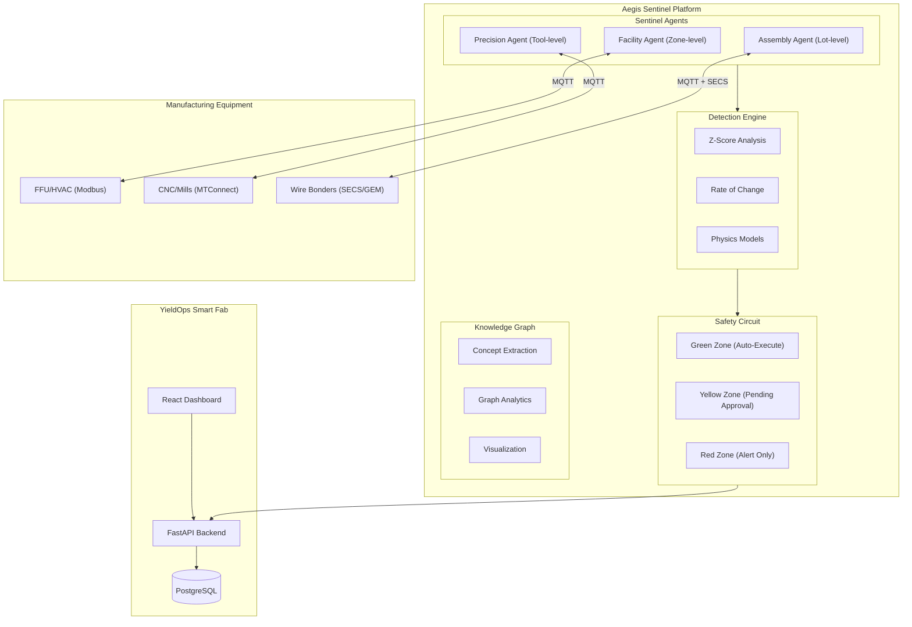
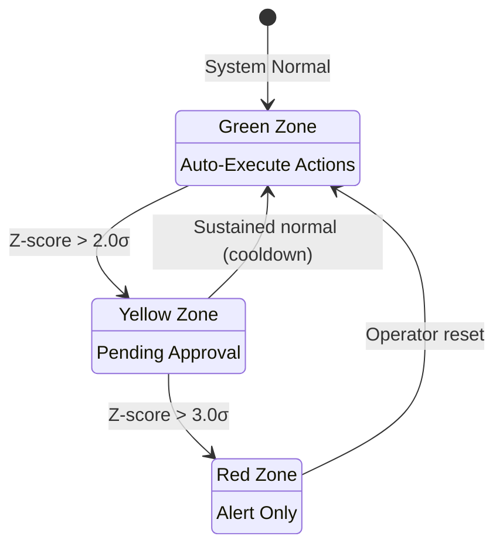
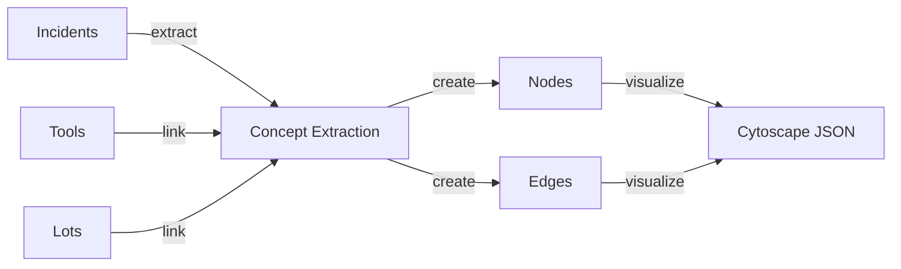

# Aegis Integration Guide

## Aegis Sentinel Integration with YieldOps

This guide covers the integration of the **Aegis Sentinel Platform** with YieldOps Smart Fab - an autonomous defense system for semiconductor manufacturing.

---

## Overview

The Aegis Sentinel Platform provides **autonomous defense capabilities** for semiconductor manufacturing through a multi-agent architecture with physics-based detection and knowledge graph intelligence.

### Key Capabilities

| Capability | Description | Technology |
|------------|-------------|------------|
| **Physics-Based Detection** | Domain-specific algorithms for each manufacturing stage | Thermal drift, Vibration analysis, Ultrasonic impedance |
| **3-Tier Safety Circuit** | Escalating response protocols | Green/Yellow/Red zones |
| **Knowledge Graph** | Incident relationship mapping | NetworkX + PostgreSQL |
| **Autonomous Response** | Auto-execute, queue, or alert based on severity | Z-score + RoC thresholds |
| **Multi-Agent Architecture** | Specialized agents for different domains | Rust/Python hybrid |

---

## Architecture



---

## Three-Agent Architecture

### 1. Facility Agent (Front-End Fab)

**Scope**: Zone-level monitoring (FFU, HVAC, cleanroom environment)

| Attribute | Details |
|-----------|---------|
| **Physics Domain** | Fluid dynamics, ISO 14644 compliance |
| **Protocol** | Modbus/BACnet |
| **Key Detection** | Filter impedance (P/Q), particle counts |
| **Equipment** | FFU units, HVAC systems, chemical delivery |

**Detection Algorithms**:
- **Filter Impedance**: Darcy-Weisbach equation `Z = P/Q`
- **ISO 14644 Compliance**: Particle count thresholds per cleanroom class
- **Airflow Monitoring**: Velocity thresholds for FFU units

```rust
// Facility Sentinel - Filter clog detection
fn detect_filter_clog(&self, pressure_drop_pa: f64, airflow_mps: f64) -> Option<Threat> {
    let impedance = pressure_drop_pa / airflow_mps;
    let baseline_impedance = self.calculate_baseline();
    
    if pressure_drop_pa > self.config.max_filter_pressure_drop {
        Some(Threat::FacilityIntegrity {
            issue: "HEPA Filter End-of-Life".to_string(),
            severity: Severity::High,
            metric: pressure_drop_pa,
        })
    } else if impedance > baseline_impedance * 1.5 {
        Some(Threat::FacilityIntegrity {
            issue: "Filter Loading Detected".to_string(),
            severity: Severity::Medium,
            metric: impedance,
        })
    } else {
        None
    }
}
```

### 2. Precision Agent (Machining/Processing)

**Scope**: Tool-level monitoring (CNC, lithography, etching)

| Attribute | Details |
|-----------|---------|
| **Physics Domain** | ISO 10816 vibration, thermal drift |
| **Protocol** | MTConnect/OPC-UA |
| **Key Detection** | Bearing fault frequencies, chatter, thermal runaway |
| **Equipment** | CNC mills, lithography scanners, etching systems |

**Detection Algorithms**:
- **Thermal Drift**: CTE-based calculations `ΔL = α·L·ΔT`
- **ISO 10816 Vibration**: Velocity-based severity classification
- **Bearing Faults**: BPFO, BPFI, BSF, FTF frequency analysis

```rust
// Precision Sentinel - Thermal drift detection
fn detect_thermal_drift(&self, temp: f64, baseline_temp: f64) -> Option<Threat> {
    let temp_rise = temp - baseline_temp;
    let expansion_mm = self.config.material_cte 
        * self.config.spindle_length_mm 
        * temp_rise;
    
    if expansion_mm > 0.005 {  // 5µm threshold
        Some(Threat::ThermalDrift {
            drift_mm: expansion_mm,
            axis: "Z".to_string(),
            severity: Severity::High,
        })
    } else {
        None
    }
}
```

### 3. Assembly Agent (Back-End Packaging)

**Scope**: Lot-level monitoring (wire bonders, die attach)

| Attribute | Details |
|-----------|---------|
| **Physics Domain** | Ultrasonic impedance, OEE tracking |
| **Protocol** | SECS/GEM (S2F41) via sidecar |
| **Key Detection** | NSOP (Non-Stick on Pad), bond quality |
| **Equipment** | Wire bonders, die attach, flip chip |

**Detection Algorithms**:
- **NSOP Detection**: Ultrasonic impedance monitoring `Z = F/v`
- **OEE Calculation**: `OEE = Availability × Performance × Quality`
- **Capillary Thermal Expansion**: CTE-based drift compensation

```rust
// Assembly Sentinel - NSOP detection
fn detect_bond_defect(&mut self, impedance_ohms: f64) -> Option<Threat> {
    if impedance_ohms < self.config.min_ultrasonic_impedance {
        self.nsop_count += 1;
        
        // Trigger after 3 consecutive NSOPs
        if self.nsop_count >= 3 {
            self.nsop_count = 0;
            Some(Threat::QualityDefect {
                defect_type: "NSOP (Non-Stick on Pad)".to_string(),
                confidence: 0.99,
                severity: Severity::Critical,
            })
        } else {
            None
        }
    } else {
        self.nsop_count = 0;
        None
    }
}
```

---

## Safety Circuit (3-Tier Zones)

The Safety Circuit provides **defense-in-depth** with three escalating response tiers:

| Zone | Threshold | Response | Auto-Action | Example |
|------|-----------|----------|-------------|---------|
| **Green** | Z-score < 2.0 | Normal monitoring | Auto-execute actions | Adjust RPM ±10%, increase coolant |
| **Yellow** | Z-score 2.0-3.0 | Caution state | Queue for approval | Reduce speed >20%, schedule maintenance |
| **Red** | Z-score > 3.0 | Critical alert | Alert only, human required | Emergency stop, cascade events |

### Zone Transitions



### Safety Circuit Implementation

```rust
fn safety_circuit(&self, threat: &Threat) -> (ResponseTier, Action) {
    match threat {
        // Critical contamination -> RED ZONE
        Threat::Contamination { severity: Severity::Critical, .. } => (
            ResponseTier::Red,
            Action::SendAlert {
                severity: Severity::Critical,
                message: "ISO CLASS VIOLATION".to_string(),
                escalate_to: Some("Process_Engineering".to_string()),
            }
        ),
        
        // NSOP -> RED ZONE (immediate stop)
        Threat::QualityDefect { defect_type, .. } 
            if defect_type.contains("NSOP") => (
            ResponseTier::Red,
            Action::FeedHold {
                reason: "CRITICAL: Non-Stick on Pad".to_string(),
            }
        ),
        
        // Throughput degradation -> GREEN ZONE (auto-optimize)
        Threat::ThroughputDegradation { issue, .. } 
            if issue.contains("Cycle Time") => (
            ResponseTier::Green,
            Action::AdjustParameter {
                parameter_name: "bond_force".to_string(),
                new_value: 1.05,
                unit: "percent".to_string(),
            }
        ),
        
        _ => (ResponseTier::Green, Action::LogOnly),
    }
}
```

---

## Knowledge Graph Integration

The Knowledge Graph provides **relationship visualization** and concept extraction for incident analysis.

### Graph Structure



### Node Types

| Type | Description | Example |
|------|-------------|---------|
| `machine` | Equipment IDs | CNC-001, LITHO-01, BOND-01 |
| `failure_type` | Detected failure modes | Thermal runaway, bearing failure, NSOP |
| `component` | Affected component | Spindle, bearing, coolant system, capillary |
| `action` | Response action taken | Emergency stop, feed hold, speed reduction |
| `severity` | Incident severity | Critical, high, medium, low |
| `agent_type` | Detecting agent | Facility, precision, assembly |

### Graph Analytics

| Feature | Implementation | Use Case |
|---------|----------------|----------|
| **Concept Extraction** | NLP pipeline on incident descriptions | Auto-tag incidents with failure modes |
| **Relationship Mapping** | NetworkX graph analytics | Identify incident clusters |
| **Community Detection** | Greedy modularity communities | Find related failure groups |
| **Centrality Analysis** | Betweenness centrality | Identify critical equipment |

---

## API Integration

### Aegis Endpoints

| Endpoint | Method | Description |
|----------|--------|-------------|
| `/api/v1/aegis/incidents` | GET | List all incidents with filtering |
| `/api/v1/aegis/incidents` | POST | Report new incident from agent |
| `/api/v1/aegis/incidents/{id}` | GET | Get incident details |
| `/api/v1/aegis/incidents/{id}/approve` | POST | Approve yellow zone action |
| `/api/v1/aegis/incidents/{id}/resolve` | POST | Resolve incident |
| `/api/v1/aegis/agents` | GET | List all sentinel agents |
| `/api/v1/aegis/agents/register` | POST | Register new agent |
| `/api/v1/aegis/safety-circuit` | GET | Get current safety circuit state |
| `/api/v1/aegis/summary` | GET | Get sentinel summary for dashboard |
| `/api/v1/aegis/knowledge-graph` | GET | Get knowledge graph data |
| `/api/v1/aegis/knowledge-graph/generate` | POST | Generate graph from incidents |

### Incident Reporting Example

```python
import requests

# Report incident from agent
response = requests.post(
    "https://api.yieldops.com/api/v1/aegis/incidents",
    json={
        "machine_id": "BOND-01",
        "severity": "critical",
        "incident_type": "NSOP",
        "message": "Non-Stick on Pad detected - impedance below threshold",
        "detected_value": 25.5,
        "threshold_value": 30.0,
        "action_taken": "Feed Hold",
        "action_zone": "red",
        "agent_type": "assembly",
        "z_score": 3.5,
        "rate_of_change": -12.3
    }
)
```

---

## Deployment

### Docker Deployment

```dockerfile
# Dockerfile.aegis
FROM rust:1.75-slim as builder

WORKDIR /app
COPY aegis/aegis-sentinel .
RUN cargo build --release

FROM debian:bookworm-slim
RUN apt-get update && apt-get install -y libssl3 ca-certificates
COPY --from=builder /app/target/release/aegis-sentinel /usr/local/bin/

ENTRYPOINT ["aegis-sentinel"]
```

### Configuration

```yaml
# aegis-config.yaml
agents:
  - type: facility
    machine_id: FAC-001
    zone: ZONE_A
    config:
      iso_class: 5
      min_airflow_velocity: 0.45
      max_filter_pressure_drop: 250.0
      
  - type: assembly
    machine_id: BOND-01
    config:
      max_bond_time_ms: 20.0
      min_ultrasonic_impedance: 30.0
      target_oee: 0.85
      material_cte: 5.5e-6
      capillary_length_mm: 10.0
      
  - type: precision
    machine_id: CNC-001
    config:
      max_vibration_velocity: 4.5
      thermal_drift_threshold: 0.005
      material_cte: 11.7e-6
      spindle_length_mm: 500.0

mqtt:
  broker: "mqtt.yieldops.com:1883"
  username: "${MQTT_USER}"
  password: "${MQTT_PASS}"
  
api:
  endpoint: "https://api.yieldops.com"
  api_key: "${YIELDOPS_API_KEY}"
```

---

## Monitoring & Metrics

### Key Metrics

| Metric | Description | Target |
|--------|-------------|--------|
| Detection Latency | Time from anomaly to alert | < 100ms |
| False Positive Rate | Incorrect alerts / total alerts | < 5% |
| Auto-Resolution Rate | Green zone auto-actions / total | > 80% |
| Agent Uptime | Availability of sentinel agents | > 99.9% |
| Knowledge Graph Coverage | % of incidents linked in graph | > 95% |

### Dashboard Integration

The Sentinel Tab in YieldOps provides:

- **KPI Cards**: Incidents (24h), Active Agents, Auto-Resolved, Pending Approval
- **Agent Coverage Panel**: Sand-to-Package coverage visualization
- **Safety Circuit Panel**: Real-time zone status
- **Incident Feed**: Real-time incident stream
- **Knowledge Graph Viz**: Interactive relationship visualization

---

## Troubleshooting

### Common Issues

| Issue | Cause | Solution |
|-------|-------|----------|
| Agent not reporting | MQTT connection failure | Check broker URL and credentials |
| False positives | Threshold too sensitive | Adjust Z-score threshold |
| Missing incidents | Agent not registered | Call `/api/v1/aegis/agents/register` |
| Graph not updating | No incidents in database | Generate from existing telemetry |
| SECS/GEM timeout | Bridge not running | Start Python sidecar adapter |

### Debug Mode

```bash
# Run agent with debug logging
RUST_LOG=debug cargo run --bin aegis-sentinel

# Test detection algorithms
cargo test --package aegis-sentinel -- detection::tests

# Validate SECS/GEM bridge
python aegis/gem_adapter.py --test-connection
```

---

## References

- [AEGIS_SAND_TO_PACKAGE.md](AEGIS_SAND_TO_PACKAGE.md) - Value chain coverage
- [aegis/SECS_GEM_INTEGRATION.md](aegis/SECS_GEM_INTEGRATION.md) - SECS/GEM protocol
- [Architecture.md](Architecture.md) - System architecture
- [README.md](README.md) - Project overview
