# Aegis Sentinel - YieldOps Integration Guide

## Full Value Chain Coverage

This document describes how the Aegis Sentinel agents integrate with the YieldOps platform to provide **end-to-end** monitoring from **Fab (Front-End)** to **Packaging (Back-End)**.

---

## Architecture Overview


---

## Agent Capabilities

### 1. Precision Sentinel (Tool-Level Monitoring)
**Files**: 
- Rust: `aegis/aegis-sentinel/src/agents/precision.rs`
- Python Engine: `apps/api/app/core/sentinel_engine.py`

**Target Equipment**: CNC Mills, Lathes, Lithography Scanners, Etching Tools

**Physics Models**:
- **Chatter Detection**: Regenerative vibration analysis (FFT-based)
- **Thermal Drift Compensation**: ΔL = α·L·ΔT (CTE-based correction)
- **Tool Wear Tracking**: Load signature analysis
- **Bearing Failure**: ISO 10816 vibration thresholds
- **Thermal Runaway**: Rate-of-change detection

**Detection Algorithm** (Z-score + RoC):
```python
z_score = (value - mean) / std_dev
roc = (value_delta / time_delta * 60)  # per minute
```

**Protocol**: MQTT / MTConnect / OPC-UA

**Safety Circuit**:
| Threat | Zone | Z-Score | Action |
|--------|------|---------|--------|
| Chatter (Low) | 🟢 Green | 2.0-2.5 | Adjust RPM -5% |
| Chatter (High) | 🟡 Yellow | 2.5-3.0 | Reduce feed 20% |
| Thermal Drift | 🟢 Green | 2.0-2.5 | Apply Z-offset compensation |
| Tool Wear | 🟡 Yellow | 2.5-3.0 | Schedule tool change |
| Thermal Runaway | 🔴 Red | >3.0 | Emergency stop |
| Bearing Failure | 🔴 Red | >3.5 | Critical alert |

---

### 2. Facility Sentinel (Zone-Level Monitoring)
**Files**:
- Rust: `aegis/aegis-sentinel/src/agents/facility.rs`
- Database: `database/migrations/003_aegis_sentinel_sand_to_package.sql`

**Target Equipment**: FFU (Fan Filter Units), HVAC, Chemical Delivery

**Physics Models**:
- **Filter Clog Detection**: P/Q impedance (Darcy-Weisbach equation)
  ```
  Z = P / Q  (Pressure / Flow)
  ```
- **ISO 14644-1 Compliance**: Cn = 10^N × (0.1/D)^2.08
- **Airflow Monitoring**: Bernoulli's principle
- **Chemical Leak Detection**: ppm threshold monitoring

**Protocol Bridge**: MODBUS/BACnet
```
[MODBUS BRIDGE] Writing Register 4001 (fan_speed): 85%
```

**Database Schema**:
```sql
-- Facility-specific fields in sensor_readings
ALTER TABLE sensor_readings ADD COLUMN airflow_mps DECIMAL(6,3);
ALTER TABLE sensor_readings ADD COLUMN particles_0_5um DECIMAL(12,2);
ALTER TABLE sensor_readings ADD COLUMN pressure_diff_pa DECIMAL(8,2);

-- Dedicated FFU status table
CREATE TABLE facility_ffu_status (
    ffu_id UUID PRIMARY KEY DEFAULT uuid_generate_v4(),
    machine_id VARCHAR(100) NOT NULL REFERENCES machines(name),
    zone_id VARCHAR(20) NOT NULL,
    airflow_velocity_mps DECIMAL(5,2) NOT NULL,
    pressure_drop_pa DECIMAL(8,2) NOT NULL,
    motor_rpm INTEGER,
    filter_life_percent DECIMAL(5,2),
    iso_class INTEGER CHECK (iso_class BETWEEN 1 AND 9),
    particle_count_0_5um DECIMAL(12,2),
    status VARCHAR(20) NOT NULL DEFAULT 'normal',
    recorded_at TIMESTAMP WITH TIME ZONE DEFAULT NOW()
);
```

**Safety Circuit**:
| Threat | Zone | Action |
|--------|------|--------|
| Filter Loading | 🟢 Green | Log for maintenance |
| Filter End-of-Life | 🟡 Yellow | Create work order |
| ISO Class Violation | 🔴 Red | Stop wafer loading |
| Chemical Leak | 🔴 Red | Emergency stop |
| Airflow Failure | 🔴 Red | Stop production |

---

### 3. Assembly Sentinel (Lot-Level Monitoring)
**Files**:
- Rust: `aegis/aegis-sentinel/src/agents/assembly.rs`
- SECS/GEM Bridge: `aegis/gem_adapter.py`
- Docs: `aegis/SECS_GEM_INTEGRATION.md`

**Target Equipment**: Wire Bonders, Die Attach, Flip Chip

**Physics Models**:
- **NSOP Detection**: Ultrasonic impedance monitoring
  - Low impedance (< 30Ω) = No bond formed
  - High impedance (> 50Ω) = Good bond
- **Shear Strength Tracking**: Statistical process control
- **Capillary Thermal Drift**: CTE compensation
- **OEE Calculation**: Availability × Performance × Quality

**Protocol Bridge**: SECS/GEM (via Python Sidecar)
```
[SECS/GEM BRIDGE] Sending S2F41 STOP to BOND-01: NSOP Detected
[SECS/GEM BRIDGE] S2F41 Remote Command to BOND-01: bond_force = 105 percent
```

**SECS/GEM Sidecar Pattern**:


**Database Schema**:
```sql
-- Assembly-specific fields in sensor_readings
ALTER TABLE sensor_readings ADD COLUMN usg_impedance DECIMAL(6,2);
ALTER TABLE sensor_readings ADD COLUMN bond_time_ms DECIMAL(6,2);
ALTER TABLE sensor_readings ADD COLUMN shear_strength_g DECIMAL(6,2);
ALTER TABLE sensor_readings ADD COLUMN capillary_temp DECIMAL(6,2);

-- Dedicated bonder status table
CREATE TABLE assembly_bonder_status (
    bonder_id UUID PRIMARY KEY DEFAULT uuid_generate_v4(),
    machine_id VARCHAR(100) NOT NULL REFERENCES machines(name),
    usg_impedance_ohms DECIMAL(6,2),
    bond_time_ms DECIMAL(6,2),
    shear_strength_g DECIMAL(6,2),
    nsop_count_24h INTEGER DEFAULT 0,
    oee_percent DECIMAL(5,2),
    status VARCHAR(20) NOT NULL DEFAULT 'normal',
    recorded_at TIMESTAMP WITH TIME ZONE DEFAULT NOW()
);
```

**Safety Circuit**:
| Threat | Zone | Action |
|--------|------|--------|
| Cycle Time Drift | 🟢 Green | Adjust bond force +5% |
| Capillary Drift (Low) | 🟢 Green | Compensate Z-offset |
| Weak Bond | 🟡 Yellow | Inspect capillary |
| USG Degradation | 🟡 Yellow | Schedule maintenance |
| NSOP Detected | 🔴 Red | Feed hold (S2F41 STOP) |
| Thermal Drift (High) | 🟡 Yellow | Check cooling |

---

## Integration Points

### 1. MQTT Communication

**Topics**:
- **Telemetry**: `factory/{machine_id}/telemetry`
- **Command**: `factory/{machine_id}/command`
- **Incident**: `aegis/incidents`

**Telemetry Message Format**:
```json
{
  "timestamp": "2026-02-08T10:00:00Z",
  "machine_id": "CNC-001",
  "metrics": {
    "temperature": 65.0,
    "vibration": 0.015,
    "load_percent": 75.0
  },
  "agent_type": "precision"
}
```

### 2. HTTP API Bridge

**Environment Variables**:
```bash
export YIELDOPS_API_URL="https://your-api.com"
export YIELDOPS_API_KEY="your-api-key"
export MQTT_BROKER="localhost"
```

**Direct API Endpoints**:
| Endpoint | Method | Purpose |
|----------|--------|---------|
| `/api/v1/aegis/incidents` | POST | Report incidents from agents |
| `/api/v1/aegis/agents/register` | POST | Register agents on startup |
| `/api/v1/aegis/agents/{id}/heartbeat` | POST | Heartbeat every 30s |
| `/api/v1/aegis/telemetry/analyze` | POST | Server-side ML analysis |
| `/api/v1/aegis/safety-circuit` | GET | Get current zone status |

**Incident Report Example**:
```json
{
  "machine_id": "CNC-001",
  "severity": "high",
  "incident_type": "thermal_runaway",
  "message": "CRITICAL: Thermal runaway detected at 95.5C",
  "detected_value": 95.5,
  "threshold_value": 95.0,
  "recommended_action": "reduce_thermal_load",
  "action_zone": "yellow",
  "agent_type": "precision",
  "z_score": 3.2,
  "rate_of_change": 8.5
}
```

### 3. Supabase Real-Time Data

**Tables**:
| Table | Purpose | Realtime |
|-------|---------|----------|
| `aegis_incidents` | All incidents (resolved/pending) | ✅ |
| `aegis_agents` | Agent registry and status | ✅ |
| `facility_ffu_status` | FFU detailed status | ✅ |
| `assembly_bonder_status` | Wire bonder status | ✅ |
| `sensor_readings` | Raw telemetry data | ✅ |
| `machines` | Equipment master data | ✅ |

**Database Functions**:
```sql
-- Get safety circuit status
SELECT * FROM get_safety_circuit_status();

-- Get facility summary (Front-End)
SELECT * FROM get_facility_summary();

-- Get assembly summary (Back-End)
SELECT * FROM get_assembly_summary();
```

---

## Running the System

### 1. Start YieldOps API

```bash
cd apps/api
pip install -r requirements.txt
uvicorn app.main:app --host 0.0.0.0 --port 8000
```

### 2. Start MQTT Broker (Mosquitto)

```bash
# macOS
brew install mosquitto
brew services start mosquitto

# Ubuntu
sudo apt install mosquitto
sudo systemctl start mosquitto

# Docker
docker run -d --name mqtt -p 1883:1883 eclipse-mosquitto
```

### 3. Start Aegis Sentinel (Rust)

```bash
cd aegis/aegis-sentinel
export YIELDOPS_API_URL="http://localhost:8000"
export MQTT_BROKER="localhost"
cargo run
```

### 4. Start SECS/GEM Bridge (for Assembly Agent)

```bash
cd aegis
pip install -r requirements-gem.txt  # Contains secsgem library
export MQTT_BROKER="localhost"
export GEM_HOST="192.168.1.100"      # Your wire bonder's IP
export GEM_PORT="5000"
python gem_adapter.py
```

### 5. Start Dashboard

```bash
cd apps/dashboard
npm install
npm run dev
```

---

## Dashboard Integration

### Sentinel Tab Components

```mermaid
flowchart TB
    subgraph SentinelTab["Sentinel Tab"]
        subgraph KPI["KPI Cards"]
            Incidents["Incidents (24h)"]
            Active["Active Agents"]
            Auto["Auto-Resolved"]
            Pending["Pending Approval"]
        end
        
        subgraph Coverage["Sand-to-Package Coverage"]
            Facility["Facility (Front-End)<br/>• FFUs: 12<br/>• Avg P/Q<br/>• ISO Comp."]
            Assembly["Assembly (Back-End)<br/>• Bonders: 4<br/>• Avg OEE<br/>• NSOP 24h"]
        end
        
        subgraph MainContent["Main Content"]
            AgentList["Agent List<br/>• Facility<br/>• Precision<br/>• Assembly<br/><br/>Safety Circuit<br/>🟢 🟡 🔴"]
            IncidentFeed["Incident Feed<br/>[Severity] [Type] [Action]<br/>[APPROVE] [RESOLVE]"]
        end
        
        subgraph KG["Knowledge Graph"]
            Graph["Network of incidents,<br/>machines, types"]
        end
    end
    
    KPI --> Coverage
    Coverage --> MainContent
    MainContent --> KG
```



### React Hooks

```typescript
// useAegisRealtime.ts - Main hook for Sentinel data
const {
  summary,           // SentinelSummary
  incidents,         // IncidentResponse[]
  agents,            // AgentStatus[]
  facilitySummary,   // FacilitySummary
  assemblySummary,   // AssemblySummary
  loading,
  isConnected,       // Realtime connection status
  isDemoMode,        // Demo mode flag
  approveIncident,   // (id: string) => Promise<void>
  resolveIncident,   // (id: string) => Promise<void>
} = useAegisRealtime();
```

---

## Interview Talking Points

### The "Fab" Story (Facility Agent)
- **Physics**: Fluid dynamics - detecting clogged filters via pressure/flow impedance (Z = P/Q)
- **Protocol**: "I know facilities use OT protocols like Modbus/BACnet, not SECS/GEM"
- **Criticality**: "If ISO class fails, the whole lot dies"
- **The Win**: Predictive maintenance - changing filters before airflow drops below ISO requirements

### The "Packaging" Story (Assembly Agent)
- **Physics**: Ultrasonics - detecting bad bonds via transducer impedance changes
- **Protocol**: "I know wire bonders are high-end tools that need SECS/GEM commands (S2F41)"
- **Criticality**: "If cycle time drifts, we lose 5% capacity (OEE impact)"
- **The Win**: Quality assurance - stopping the line instantaneously on NSOP defects

### The "Machining" Story (Precision Agent)
- **Physics**: ISO 10816 vibration standards + CTE thermal expansion
- **Protocol**: "MTConnect/OPC-UA for CNC controllers"
- **Criticality**: "Bearing failure can destroy a $50K spindle"
- **The Win**: Predictive maintenance based on actual vibration signatures

### The "Integration" Story
- **Decoupling**: "Sentinel acts instantly (safety); YieldOps reports eventually (analytics)"
- **Protocol Bridge**: "We translate between industrial protocols (Modbus, SECS/GEM) and REST APIs"
- **Full Coverage**: "From Sand to Package - Fab to Packaging"
- **Safety Circuit**: "3-tier zone system inspired by aerospace/nuclear control systems"

---

## Configuration

### Agent Configuration (YAML)

```yaml
# aegis/aegis-sentinel/config/agents.yaml
agents:
  # Precision Agents (CNC Machining)
  - machine_id: "CNC-001"
    agent_type: "precision"
    config:
      vibration_critical: 10.0
      thermal_drift_max: 0.05
      z_score_threshold: 3.0
      
  # Facility Agents (Front-End Fab)
  - machine_id: "FAC-001"
    agent_type: "facility"
    config:
      iso_class: 5
      min_airflow_velocity: 0.45
      max_pressure_drop_pa: 250.0
      
  # Assembly Agents (Back-End Packaging)
  - machine_id: "BOND-01"
    agent_type: "assembly"
    config:
      max_bond_time_ms: 20.0
      min_ultrasonic_impedance: 30.0
      max_nsop_count_24h: 5
```

### Environment Variables

```bash
# MQTT Configuration
MQTT_BROKER=localhost
MQTT_PORT=1883

# YieldOps API
YIELDOPS_API_URL=http://localhost:8000
YIELDOPS_API_KEY=your-secret-key

# Supabase (for supabase-bridge)
SUPABASE_URL=your-project.supabase.co
SUPABASE_SERVICE_KEY=your-service-key

# SECS/GEM (for gem_adapter.py)
GEM_HOST=192.168.1.100
GEM_PORT=5000
GEM_DEVICE_ID=1
```

---

## Testing

### Unit Tests (Rust)

```bash
cd aegis/aegis-sentinel
cargo test
```

### Integration Test

```bash
# Send test telemetry via MQTT
mosquitto_pub -t "factory/CNC-001/telemetry" -m '{
  "timestamp": "2026-02-08T10:00:00Z",
  "machine_id": "CNC-001",
  "metrics": {
    "temperature": 95.0,
    "vibration": 0.08,
    "load_percent": 85.0
  },
  "agent_type": "precision"
}'

# Check that incident was created
curl http://localhost:8000/api/v1/aegis/incidents
```

### Test Incident Creation via API

```bash
curl -X POST http://localhost:8000/api/v1/aegis/incidents \
  -H "Content-Type: application/json" \
  -d '{
    "machine_id": "TEST-001",
    "severity": "high",
    "incident_type": "thermal_runaway",
    "message": "Test incident",
    "detected_value": 95.0,
    "threshold_value": 80.0,
    "recommended_action": "reduce_thermal_load",
    "action_zone": "yellow",
    "agent_type": "precision",
    "z_score": 3.5,
    "rate_of_change": 10.0
  }'
```

---

## Monitoring

### Dashboard Views

1. **Overview Tab**: KPIs, machine status, job queue, System Knowledge Graph
2. **Machines Tab**: Grid/List views with real-time data, VM predictions
3. **Jobs Tab**: Job scheduling with priority levels, Jobs Knowledge Graph
4. **Sentinel Tab**: Agent status, incidents, safety circuit, Knowledge Graph

### Alerts

| Severity | Notification | Action Required |
|----------|--------------|-----------------|
| Critical | Browser notification + Sound | Immediate intervention |
| High | Browser notification | Review within 15 minutes |
| Medium | Dashboard badge | Review within 1 hour |
| Low | Log only | Review in daily report |

---

## Deployment

### Docker Compose

```yaml
version: '3.8'
services:
  aegis-sentinel:
    build: ./aegis/aegis-sentinel
    environment:
      - MQTT_BROKER=mosquitto
      - YIELDOPS_API_URL=http://api:8000
    depends_on:
      - mosquitto
      - api
    
  gem-adapter:
    build: 
      context: ./aegis
      dockerfile: Dockerfile.gem
    environment:
      - MQTT_BROKER=mosquitto
      - GEM_HOST=${GEM_HOST}
    depends_on:
      - mosquitto
    
  mosquitto:
    image: eclipse-mosquitto:latest
    ports:
      - "1883:1883"
```

### Kubernetes

```yaml
apiVersion: apps/v1
kind: Deployment
metadata:
  name: aegis-sentinel
spec:
  replicas: 3
  selector:
    matchLabels:
      app: aegis-sentinel
  template:
    spec:
      containers:
      - name: sentinel
        image: aegis-sentinel:latest
        env:
        - name: YIELDOPS_API_URL
          value: "https://api.yieldops.com"
        - name: MQTT_BROKER
          value: "mqtt-broker"
---
apiVersion: apps/v1
kind: Deployment
metadata:
  name: gem-adapter
spec:
  replicas: 1
  selector:
    matchLabels:
      app: gem-adapter
  template:
    spec:
      containers:
      - name: gem-adapter
        image: gem-adapter:latest
        env:
        - name: MQTT_BROKER
          value: "mqtt-broker"
        - name: GEM_HOST
          valueFrom:
            secretKeyRef:
              name: gem-secrets
              key: host
```

---

## Troubleshooting

### Agent Not Reporting Incidents

1. Check MQTT connection: `mosquitto_sub -t "factory/+/telemetry"`
2. Verify agent registration: `curl /api/v1/aegis/agents`
3. Check API logs for errors
4. Verify Supabase realtime is enabled for `aegis_incidents`

### SECS/GEM Connection Fails

1. Verify network: `ping <GEM_HOST>`
2. Check HSMS port: `telnet <GEM_HOST> 5000`
3. Ensure equipment is in ONLINE/REMOTE mode
4. Check CEID configuration on equipment

### Knowledge Graph Not Generating

1. Ensure incidents exist: `curl /api/v1/aegis/incidents`
2. Check NetworkX is installed: `pip install networkx`
3. Verify incident data has required fields (machine_id, incident_type)

---

## Summary

This integration demonstrates:
1. **Domain Authority**: Full understanding of Fab + Packaging manufacturing
2. **Protocol Knowledge**: Modbus, SECS/GEM, MQTT, REST
3. **Physics-Based Detection**: Real engineering principles (Z-score, RoC, impedance)
4. **Safety-Critical Design**: 3-tier response circuit (Green/Yellow/Red)
5. **Enterprise Integration**: Supabase, real-time dashboards, knowledge graphs
6. **Full Value Chain**: Sand-to-Package coverage

**Result**: A "Sand-to-Package" platform that hiring managers at Intel and TSMC look for.
