# Aegis Sand-to-Package Coverage

## Sand-to-Package Value Chain Coverage

This document details how the **Aegis Sentinel Platform** provides autonomous defense coverage across the entire semiconductor manufacturing value chain - from raw silicon (sand) to finished packaged devices.

---

## Overview


---

## Coverage Matrix

| Manufacturing Stage | Equipment | Aegis Agent | Physics Domain | Protocol |
|---------------------|-----------|-------------|----------------|----------|
| **Cleanroom Environment** | FFU, HVAC | Facility Agent | Fluid dynamics | Modbus/BACnet |
| **Lithography** | EUV/DUV Scanners | Precision Agent | Thermal, Vibration | MTConnect/OPC-UA |
| **Etching** | Plasma Etchers | Precision Agent | RF, Pressure | MTConnect/OPC-UA |
| **Deposition** | CVD/PVD Systems | Precision Agent | Temperature, Vacuum | MTConnect/OPC-UA |
| **CMP** | Polishers | Precision Agent | Pressure, Vibration | MTConnect/OPC-UA |
| **Dicing** | Saws | Precision Agent | Spindle vibration | MTConnect/OPC-UA |
| **Die Attach** | Pick & Place | Assembly Agent | Force, Vision | SECS/GEM |
| **Wire Bonding** | Ball/Wedge Bonders | Assembly Agent | Ultrasonic impedance | SECS/GEM |
| **Test** | ATE Equipment | Assembly Agent | Electrical | SECS/GEM |

---

## Front-End Fab Coverage

### Facility Agent - Cleanroom Infrastructure

The Facility Agent monitors the **environmental foundation** of semiconductor manufacturing.


#### FFU (Fan Filter Unit) Monitoring

| Parameter | Normal Range | Alert Threshold | Critical Threshold |
|-----------|--------------|-----------------|-------------------|
| Airflow Velocity | 0.40 - 0.50 m/s | < 0.36 m/s | < 0.30 m/s |
| Pressure Drop | 100 - 200 Pa | > 220 Pa | > 250 Pa |
| Motor Current | Rated ±10% | > +15% | > +25% |
| ISO Class | Per zone spec | 80% of limit | > limit |

```rust
// ISO 14644-1 Particle Limits (particles/m³)
const ISO_CLASS_LIMITS: [(u8, f64); 9] = [
    (1, 10.0),
    (2, 100.0),
    (3, 1_000.0),
    (4, 10_000.0),
    (5, 100_000.0),  // Class 5 = 3,520 particles @ 0.5µm
    (6, 1_000_000.0),
    (7, 10_000_000.0),
    (8, 100_000_000.0),
    (9, 1_000_000_000.0),
];

fn detect_contamination(&self, particle_count_0_5um: f64) -> Option<Threat> {
    let limit = ISO_CLASS_LIMITS[self.config.iso_class as usize].1 
        * (0.1_f64 / 0.5_f64).powf(2.08);
    
    if particle_count_0_5um > limit {
        Some(Threat::Contamination {
            zone_id: self.agent_id.clone(),
            particle_count: particle_count_0_5um,
            limit,
            severity: Severity::Critical,
        })
    } else {
        None
    }
}
```

#### Filter Life Prediction

Using the Darcy-Weisbach equation to predict HEPA filter end-of-life:

```
Z = ΔP / Q

Where:
- Z = Filter impedance (Pa·s/m³)
- ΔP = Pressure drop across filter (Pa)
- Q = Airflow rate (m³/s)

As filter loads:
- Particles accumulate in media
- ΔP increases for constant Q
- Z increases linearly with loading
- Alert when Z > 1.5 × baseline
```

### Precision Agent - Process Equipment

The Precision Agent monitors **lithography, etching, deposition, and CMP** equipment.

```mermaid
flowchart LR
    subgraph PrecisionAgent["PRECISION AGENT"]
        Litho["LITHOGRAPHY"]
        Etch["ETCHING"]
        Dep["DEPOSITION"]
        CMP["CMP"]
    end
    
    subgraph Physics["PHYSICS"]
        Thermal["Thermal Drift<br/>CTE: ΔL = α·L·ΔT"]
        Vibration["ISO 10816<br/>Vibration"]
        Pressure["Chuck Vacuum"]
        RF["RF Power"]
    end
    
    subgraph Detection["DETECTION"]
        ThermalRunaway["Thermal Runaway"]
        BearingFault["Bearing Fault"]
        VacuumLoss["Vacuum Loss"]
        RFDrift["RF Drift"]
    end
    
    Litho --> Thermal --> ThermalRunaway
    Etch --> Vibration --> BearingFault
    Dep --> Pressure --> VacuumLoss
    CMP --> RF --> RFDrift
```



#### Lithography Scanner Monitoring

| Parameter | Physics | Detection Method | Impact |
|-----------|---------|------------------|--------|
| Stage Temperature | CTE (0.5 ppm/°C) | Thermal drift calc | Overlay error |
| Vibration | ISO 10816 Class II | Velocity RMS | Image blur |
| Laser Power | Optical stability | Power monitoring | Dose variation |
| Chuck Vacuum | Pressure differential | Vacuum transducer | Wafer slip |

#### Thermal Drift Calculation

```rust
// Coefficient of Thermal Expansion (CTE) values
const CTE_SILICON: f64 = 2.6e-6;      // Silicon: 2.6 × 10⁻⁶ /°C
const CTE_ALUMINA: f64 = 7.2e-6;      // Ceramic: 7.2 × 10⁻⁶ /°C
const CTE_STEEL: f64 = 11.7e-6;       // Steel: 11.7 × 10⁻⁶ /°C
const CTE_TUNGSTEN: f64 = 4.5e-6;     // Tungsten: 4.5 × 10⁻⁶ /°C

fn calculate_thermal_drift(
    baseline_temp: f64,
    current_temp: f64,
    length_mm: f64,
    material_cte: f64
) -> f64 {
    let delta_t = current_temp - baseline_temp;
    let expansion_mm = material_cte * length_mm * delta_t;
    
    // For lithography: overlay budget is typically < 3nm
    // Alert if thermal drift > 1nm
    expansion_mm * 1_000_000.0  // Convert to nanometers
}
```

#### ISO 10816 Vibration Analysis

```rust
// ISO 10816-1 Vibration Severity Classes
enum VibrationClass {
    ClassI,    // Small machines (< 15 kW)
    ClassII,   // Medium machines (15-75 kW)
    ClassIII,  // Large machines (> 75 kW)
    ClassIV,   // Turbo machines
}

// Velocity-based severity zones (mm/s RMS)
fn classify_vibration(velocity_rms: f64, machine_class: VibrationClass) -> Severity {
    let thresholds = match machine_class {
        VibrationClass::ClassI => (2.8, 4.5, 7.1, 11.0, 18.0),
        VibrationClass::ClassII => (4.5, 7.1, 11.0, 18.0, 28.0),
        VibrationClass::ClassIII => (7.1, 11.0, 18.0, 28.0, 45.0),
        VibrationClass::ClassIV => (11.0, 18.0, 28.0, 45.0, 71.0),
    };
    
    match velocity_rms {
        v if v < thresholds.0 => Severity::Low,      // A/B boundary
        v if v < thresholds.1 => Severity::Medium,   // B/C boundary
        v if v < thresholds.2 => Severity::High,     // C/D boundary
        v if v < thresholds.3 => Severity::Critical, // Zone D
        _ => Severity::Critical,
    }
}
```

---

## Back-End Packaging Coverage

### Assembly Agent - Wire Bonding

The Assembly Agent monitors **wire bonding, die attach, and test equipment**.


#### Wire Bonding Physics

**Ultrasonic Impedance Monitoring** (The "Killer" Physics):

```
Z_mechanical = F / v

Where:
- Z = Mechanical impedance (Ω)
- F = Ultrasonic force (N)
- v = Vibration velocity (m/s)

NSOP Detection:
- Good bond: Z > 30Ω (wire bonded to pad)
- NSOP: Z < 30Ω (wire didn't stick)

This is the primary detection mechanism for wire bonding defects.
```

```rust
// Assembly Sentinel - NSOP detection
pub struct AssemblyConfig {
    pub max_bond_time_ms: f64,           // 20ms max cycle time
    pub min_ultrasonic_impedance: f64,   // 30Ω minimum
    pub target_oee: f64,                 // 85% target
    pub material_cte: f64,               // 5.5e-6 for tungsten carbide
    pub capillary_length_mm: f64,        // 10mm standard
}

fn detect_nsop(&mut self, impedance_ohms: f64) -> Option<Threat> {
    if impedance_ohms < self.config.min_ultrasonic_impedance {
        self.nsop_count += 1;
        
        // Trigger after 3 consecutive NSOPs
        if self.nsop_count >= 3 {
            self.nsop_count = 0;
            Some(Threat::QualityDefect {
                defect_type: "NSOP (Non-Stick on Pad)".to_string(),
                confidence: 0.99,
                severity: Severity::Critical,
            })
        } else {
            None
        }
    } else {
        self.nsop_count = 0;
        None
    }
}
```

#### OEE (Overall Equipment Effectiveness)

```rust
// OEE = Availability × Performance × Quality

fn calculate_oee(&self) -> OeeMetrics {
    let availability = self.run_time / self.planned_production_time;
    
    let theoretical_cycle_time = 15.0; // ms per bond
    let actual_cycle_time = self.bond_time_history.avg();
    let performance = theoretical_cycle_time / actual_cycle_time;
    
    let quality = self.good_units as f64 / self.total_units as f64;
    
    OeeMetrics {
        availability,
        performance,
        quality,
        oee: availability * performance * quality,
    }
}
```

| Metric | Target | World Class | Aegis Alert |
|--------|--------|-------------|-------------|
| Availability | > 90% | > 95% | < 85% |
| Performance | > 95% | > 98% | < 90% |
| Quality | > 99% | > 99.5% | < 98% |
| **OEE** | **> 85%** | **> 90%** | **< 80%** |

#### Capillary Thermal Expansion

```
Tungsten Carbide CTE: 5.5 × 10⁻⁶ /°C
Ceramic Capillary CTE: 3.0 × 10⁻⁶ /°C

For 10mm capillary:
ΔT = 50°C → Expansion = 2.75µm

Impact on bonding:
- Affects Z-height accuracy
- Changes loop height
- Can cause bond placement errors

Auto-compensation: Adjust Z-offset by -ΔL
```

---

## Value Chain Integration

### Data Flow Across Manufacturing Stages


### Lot Traceability

| Stage | Agent | Lot ID Format | Key Metrics |
|-------|-------|---------------|-------------|
| Litho | Precision | LOT-YYYYMMDD-XXX | Overlay, CD, Dose |
| Etch | Precision | LOT-YYYYMMDD-XXX | Etch rate, Uniformity |
| Deposition | Precision | LOT-YYYYMMDD-XXX | Thickness, Stress |
| Dicing | Precision | WAFER-XXX | Chipping, Street width |
| Die Attach | Assembly | PKG-YYYYMMDD-XXX | Placement accuracy |
| Wire Bond | Assembly | PKG-YYYYMMDD-XXX | NSOP count, Pull test |
| Test | Assembly | PKG-YYYYMMDD-XXX | Yield, Bin sort |

---

## Coverage Dashboard

### Sentinel Tab Visualization

The YieldOps dashboard provides real-time visibility into Sand-to-Package coverage:

```
┌─────────────────────────────────────────────────────────────┐
│  AGENT COVERAGE - SAND TO PACKAGE                          │
├─────────────────────────────────────────────────────────────┤
│                                                             │
│  FRONT-END FAB                        BACK-END PACKAGING   │
│  ┌─────────────┐                      ┌─────────────┐       │
│  │ 🏭 Facility │                      │ 🔧 Assembly │       │
│  │    Agent    │                      │    Agent    │       │
│  ├─────────────┤                      ├─────────────┤       │
│  │ FFU: 12 ✓   │                      │ Bonders: 8 ✓│       │
│  │ HVAC: 4 ✓   │                      │ Die Att: 4 ✓│       │
│  │ Chem: 2 ✓   │                      │ Test: 6 ✓   │       │
│  └─────────────┘                      └─────────────┘       │
│                                                             │
│  PRECISION AGENT (Cross-cutting)                           │
│  ┌─────────────────────────────────────┐                    │
│  │ Litho: 8 ✓  Etch: 8 ✓  Dep: 10 ✓   │                    │
│  │ CMP: 4 ✓    Dicing: 6 ✓            │                    │
│  └─────────────────────────────────────┘                    │
│                                                             │
│  Coverage: 48/48 machines (100%)                           │
│  Active Agents: 3 | Incidents (24h): 12 | Resolved: 10      │
└─────────────────────────────────────────────────────────────┘
```

### Zone Status

| Zone | Equipment Count | Agent Type | Status |
|------|-----------------|------------|--------|
| ZONE A (Litho) | 8 | Precision | ✅ Active |
| ZONE B (Etch) | 8 | Precision | ✅ Active |
| ZONE C (Dep) | 10 | Precision | ✅ Active |
| ZONE D (Inspection) | 8 | Precision | ✅ Active |
| ZONE E (Clean) | 8 | Facility | ✅ Active |
| Packaging | 6 | Assembly | ✅ Active |

---

## Performance Metrics

### Coverage KPIs

| Metric | Definition | Target | Current |
|--------|------------|--------|---------|
| **Equipment Coverage** | % of tools with agents | 100% | 100% |
| **Stage Coverage** | % of manufacturing stages | 100% | 100% |
| **Detection Latency** | Alert time after anomaly | < 100ms | 45ms |
| **False Positive Rate** | Incorrect alerts | < 5% | 2.3% |
| **Auto-Resolution** | Green zone actions / total | > 80% | 87% |

### Physics-Based Detection Accuracy

| Detection Type | Physics Model | Accuracy | Validation Method |
|----------------|---------------|----------|-------------------|
| NSOP | Ultrasonic Impedance | 99.2% | Visual inspection |
| Filter Clog | Darcy-Weisbach | 94.5% | Pressure gauge |
| Thermal Drift | CTE Calculation | 98.7% | Laser measurement |
| Bearing Fault | ISO 10816 | 91.3% | Vibration analysis |
| ISO Violation | ISO 14644-1 | 99.9% | Particle counter |

---

## Implementation Guide

### Adding Coverage to New Equipment

1. **Identify Equipment Type**
   ```bash
   # Determine which agent should handle the equipment
   if equipment.zone in ["CLEANROOM", "FFU", "HVAC"]:
       agent_type = "facility"
   elif equipment.stage in ["LITHO", "ETCH", "DEP", "CMP"]:
       agent_type = "precision"
   elif equipment.stage in ["BOND", "ATTACH", "TEST"]:
       agent_type = "assembly"
   ```

2. **Configure Physics Parameters**
   ```yaml
   # config/equipment/{machine_id}.yaml
   agent_type: precision
   machine_id: LITHO-09
   
   physics:
     material_cte: 2.6e-6        # Silicon
     spindle_length_mm: 200.0    # Stage travel
     thermal_baseline: 22.0      # °C
     
   thresholds:
     thermal_drift_nm: 1.0       # Overlay budget
     vibration_mm_s: 4.5         # ISO 10816 Class II
     vacuum_pa: 50000.0          # Chuck vacuum
   ```

3. **Register Agent**
   ```bash
   curl -X POST https://api.yieldops.com/api/v1/aegis/agents/register \
     -H "Content-Type: application/json" \
     -d @config/equipment/LITHO-09.yaml
   ```

4. **Verify Coverage**
   ```bash
   curl https://api.yieldops.com/api/v1/aegis/summary
   ```

---

## References

- [AEGIS_INTEGRATION_GUIDE.md](AEGIS_INTEGRATION_GUIDE.md) - Integration details
- [aegis/SECS_GEM_INTEGRATION.md](aegis/SECS_GEM_INTEGRATION.md) - SECS/GEM protocol
- [Architecture.md](Architecture.md) - System architecture
- ISO 14644-1: Cleanrooms and associated controlled environments
- ISO 10816: Mechanical vibration - Evaluation of machine vibration
