# Aegis Sentinel: Sand-to-Package Platform

## Overview

The **Aegis Sentinel** transforms YieldOps from a single-point solution into a **"Sand-to-Package" Platform** - covering the full semiconductor manufacturing value chain from raw silicon (sand) to finished packaged chips. This is the specific domain authority that hiring managers at Intel and TSMC look for.

## Architecture: Full Value Chain Coverage

```mermaid
flowchart TB
    subgraph Platform["AEGIS SENTINEL PLATFORM - CrowdStrike for Physical Infrastructure"]
        subgraph FrontEnd["FRONT-END (FAB)"]
            Facility["Facility Agent"]
            FFU["• FFU/HEPA Filters"]
            HVAC["• HVAC Systems"]
            Chemical["• Chemical Delivery"]
            Cleanroom["• Cleanroom Env"]
            Modbus["Protocol: Modbus/BACnet"]
            Bernoulli["Physics: Bernoulli Flow, Darcy-Weisbach, ISO 14644-1"]
        end
        
        subgraph BackEnd["BACK-END (PKG)"]
            Assembly["Assembly Agent"]
            Wire["• Wire Bonders"]
            Die["• Die Attach"]
            Flip["• Flip Chip"]
            Test["• Test Equipment"]
            SECS["Protocol: SECS/GEM, S2F41 Host Cmd"]
            Ultrasonic["Physics: Ultrasonic Impedance, CTE Thermal Drift"]
        end
        
        subgraph Precision["PRECISION"]
            PrecisionAgent["Precision Agent"]
            CNC["• CNC Mills"]
            Lathe["• CNC Lathes"]
            Machining["• Machining"]
            Litho["• Lithography"]
            MTConnect["Protocol: MTConnect/OPC-UA"]
            Vibration["Physics: Vibration, ISO 10816, CTE Thermal"]
        end
        
        subgraph Safety["SAFETY CIRCUIT"]
            Green["🟢 GREEN: Auto-exec"]
            Yellow["🟡 YELLOW: Pending"]
            Red["🔴 RED: Human req."]
        end
        
        subgraph Dashboard["YIELDOPS DASHBOARD"]
            React["React + Realtime"]
            Overview["• Overview Tab"]
            Machines["• Machines Tab"]
            Jobs["• Jobs Tab"]
            Sentinel["• Sentinel Tab"]
        end
    end
    
    Facility --> Safety
    Assembly --> Safety
    PrecisionAgent --> Safety
    Safety --> Dashboard
```



---

## Agent Details

### 1. Facility Agent (The "Lungs" of the Fab)

**Files:**
- Rust Implementation: `aegis/aegis-sentinel/src/agents/facility.rs`
- Database Schema: `database/migrations/003_aegis_sentinel_sand_to_package.sql`

**Purpose:** Protects the environment where chips are made. If the air fails, the yield hits 0%.

**Target Equipment:**
- FFU (Fan Filter Units)
- HVAC Systems
- Chemical Delivery Systems
- Cleanroom Monitoring

**Key Physics Models:**

| Detection | Physics Model | Formula/Standard |
|-----------|---------------|------------------|
| HEPA Filter Clogging | Darcy-Weisbach Impedance | `Z = P/Q` (Pressure/Flow) |
| ISO Class Violation | ISO 14644-1 | `Cn = 10^N × (0.1/D)^2.08` |
| Airflow Failure | Bernoulli's Principle | Velocity drop detection |
| Chemical Leak | ppm Threshold | Parts per million monitoring |

**Protocol Bridge:**
```rust
// Explicit Modbus register writes show domain knowledge
info!("[MODBUS BRIDGE] Writing Register 4001 ({}): {}", parameter_name, new_value);
```

**Database Schema:**
```sql
-- Facility-specific sensor fields
ALTER TABLE sensor_readings ADD COLUMN airflow_mps DECIMAL(6,3);
ALTER TABLE sensor_readings ADD COLUMN particles_0_5um DECIMAL(12,2);
ALTER TABLE sensor_readings ADD COLUMN pressure_diff_pa DECIMAL(8,2);
ALTER TABLE sensor_readings ADD COLUMN chemical_ppm DECIMAL(8,4);

-- Dedicated FFU status table
CREATE TABLE facility_ffu_status (
    ffu_id UUID PRIMARY KEY DEFAULT uuid_generate_v4(),
    machine_id VARCHAR(100) NOT NULL REFERENCES machines(name),
    zone_id VARCHAR(20) NOT NULL,
    airflow_velocity_mps DECIMAL(5,2) NOT NULL,
    pressure_drop_pa DECIMAL(8,2) NOT NULL,
    filter_life_percent DECIMAL(5,2),
    iso_class INTEGER CHECK (iso_class BETWEEN 1 AND 9),
    particle_count_0_5um DECIMAL(12,2),
    status VARCHAR(20) NOT NULL DEFAULT 'normal',
    recorded_at TIMESTAMP WITH TIME ZONE DEFAULT NOW()
);
```

**Interview Hook:**
> "I normalize pressure drop against airflow (P/Q) to calculate filter impedance, rather than just waiting for a high-pressure alarm. This predicts end-of-life before airflow drops below ISO Class requirements, preventing yield loss from contamination."

---

### 2. Assembly Agent (The "Hands" of Packaging)

**Files:**
- Rust Implementation: `aegis/aegis-sentinel/src/agents/assembly.rs`
- SECS/GEM Bridge: `aegis/gem_adapter.py`
- Integration Docs: `aegis/SECS_GEM_INTEGRATION.md`

**Purpose:** Protects mechanical throughput at the end of the line. Quality issues here affect shipped products.

**Target Equipment:**
- Wire Bonders (K&S, ASM)
- Die Attach Equipment
- Flip Chip Bonders
- Test Equipment

**Key Physics Models:**

| Detection | Physics Model | Metric/Threshold |
|-----------|---------------|------------------|
| NSOP (Non-Stick on Pad) | Ultrasonic Impedance | < 30Ω indicates no bond |
| Bond Quality | Shear Strength | < 8g indicates weak bond |
| Capillary Drift | CTE Expansion | `ΔL = α × L × ΔT` |
| Throughput | OEE Calculation | Availability × Performance × Quality |
| USG Degradation | Impedance Baseline | Deviation from baseline |

**Protocol Bridge (SECS/GEM via Sidecar):**
```rust
// SECS/GEM S2F41 Host Command Send via MQTT bridge
info!("[SECS/GEM BRIDGE] Sending S2F41 STOP to {}: {}", machine_id, reason);

// MQTT message to Python bridge
{
  "action": "STOP",
  "machine_id": "BOND-01",
  "reason": "NSOP Detected",
  "protocol": "SECS-II",
  "stream": 2,
  "function": 41
}
```

**SECS/GEM Sidecar Pattern:**


Why this pattern?
- SECS/GEM is a complex binary protocol (6+ months to implement in Rust)
- Python has mature `secsgem` library
- Rust handles physics/AI; Python handles protocol translation
- Bridge can be updated independently
```

**Database Schema:**
```sql
-- Assembly-specific sensor fields
ALTER TABLE sensor_readings ADD COLUMN usg_impedance DECIMAL(6,2);
ALTER TABLE sensor_readings ADD COLUMN bond_time_ms DECIMAL(6,2);
ALTER TABLE sensor_readings ADD COLUMN shear_strength_g DECIMAL(6,2);
ALTER TABLE sensor_readings ADD COLUMN capillary_temp DECIMAL(6,2);

-- Dedicated bonder status table
CREATE TABLE assembly_bonder_status (
    bonder_id UUID PRIMARY KEY DEFAULT uuid_generate_v4(),
    machine_id VARCHAR(100) NOT NULL REFERENCES machines(name),
    usg_frequency_khz DECIMAL(6,2),
    usg_impedance_ohms DECIMAL(6,2),
    bond_force_grams DECIMAL(6,2),
    bond_time_ms DECIMAL(6,2),
    capillary_temp_c DECIMAL(5,2),
    shear_strength_g DECIMAL(6,2),
    nsop_count_24h INTEGER DEFAULT 0,
    oee_percent DECIMAL(5,2),
    cycle_time_ms DECIMAL(6,2),
    units_bonded_24h INTEGER,
    status VARCHAR(20) NOT NULL DEFAULT 'normal',
    recorded_at TIMESTAMP WITH TIME ZONE DEFAULT NOW()
);
```

**Interview Hook:**
> "I catch Non-Stick defects in milliseconds by monitoring transducer impedance. Low impedance means no bond formed - we stop the line immediately via SECS/GEM S2F41, preventing thousands of bad units from moving down the line. This saves both yield and reputation."

---

### 3. Precision Agent (The "Brain" of CNC)

**Files:**
- Rust Implementation: `aegis/aegis-sentinel/src/agents/precision.rs`
- Detection Engine: `apps/api/app/core/sentinel_engine.py`

**Purpose:** Protects high-precision machining operations where tolerances matter.

**Target Equipment:**
- CNC Mills and Machining Centers
- CNC Lathes
- Lithography Scanners
- Etching Equipment

**Key Physics Models:**

| Detection | Physics Model | Standard/Formula |
|-----------|---------------|------------------|
| Chatter | Regenerative Vibration | FFT-based frequency analysis |
| Thermal Drift | CTE Expansion | `ΔL = α·L·ΔT` |
| Bearing Failure | ISO 10816 Vibration | Velocity-based severity classes |
| Tool Wear | Load Signature | Exponential growth model |

**ISO 10816 Vibration Classes:**
| Class | Machine Type | Threshold (mm/s) |
|-------|--------------|------------------|
| I | Small (< 15 kW) | 2.8 |
| II | Medium (15-75 kW) | 4.5 |
| III | Large (> 75 kW) | 7.1 |
| IV | Turbo machines | 11.0 |

**Bearing Fault Frequencies:**
| Fault Type | Formula |
|------------|---------|
| BPFO (Outer Race) | (n/2) × RPM × (1 - d/D × cos θ) |
| BPFI (Inner Race) | (n/2) × RPM × (1 + d/D × cos θ) |
| BSF (Ball) | (D/2d) × RPM × (1 - (d/D × cos θ)²) |
| FTF (Cage) | (1/2) × RPM × (1 - d/D × cos θ) |

**Interview Hook:**
> "I implement ISO 10816 vibration standards with frequency-domain analysis for bearing fault detection. I can identify BPFO, BPFI, BSF, and FTF frequencies to predict failures before they cause catastrophic spindle damage."

---

## Protocol Differentiation

| Agent Type | Domain | Protocol | Why It Matters |
|------------|--------|----------|----------------|
| **Facility** | Front-End Fab | Modbus/BACnet | Building automation - knows facilities use OT protocols, not SECS/GEM |
| **Assembly** | Back-End Packaging | SECS/GEM | High-end tools need complex commands - S2F41 Host Cmd |
| **Precision** | Machining | MTConnect/OPC-UA | CNC controllers use manufacturing protocols |

**Interview Talking Point:**
> "I explicitly bridge different protocol stacks because Fab facilities run on Modbus/BACnet for HVAC/FFU, while packaging tools use SECS/GEM for process control. Knowing which protocol to use where shows real-world manufacturing experience."

---

## Data Flow Architecture


---

## Database Schema (Supabase)

### Core Tables

| Table | Purpose | Key Fields |
|-------|---------|------------|
| `aegis_incidents` | Sentinel-detected threats | severity, action_zone, agent_type, z_score |
| `aegis_agents` | Agent registry and status | agent_type, protocol, capabilities |
| `sensor_readings` | Unified telemetry | agent_type, metrics per domain |
| `facility_ffu_status` | FFU detailed status | pressure_drop_pa, iso_class, particle_count |
| `assembly_bonder_status` | Wire bonder status | oee_percent, nsop_count_24h, usg_impedance |

### Agent Type Differentiation in Schema

```sql
-- Agent type tracking
ALTER TABLE sensor_readings ADD COLUMN agent_type VARCHAR(50) 
    CHECK (agent_type IN ('facility', 'assembly', 'precision', 'fab_equipment'))
    DEFAULT 'fab_equipment';

-- Facility (Front-End) fields
COMMENT ON COLUMN sensor_readings.airflow_mps IS 'FFU airflow velocity (Facility Agent)';
COMMENT ON COLUMN sensor_readings.particles_0_5um IS 'ISO 14644 particle count (Facility Agent)';
COMMENT ON COLUMN sensor_readings.pressure_diff_pa IS 'HEPA filter pressure drop (Facility Agent)';

-- Assembly (Back-End) fields
COMMENT ON COLUMN sensor_readings.usg_impedance IS 'Ultrasonic generator impedance (Assembly Agent)';
COMMENT ON COLUMN sensor_readings.bond_time_ms IS 'Wire bond cycle time (Assembly Agent)';
COMMENT ON COLUMN sensor_readings.shear_strength_g IS 'Post-bond shear strength (Assembly Agent)';
```

### Analytics Functions

```sql
-- Get Facility Agent summary (Front-End)
SELECT * FROM get_facility_summary();
-- Returns: total_ffus, critical_ffus, avg_pressure_drop_pa, 
--          max_particle_count, iso_compliant_zones

-- Get Assembly Agent summary (Back-End)
SELECT * FROM get_assembly_summary();
-- Returns: total_bonders, warning_bonders, avg_oee_percent,
--          total_nsop_24h, avg_bond_time_ms

-- Get safety circuit status
SELECT * FROM get_safety_circuit_status();
-- Returns: green_actions_24h, yellow_pending, red_alerts_24h,
--          agents_active, agents_total
```

---

## Dashboard: Sentinel Tab

### Sand-to-Package Coverage Panel

```mermaid
flowchart TB
    subgraph Coverage["Sand-to-Package Coverage Panel"]
        subgraph Facility["FACILITY AGENT (Front-End Fab)"]
            FEquip["🔧 Equipment<br/>FFU Units: 12<br/>HVAC Zones: 8"]
            FMetrics["📊 Metrics 24h<br/>Avg Pressure: 145 Pa<br/>Max Particles: 2,100<br/>ISO Compliant: 8/8"]
            FStatus["🚨 Status<br/>🟢 Normal: 10<br/>🟡 Warning: 2<br/>🔴 Critical: 0"]
            FProto["Protocol: Modbus/BACnet<br/>Physics: P/Q Impedance"]
        end
        
        subgraph Assembly["ASSEMBLY AGENT (Back-End PKG)"]
            AEquip["🔧 Equipment<br/>Wire Bonders: 4<br/>Die Attach: 2"]
            AMetrics["📊 Metrics 24h<br/>Avg OEE: 87%<br/>Total NSOP: 3<br/>Avg Bond Time: 18.5 ms"]
            AStatus["🚨 Status<br/>🟢 Normal: 3<br/>🟡 Warning: 1<br/>🔴 Critical: 0"]
            AProto["Protocol: SECS/GEM<br/>Physics: USG Impedance"]
        end
    end
    
    Facility --> Assembly
```



### Key Components

| Component | File | Purpose |
|-----------|------|---------|
| **AgentCoveragePanel** | `apps/dashboard/src/components/aegis/AgentCoveragePanel.tsx` | Sand-to-Package overview |
| **SentinelAgentCard** | `apps/dashboard/src/components/aegis/SentinelAgentCard.tsx` | Individual agent status |
| **SafetyCircuitPanel** | `apps/dashboard/src/components/aegis/SafetyCircuitPanel.tsx` | 3-tier zone display |
| **IncidentFeed** | `apps/dashboard/src/components/aegis/IncidentFeed.tsx` | Real-time incidents |
| **KnowledgeGraphViz** | `apps/dashboard/src/components/aegis/KnowledgeGraphViz.tsx` | Relationship graph |
| **AgentTopology** | `apps/dashboard/src/components/aegis/AgentTopology.tsx` | Network topology view |

---

## Interview Summary Table

| Feature | The "Fab" Story | The "Packaging" Story | The "Machining" Story |
|---------|-----------------|----------------------|----------------------|
| **Physics** | Fluid Dynamics: P/Q impedance for filter clogging | Ultrasonics: USG impedance for NSOP detection | Vibration: ISO 10816 bearing analysis |
| **Protocol** | Modbus/BACnet: OT protocols for facilities | SECS/GEM: S2F41 for high-end tools | MTConnect/OPC-UA: CNC standards |
| **Criticality** | Yield Integrity: "If ISO class fails, the whole lot dies" | Quality: "NSOP means field failures" | Equipment Protection: "Bearing failure destroys spindles" |
| **The "Win"** | Predictive Maintenance: Change filters before yield drops | Quality Assurance: Stop line on defects | Predictive Maintenance: FFT-based fault detection |
| **Metrics** | Pressure Drop, Particle Count, ISO Class | USG Impedance, OEE, NSOP Count | Vibration, Temperature, Z-Score |

---

## Deployment

### 1. Start MQTT Broker

```bash
# Using Docker
docker run -d --name mqtt -p 1883:1883 eclipse-mosquitto

# Or using Homebrew (macOS)
brew install mosquitto
brew services start mosquitto
```

### 2. Run Aegis Sentinel (Rust)

```bash
cd aegis/aegis-sentinel
export MQTT_BROKER="localhost:1883"
export YIELDOPS_API_URL="http://localhost:8000"
cargo run
```

### 3. Run SECS/GEM Bridge (Python, for Assembly Agent)

```bash
cd aegis
pip install -r requirements-gem.txt
export MQTT_BROKER="localhost:1883"
export GEM_HOST="192.168.1.100"  # Your wire bonder IP
python gem_adapter.py
```

### 4. Configure Frontend

```bash
cd apps/dashboard
export VITE_SUPABASE_URL="your_supabase_url"
export VITE_SUPABASE_ANON_KEY="your_anon_key"
npm run dev
```

---

## Key Files

| Component | File | Purpose |
|-----------|------|---------|
| **Facility Agent** | `aegis/aegis-sentinel/src/agents/facility.rs` | Front-End Fab monitoring |
| **Assembly Agent** | `aegis/aegis-sentinel/src/agents/assembly.rs` | Back-End Packaging monitoring |
| **Precision Agent** | `aegis/aegis-sentinel/src/agents/precision.rs` | CNC/tool-level monitoring |
| **Sentinel Engine** | `apps/api/app/core/sentinel_engine.py` | Python detection engine |
| **Knowledge Graph** | `apps/api/app/core/knowledge_graph_engine.py` | Graph analytics |
| **SECS/GEM Bridge** | `aegis/gem_adapter.py` | Protocol adapter |
| **Database Migration** | `database/migrations/003_aegis_sentinel_sand_to_package.sql` | Schema |
| **Frontend Hook** | `apps/dashboard/src/hooks/useAegisRealtime.ts` | Real-time data subscription |
| **Coverage Panel** | `apps/dashboard/src/components/aegis/AgentCoveragePanel.tsx` | Sand-to-Package UI |

---

## The Complete Story

> "I've built a full-stack semiconductor manufacturing platform called YieldOps that covers the entire value chain from Sand-to-Package.
>
> **Front-End (Fab):** My Facility Agent monitors FFU units using fluid dynamics - specifically Darcy-Weisbach impedance calculations to predict HEPA filter end-of-life before airflow drops. It uses Modbus/BACnet because that's what building automation systems speak.
>
> **Back-End (Packaging):** My Assembly Agent monitors wire bonders using ultrasonic impedance - if the transducer impedance stays low, it means the wire didn't stick (NSOP). We immediately send a SECS/GEM S2F41 Host Command to stop the machine, preventing thousands of bad units.
>
> **Machining:** My Precision Agent implements ISO 10816 vibration standards with FFT-based bearing fault detection (BPFO, BPFI, BSF, FTF) to predict failures before they cause catastrophic spindle damage.
>
> **The Safety Circuit:** All agents feed into a 3-tier safety circuit - Green zone actions auto-execute, Yellow zone queues for approval, and Red zone requires human intervention. This decouples safety from reporting.
>
> **Knowledge Graph:** I use NetworkX to build relationship graphs from incident data, extracting concepts like 'bearing_failure', 'thermal_runaway', and 'nsop' to identify failure patterns.
>
> **Real-time Integration:** Everything flows through Supabase Realtime, so the YieldOps dashboard shows live data from all agents with the Sentinel Tab providing Sand-to-Package coverage visualization."

---

## Built With

- **Rust** - High-performance edge agents
- **Python/FastAPI** - Backend API and ML
- **MQTT** - Lightweight telemetry transport
- **Supabase** - Real-time PostgreSQL
- **React + TypeScript** - Dashboard frontend
- **Tailwind CSS** - UI styling
- **NetworkX** - Graph analytics
- **Physics** - Real engineering calculations

---

*This is domain expertise that separates a generic developer from a manufacturing systems engineer.*
