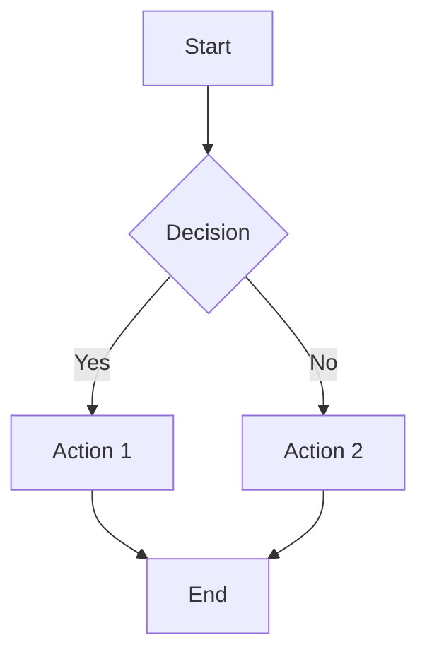
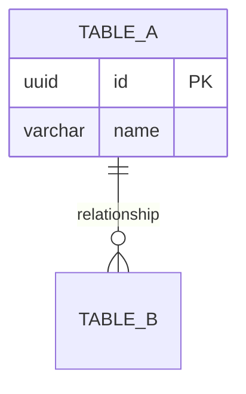
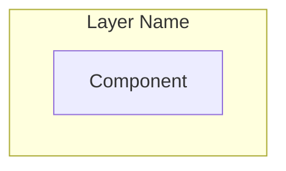
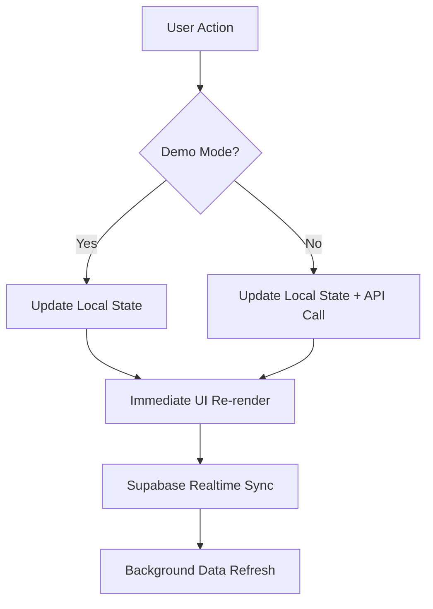

# YieldOps - Smart Fab

> **AI Coding Agent Guide** - This document contains essential information for AI agents working on the YieldOps project.

---

## Project Overview

**YieldOps - Smart Fab** is a full-stack Industrial IoT (IIoT) portfolio project demonstrating intelligent semiconductor manufacturing capabilities. The system simulates a fabrication plant with real-time machine monitoring, automated job dispatching using Theory of Constraints (ToC) algorithms, predictive maintenance through machine learning, and Virtual Metrology for advanced process control.

### Key Capabilities

- **Real-time Monitoring**: Live machine status via WebSockets/Supabase Realtime
- **Intelligent Dispatching**: Automated job routing based on efficiency and priority (Theory of Constraints)
- **Predictive Maintenance**: Anomaly detection using Isolation Forest with SPC control charts
- **Virtual Metrology**: Predict film thickness and enable Run-to-Run (R2R) control
- **Capacity Planning**: Monte Carlo simulation for production forecasting
- **Chaos Engineering**: Controlled failure injection for resilience testing
- **Process Capability (CPK)**: Statistical process control with CPK calculation and visualization
- **Job Lifecycle Management**: Full job status control (Pending → Queued → Running → Completed/Failed)
- **Autonomous Job Generation**: Database-backed dynamic job creation with weighted customers, priorities, and recipes
- **Simulation Speed Control**: 1x/10x/100x speed for accelerated demo/testing
- **Mobile-Responsive Design**: Full dashboard functionality on mobile devices
- **Demo Mode**: Full functionality without backend configuration

### Live Deployments

- **Frontend**: https://yield-ops-dashboard.vercel.app/
- **Backend API**: https://beneficial-mathilde-yieldops-883cf8bf.koyeb.app/

---

## Technology Stack

| Layer | Technology | Purpose | Hosting |
|-------|------------|---------|---------|
| **Frontend** | React 18 + Vite + TypeScript | UI Framework | Vercel |
| **Styling** | Tailwind CSS 3.4 | Utility-first CSS | - |
| **Charts** | Recharts | Data Visualization | - |
| **Icons** | Lucide React | Icon Library | - |
| **Backend** | FastAPI (Python 3.11) | API & ML Services | Koyeb |
| **Database** | PostgreSQL 15 | Primary Data Store | Supabase |
| **Realtime** | Supabase Realtime | WebSocket Events | Supabase |
| **ML** | Scikit-Learn | Anomaly Detection & VM | - |
| **Rust** | PyO3 + rayon | High-performance compute | - |

### Why This Stack?

| Component | Winner | Reason |
|-----------|--------|--------|
| **Database** | **Supabase** | Free Realtime (WebSockets) for live dashboard updates without polling |
| **Backend** | **Koyeb** | Free tier with no cold starts - stays running for responsive demos |
| **Frontend** | **Vercel** | Best React support with automatic CI/CD and client-side routing |

---

## Repository Structure

```
YieldOps/
├── apps/
│   ├── dashboard/          # React Frontend (Vercel)
│   │   ├── src/
│   │   │   ├── components/
│   │   │   │   ├── tabs/         # Overview, Machines, Jobs tabs
│   │   │   │   ├── ui/           # Reusable UI components
│   │   │   │   ├── MachineNode.tsx
│   │   │   │   ├── SPCControlChart.tsx
│   │   │   │   └── ...
│   │   │   ├── hooks/         # Custom React hooks
│   │   │   │   ├── useRealtime.ts
│   │   │   │   ├── useVirtualMetrology.ts
│   │   │   │   ├── useAutonomousSimulation.ts
│   │   │   │   └── useJobStream.ts
│   │   │   ├── services/      # API & Supabase clients
│   │   │   ├── lib/           # Utility libraries (spcEngine.ts)
│   │   │   └── types/         # TypeScript types
│   │   ├── .env               # Environment variables (not in git)
│   │   ├── package.json
│   │   ├── tsconfig.json
│   │   ├── tailwind.config.js
│   │   └── vercel.json
│   │
│   └── api/                # FastAPI Backend (Koyeb)
│       ├── app/
│       │   ├── api/v1/        # API endpoints
│       │   │   ├── machines.py
│       │   │   ├── jobs.py
│       │   │   ├── dispatch.py
│       │   │   ├── chaos.py
│       │   │   ├── analytics.py
│       │   │   ├── vm.py
│       │   │   ├── scheduler.py
│       │   │   └── job_generator.py
│       │   ├── core/          # ML & algorithms
│       │   │   ├── toc_engine.py
│       │   │   ├── anomaly_detector.py
│       │   │   ├── monte_carlo.py
│       │   │   ├── vm_engine.py
│       │   │   ├── dynamic_job_generator.py
│       │   │   ├── rust_monte_carlo.py
│       │   │   └── rust_scheduler.py
│       │   ├── models/        # Pydantic schemas
│       │   └── services/      # Database service
│       ├── .env               # Environment variables (not in git)
│       ├── requirements.txt
│       ├── Dockerfile
│       └── koyeb.yaml
│
├── packages/
│   └── types/              # Shared TypeScript types (minimal usage)
│
├── rust/                   # High-performance Rust extensions
│   ├── monte_carlo/        # Parallel Monte Carlo simulation
│   ├── scheduler/          # Constraint-based scheduler
│   ├── Cargo.toml          # Workspace configuration
│   └── pyproject.toml      # Maturin build config
│
├── database/               # Schema & seed files
│   ├── schema.sql          # Core database schema
│   ├── seed.sql            # Seed data (48 machines, 25 jobs)
│   ├── reset_and_seed.sql  # Full reset + seed for Supabase
│   └── migrations/
│       ├── 002_virtual_metrology.sql
│       └── 003_autonomous_jobs.sql
│
├── ml/                     # ML notebooks & scripts
├── README.md               # Project overview
├── Architecture.md         # Detailed architecture docs
├── package.json            # Root workspace config
└── koyeb.yaml              # Root Koyeb deployment config
```

---

## Build and Development Commands

### Prerequisites

- Node.js 18+
- Python 3.11+
- Rust (optional, for high-performance modules)
- Supabase account (optional for demo mode)

### Installation

```bash
# Install root dependencies
npm install

# Install dashboard dependencies
cd apps/dashboard && npm install

# Install API dependencies (requires Python 3.11+)
cd apps/api
python3 -m venv .venv
source .venv/bin/activate  # On Windows: .venv\Scripts\activate
pip install -r requirements.txt
```

### Development Commands

```bash
# From project root:

# Start dashboard dev server (Vite)
npm run dev:dashboard

# Start API dev server (FastAPI with hot reload)
npm run dev:api

# Build dashboard for production
npm run build

# Run linting (dashboard only)
npm run lint
```

### Rust Module Building (Optional)

```bash
cd rust

# Install maturin
pip install maturin

# Build for Python (requires PYO3_USE_ABI3_FORWARD_COMPATIBILITY for Python 3.14+)
PYO3_USE_ABI3_FORWARD_COMPATIBILITY=1 maturin develop --release
```

---

## Diagrams and Graphs

Use **Mermaid.js** syntax for all diagrams, flowcharts, and graphs in documentation.

### Common Mermaid Diagram Types

| Type | Use Case | Syntax |
|------|----------|--------|
| `flowchart` | Process flows, state machines, architecture | `flowchart TD` or `flowchart LR` |
| `erDiagram` | Entity relationship diagrams | `erDiagram` |
| `sequenceDiagram` | API call sequences | `sequenceDiagram` |
| `classDiagram` | Class hierarchies | `classDiagram` |
| `gantt` | Timelines, roadmaps | `gantt` |

### Example Patterns

**Flowchart (Top-Down):**


**Entity Relationship:**


**Architecture Diagram:**


---

## Code Style Guidelines

### Python (Backend)

- **Formatter**: Use `black` or consistent 4-space indentation
- **Imports**: Group as: stdlib → third-party → local (app.*)
- **Type Hints**: Use Python 3.11+ type hints with `|` union syntax
- **Docstrings**: Use Google-style docstrings for all public functions
- **Async**: All database operations use `async/await` with `asyncpg`
- **Error Handling**: Use try/except with specific exceptions, log with `logging` module

Example:
```python
"""
YieldOps API - Main Application

FastAPI application for Smart Fab IIoT Manufacturing Execution System.
"""

from fastapi import FastAPI
from fastapi.middleware.cors import CORSMiddleware
from contextlib import asynccontextmanager
import logging

# Configure logging
logging.basicConfig(
    level=logging.INFO,
    format='%(asctime)s - %(name)s - %(levelname)s - %(message)s'
)
logger = logging.getLogger(__name__)
```

### TypeScript/React (Frontend)

- **Formatter**: ESLint with TypeScript parser
- **Components**: Functional components with hooks
- **Imports**: Group as: React → third-party (lucide, recharts) → local (@/* aliases)
- **Types**: Define interfaces in `src/types/index.ts`
- **Styling**: Tailwind CSS utility classes
- **Naming**: PascalCase for components, camelCase for functions/variables
- **Mobile-First**: Use responsive prefixes (`sm:`, `md:`, `lg:`) for responsive design

Example:
```typescript
import { useState, useEffect } from 'react';
import { RefreshCw } from 'lucide-react';
import { Machine } from './types';

interface KpiCardProps {
  title: string;
  value: number;
  icon: React.ReactNode;
}

export function KpiCard({ title, value, icon }: KpiCardProps) {
  return (
    <div className="bg-white rounded-lg shadow p-4 sm:p-6">
      <div className="flex items-center justify-between">
        <h3 className="text-sm font-medium text-gray-500">{title}</h3>
        {icon}
      </div>
      <p className="mt-2 text-2xl sm:text-3xl font-bold">{value}</p>
    </div>
  );
}
```

### Tailwind CSS Conventions

- Use responsive prefixes for mobile-first design: `px-4 sm:px-6 lg:px-8`
- Hide labels on mobile: `hidden sm:block` or `hidden sm:inline`
- Grid layouts: `grid-cols-2 sm:grid-cols-3 md:grid-cols-4`
- Content clearance for fixed bottom nav: `pb-24`
- Touch-friendly tap targets: minimum 48px (`min-w-[48px] min-h-[48px]`)

### Database/SQL Conventions

- Use lowercase for SQL keywords
- Use snake_case for table and column names
- Always include timestamps (`created_at`, `updated_at`)
- Use UUID for primary keys with `uuid_generate_v4()`
- Include foreign key constraints with `ON DELETE CASCADE` where appropriate

---

## Testing Instructions

### Backend Testing

```bash
cd apps/api

# Run all tests
pytest tests/

# Run with coverage
pytest --cov=app tests/
```

### Manual API Testing

```bash
# Health check
curl http://localhost:8000/health

# Get machines
curl http://localhost:8000/api/v1/machines

# Inject chaos
curl -X POST http://localhost:8000/api/v1/chaos/inject \
  -H "Content-Type: application/json" \
  -d '{"failure_type": "machine_down"}'

# Run Monte Carlo simulation
curl -X POST http://localhost:8000/api/v1/analytics/monte-carlo \
  -H "Content-Type: application/json" \
  -d '{"time_horizon_days": 30, "n_simulations": 1000}'

# Get VM status
curl http://localhost:8000/api/v1/vm/status/{machine_id}
```

### Frontend Testing

```bash
cd apps/dashboard

# Run linting
npm run lint

# Build (catches TypeScript errors)
npm run build
```

---

## Deployment

### Frontend (Vercel)

1. Connect GitHub repo to Vercel
2. Set framework preset to "Vite"
3. Set root directory to `apps/dashboard`
4. Add environment variables:
   - `VITE_SUPABASE_URL`
   - `VITE_SUPABASE_ANON_KEY`
   - `VITE_API_URL`

### Backend (Koyeb)

Using Koyeb CLI:
```bash
koyeb app create yieldops-api \
  --git github.com:AngelP17/YieldOps.git \
  --git-branch main \
  --git-build-command "pip install -r requirements.txt" \
  --git-run-command "uvicorn app.main:app --host 0.0.0.0 --port 8000" \
  --git-workdir apps/api \
  --ports 8000:http \
  --instance-type nano
```

### Database (Supabase)

1. Create project at [supabase.com](https://supabase.com)
2. Run migrations in Supabase SQL Editor (in order):
   - `database/reset_and_seed.sql`
   - `database/migrations/003_autonomous_jobs.sql`

---

## Security Considerations

### Pre-commit Hooks

The project uses `detect-secrets` to prevent accidental commit of secrets:

```yaml
# .pre-commit-config.yaml
repos:
  - repo: https://github.com/Yelp/detect-secrets
    rev: v1.5.0
    hooks:
      - id: detect-secrets
        args: ['--baseline', '.secrets.baseline']
```

### Environment Variables

**Never commit `.env` files!** They are in `.gitignore`.

Required environment variables:

**apps/api/.env:**
```bash
SUPABASE_URL=your_supabase_url
SUPABASE_SERVICE_KEY=your_service_key
SUPABASE_ANON_KEY=your_anon_key
DEBUG=true
AUTO_INIT_MODEL=true
```

**apps/dashboard/.env:**
```bash
VITE_SUPABASE_URL=your_supabase_url
VITE_SUPABASE_ANON_KEY=your_anon_key
VITE_API_URL=http://localhost:8000
```

### CORS Configuration

The API has CORS configured for specific origins in `apps/api/app/main.py`:
- Production: `https://yield-ops-dashboard.vercel.app`
- Local development: `http://localhost:5173`, `http://localhost:3000`

### Database Security

- Row Level Security (RLS) policies are defined in `database/schema.sql`
- Service key should only be used server-side
- Anon key is safe for client-side usage

---

## Key Architecture Patterns

### Dual-State Pattern (Frontend)

The frontend uses a dual-state pattern for immediate UI feedback:



### Job Lifecycle States

```
PENDING → QUEUED → RUNNING → COMPLETED
   ↓          ↓          ↓
CANCELLED  CANCELLED   FAILED
   ↑          ↑          ↑
 (Retry)   (Retry)    (Retry)
```

### Machine Status States

- `IDLE` - Available for new jobs
- `RUNNING` - Processing a job
- `DOWN` - Failed, needs recovery
- `MAINTENANCE` - Scheduled maintenance

---

## Important File Locations

| Purpose | Path |
|---------|------|
| API Entry Point | `apps/api/app/main.py` |
| Frontend Entry | `apps/dashboard/src/App.tsx` |
| Database Schema | `database/schema.sql` |
| Database Seed | `database/seed.sql` |
| Types (Shared) | `apps/dashboard/src/types/index.ts` |
| SPC Engine | `apps/dashboard/src/lib/spcEngine.ts` |
| ToC Engine | `apps/api/app/core/toc_engine.py` |
| Anomaly Detector | `apps/api/app/core/anomaly_detector.py` |
| VM Engine | `apps/api/app/core/vm_engine.py` |
| Job Generator | `apps/api/app/core/dynamic_job_generator.py` |

---

## Documentation References

- `README.md` - Project overview and quick start
- `Architecture.md` - Detailed architecture, database schema, API specs
- `apps/api/README.md` - API-specific documentation
- `apps/dashboard/README.md` - Frontend documentation

---

## License

MIT License
