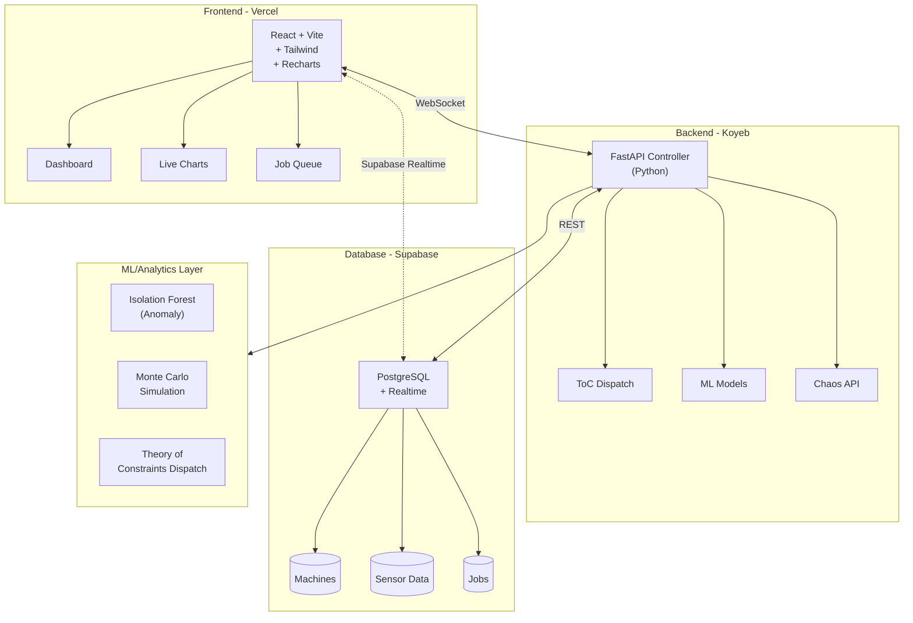
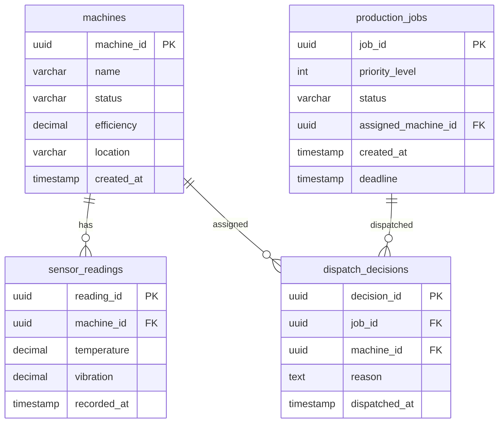

# YieldOps - Smart Fab Architecture
## Intelligent Manufacturing & IIoT Portfolio Project

**Monorepo:** `git@github.com:AngelP17/YieldOps.git`  
**Supabase:** `https://vwayvxcvkozxumezwqio.supabase.co`

### Credentials
```
SUPABASE_URL=https://vwayvxcvkozxumezwqio.supabase.co
SUPABASE_ANON_KEY=YOUR_SUPABASE_ANON_KEY
SUPABASE_SERVICE_KEY=YOUR_SUPABASE_SERVICE_KEY
```

---

## Executive Summary

**Smart Fab** is a full-stack Industrial IoT (IIoT) portfolio project demonstrating intelligent semiconductor manufacturing capabilities. The system simulates a fabrication plant with real-time machine monitoring, automated job dispatching using Theory of Constraints (ToC) algorithms, and predictive maintenance through machine learning.

### Key Capabilities
- **Real-time Monitoring**: Live machine status via WebSockets
- **Intelligent Dispatching**: Automated job routing based on efficiency and priority
- **Predictive Maintenance**: Anomaly detection using Isolation Forest
- **Capacity Planning**: Monte Carlo simulation for production forecasting
- **Chaos Engineering**: Controlled failure injection for resilience testing

---

## Architecture Overview



---

## Technology Stack

| Layer | Technology | Purpose | Free Tier |
|-------|------------|---------|-----------|
| **Frontend** | React 18 + Vite + TypeScript | UI Framework | **Vercel** |
| **Styling** | Tailwind CSS 3.4 | Utility-first CSS | - |
| **Charts** | Recharts | Data Visualization | - |
| **Backend** | FastAPI (Python 3.11) | API & ML Services | **Koyeb** |
| **Database** | PostgreSQL 15 | Primary Data Store | **Supabase** |
| **Realtime** | Supabase Realtime | WebSocket Events | **Supabase** |
| **ML** | Scikit-Learn | Anomaly Detection | - |
| **Container** | Docker | Deployment | - |

### Why This Stack?

| Component | Winner | Why It Wins |
|-----------|--------|-------------|
| **Database** | **Supabase** | The only option that gives you **Realtime (WebSockets) for free**. Essential for live dashboard updates without polling. |
| **Backend** | **Koyeb** | Free tier with 2 nano instances (512MB RAM, 0.1 vCPU). No cold starts like Render - stays running. Better for demos that need to be responsive. |
| **Frontend** | **Vercel** | Better for React than GitHub Pages. Handles client-side routing (React Router) out of the box and automatically sets up CI/CD from your repo. |

---

## Database Schema

### Entity Relationship Diagram



### SQL Schema Definition

```sql
-- =====================================================
-- TSMC SMART FACTORY - DATABASE SCHEMA
-- PostgreSQL 15+ | Supabase Compatible
-- =====================================================

-- Enable UUID extension
CREATE EXTENSION IF NOT EXISTS "uuid-ossp";

-- =====================================================
-- TABLE: machines
-- Purpose: Store fabrication equipment metadata and status
-- =====================================================
CREATE TABLE machines (
    machine_id UUID PRIMARY KEY DEFAULT uuid_generate_v4(),
    name VARCHAR(100) NOT NULL UNIQUE,
    type VARCHAR(50) NOT NULL CHECK (type IN ('lithography', 'etching', 'deposition', 'inspection', 'cleaning')),
    status VARCHAR(20) NOT NULL DEFAULT 'IDLE' CHECK (status IN ('IDLE', 'RUNNING', 'DOWN', 'MAINTENANCE')),
    efficiency_rating DECIMAL(4,2) NOT NULL CHECK (efficiency_rating >= 0.00 AND efficiency_rating <= 1.00),
    location_zone VARCHAR(20) NOT NULL,
    max_temperature DECIMAL(6,2) DEFAULT 85.00,
    max_vibration DECIMAL(6,2) DEFAULT 5.00,
    current_wafer_count INTEGER DEFAULT 0,
    total_wafers_processed INTEGER DEFAULT 0,
    last_maintenance TIMESTAMP WITH TIME ZONE,
    created_at TIMESTAMP WITH TIME ZONE DEFAULT NOW(),
    updated_at TIMESTAMP WITH TIME ZONE DEFAULT NOW()
);

COMMENT ON TABLE machines IS 'Semiconductor fabrication equipment registry';
COMMENT ON COLUMN machines.efficiency_rating IS 'Throughput efficiency (0.00-1.00). Higher = faster processing';

-- =====================================================
-- TABLE: sensor_readings
-- Purpose: Real-time IoT sensor data from machines
-- =====================================================
CREATE TABLE sensor_readings (
    reading_id UUID PRIMARY KEY DEFAULT uuid_generate_v4(),
    machine_id UUID NOT NULL REFERENCES machines(machine_id) ON DELETE CASCADE,
    temperature DECIMAL(6,2) NOT NULL CHECK (temperature >= -50 AND temperature <= 200),
    vibration DECIMAL(6,3) NOT NULL CHECK (vibration >= 0),
    pressure DECIMAL(8,2),
    humidity DECIMAL(5,2),
    power_consumption DECIMAL(8,2),
    is_anomaly BOOLEAN DEFAULT FALSE,
    anomaly_score DECIMAL(5,4),
    recorded_at TIMESTAMP WITH TIME ZONE DEFAULT NOW()
);

-- Index for time-series queries
CREATE INDEX idx_sensor_readings_machine_time 
    ON sensor_readings(machine_id, recorded_at DESC);

-- Index for anomaly detection queries
CREATE INDEX idx_sensor_readings_anomaly 
    ON sensor_readings(is_anomaly, recorded_at DESC) 
    WHERE is_anomaly = TRUE;

COMMENT ON TABLE sensor_readings IS 'Real-time sensor telemetry from IIoT devices';

-- =====================================================
-- TABLE: production_jobs
-- Purpose: Wafer processing jobs with priority levels
-- =====================================================
CREATE TABLE production_jobs (
    job_id UUID PRIMARY KEY DEFAULT uuid_generate_v4(),
    job_name VARCHAR(100) NOT NULL,
    wafer_count INTEGER NOT NULL CHECK (wafer_count > 0),
    priority_level INTEGER NOT NULL CHECK (priority_level BETWEEN 1 AND 5),
    status VARCHAR(20) NOT NULL DEFAULT 'PENDING' 
        CHECK (status IN ('PENDING', 'QUEUED', 'RUNNING', 'COMPLETED', 'FAILED', 'CANCELLED')),
    recipe_type VARCHAR(50) NOT NULL,
    assigned_machine_id UUID REFERENCES machines(machine_id),
    estimated_duration_minutes INTEGER,
    actual_start_time TIMESTAMP WITH TIME ZONE,
    actual_end_time TIMESTAMP WITH TIME ZONE,
    deadline TIMESTAMP WITH TIME ZONE,
    customer_tag VARCHAR(50),
    is_hot_lot BOOLEAN DEFAULT FALSE,
    created_at TIMESTAMP WITH TIME ZONE DEFAULT NOW(),
    updated_at TIMESTAMP WITH TIME ZONE DEFAULT NOW()
);

-- Index for dispatch queries (priority-based)
CREATE INDEX idx_production_jobs_dispatch 
    ON production_jobs(status, priority_level DESC, created_at ASC) 
    WHERE status = 'PENDING';

-- Index for hot lots
CREATE INDEX idx_production_jobs_hot_lot 
    ON production_jobs(is_hot_lot, priority_level DESC) 
    WHERE is_hot_lot = TRUE;

COMMENT ON TABLE production_jobs IS 'Wafer processing jobs with Theory of Constraints priority';
COMMENT ON COLUMN production_jobs.priority_level IS '1=Highest (Hot Lots), 5=Lowest (Standard)';
COMMENT ON COLUMN production_jobs.is_hot_lot IS 'VIP customer jobs that bypass normal queue';

-- =====================================================
-- TABLE: dispatch_decisions
-- Purpose: Audit log for ToC dispatch algorithm decisions
-- =====================================================
CREATE TABLE dispatch_decisions (
    decision_id UUID PRIMARY KEY DEFAULT uuid_generate_v4(),
    job_id UUID NOT NULL REFERENCES production_jobs(job_id),
    machine_id UUID NOT NULL REFERENCES machines(machine_id),
    decision_reason TEXT NOT NULL,
    algorithm_version VARCHAR(20) DEFAULT '1.0.0',
    efficiency_at_dispatch DECIMAL(4,2),
    queue_depth_at_dispatch INTEGER,
    estimated_completion TIMESTAMP WITH TIME ZONE,
    dispatched_at TIMESTAMP WITH TIME ZONE DEFAULT NOW()
);

-- Index for analytics
CREATE INDEX idx_dispatch_decisions_time 
    ON dispatch_decisions(dispatched_at DESC);

COMMENT ON TABLE dispatch_decisions IS 'Audit trail for Theory of Constraints dispatch decisions';

-- =====================================================
-- TABLE: maintenance_logs
-- Purpose: Track machine maintenance history
-- =====================================================
CREATE TABLE maintenance_logs (
    log_id UUID PRIMARY KEY DEFAULT uuid_generate_v4(),
    machine_id UUID NOT NULL REFERENCES machines(machine_id),
    maintenance_type VARCHAR(50) NOT NULL,
    description TEXT,
    technician_id VARCHAR(50),
    started_at TIMESTAMP WITH TIME ZONE,
    completed_at TIMESTAMP WITH TIME ZONE,
    downtime_minutes INTEGER,
    parts_replaced TEXT[]
);

-- =====================================================
-- TABLE: capacity_simulations
-- Purpose: Store Monte Carlo simulation results
-- =====================================================
CREATE TABLE capacity_simulations (
    simulation_id UUID PRIMARY KEY DEFAULT uuid_generate_v4(),
    simulation_name VARCHAR(100) NOT NULL,
    scenario_params JSONB NOT NULL,
    iterations INTEGER NOT NULL,
    mean_throughput DECIMAL(10,2),
    p95_throughput DECIMAL(10,2),
    p99_throughput DECIMAL(10,2),
    confidence_interval JSONB,
    results_data JSONB,
    created_at TIMESTAMP WITH TIME ZONE DEFAULT NOW()
);

-- =====================================================
-- TABLE: anomaly_alerts
-- Purpose: ML-detected anomaly notifications
-- =====================================================
CREATE TABLE anomaly_alerts (
    alert_id UUID PRIMARY KEY DEFAULT uuid_generate_v4(),
    machine_id UUID NOT NULL REFERENCES machines(machine_id),
    reading_id UUID REFERENCES sensor_readings(reading_id),
    alert_type VARCHAR(50) NOT NULL,
    severity VARCHAR(20) NOT NULL CHECK (severity IN ('LOW', 'MEDIUM', 'HIGH', 'CRITICAL')),
    description TEXT,
    acknowledged BOOLEAN DEFAULT FALSE,
    acknowledged_by VARCHAR(50),
    acknowledged_at TIMESTAMP WITH TIME ZONE,
    created_at TIMESTAMP WITH TIME ZONE DEFAULT NOW()
);

-- =====================================================
-- FUNCTIONS & TRIGGERS
-- =====================================================

-- Auto-update updated_at timestamp
CREATE OR REPLACE FUNCTION update_updated_at_column()
RETURNS TRIGGER AS $$
BEGIN
    NEW.updated_at = NOW();
    RETURN NEW;
END;
$$ LANGUAGE plpgsql;

CREATE TRIGGER update_machines_updated_at
    BEFORE UPDATE ON machines
    FOR EACH ROW EXECUTE FUNCTION update_updated_at_column();

CREATE TRIGGER update_production_jobs_updated_at
    BEFORE UPDATE ON production_jobs
    FOR EACH ROW EXECUTE FUNCTION update_updated_at_column();

-- Function to calculate machine utilization
CREATE OR REPLACE FUNCTION get_machine_utilization(
    p_machine_id UUID,
    p_hours INTEGER DEFAULT 24
)
RETURNS DECIMAL(5,2) AS $$
DECLARE
    v_total_time INTERVAL;
    v_running_time INTERVAL;
    v_utilization DECIMAL(5,2);
BEGIN
    SELECT 
        COALESCE(SUM(actual_end_time - actual_start_time), INTERVAL '0')
    INTO v_running_time
    FROM production_jobs
    WHERE assigned_machine_id = p_machine_id
      AND actual_start_time >= NOW() - (p_hours || ' hours')::INTERVAL
      AND status = 'COMPLETED';
    
    v_total_time := (p_hours || ' hours')::INTERVAL;
    v_utilization := LEAST(100.00, ROUND(
        (EXTRACT(EPOCH FROM v_running_time) / EXTRACT(EPOCH FROM v_total_time)) * 100, 2
    ));
    
    RETURN v_utilization;
END;
$$ LANGUAGE plpgsql;

-- =====================================================
-- ROW LEVEL SECURITY (RLS) POLICIES
-- =====================================================

-- Enable RLS on all tables
ALTER TABLE machines ENABLE ROW LEVEL SECURITY;
ALTER TABLE sensor_readings ENABLE ROW LEVEL SECURITY;
ALTER TABLE production_jobs ENABLE ROW LEVEL SECURITY;
ALTER TABLE dispatch_decisions ENABLE ROW LEVEL SECURITY;

-- Allow read access to all authenticated users
CREATE POLICY "Allow read access" ON machines FOR SELECT USING (true);
CREATE POLICY "Allow read access" ON sensor_readings FOR SELECT USING (true);
CREATE POLICY "Allow read access" ON production_jobs FOR SELECT USING (true);
CREATE POLICY "Allow read access" ON dispatch_decisions FOR SELECT USING (true);

-- Allow insert/update for service role only
CREATE POLICY "Allow service insert" ON machines FOR INSERT WITH CHECK (true);
CREATE POLICY "Allow service update" ON machines FOR UPDATE USING (true);
CREATE POLICY "Allow service insert" ON sensor_readings FOR INSERT WITH CHECK (true);
CREATE POLICY "Allow service insert" ON production_jobs FOR INSERT WITH CHECK (true);
CREATE POLICY "Allow service update" ON production_jobs FOR UPDATE USING (true);
CREATE POLICY "Allow service insert" ON dispatch_decisions FOR INSERT WITH CHECK (true);
```

---

## Seed Data Script

```sql
-- =====================================================
-- SEED DATA: TSMC SMART FACTORY
-- Run after schema creation
-- =====================================================

-- Clear existing data (optional - for reset)
-- TRUNCATE TABLE dispatch_decisions, production_jobs, sensor_readings, machines CASCADE;

-- =====================================================
-- SEED: Machines (8 machines representing a mini-fab)
-- =====================================================
INSERT INTO machines (machine_id, name, type, status, efficiency_rating, location_zone, max_temperature, max_vibration, last_maintenance) VALUES
-- Lithography (Bottleneck process - highest value)
('a1b2c3d4-e5f6-7890-abcd-ef1234567890', 'LITHO-01', 'lithography', 'IDLE', 0.95, 'ZONE_A', 75.00, 2.50, NOW() - INTERVAL '7 days'),
('b2c3d4e5-f6a7-8901-bcde-f12345678901', 'LITHO-02', 'lithography', 'IDLE', 0.88, 'ZONE_A', 75.00, 2.50, NOW() - INTERVAL '5 days'),

-- Etching
('c3d4e5f6-a7b8-9012-cdef-123456789012', 'ETCH-01', 'etching', 'IDLE', 0.92, 'ZONE_B', 85.00, 4.00, NOW() - INTERVAL '3 days'),
('d4e5f6a7-b8c9-0123-defa-234567890123', 'ETCH-02', 'etching', 'IDLE', 0.85, 'ZONE_B', 85.00, 4.00, NOW() - INTERVAL '10 days'),

-- Deposition
('e5f6a7b8-c9d0-1234-efab-345678901234', 'DEP-01', 'deposition', 'IDLE', 0.90, 'ZONE_C', 80.00, 3.00, NOW() - INTERVAL '4 days'),
('f6a7b8c9-d0e1-2345-fabc-456789012345', 'DEP-02', 'deposition', 'IDLE', 0.87, 'ZONE_C', 80.00, 3.00, NOW() - INTERVAL '8 days'),

-- Inspection (Critical for quality)
('a7b8c9d0-e1f2-3456-abcd-567890123456', 'INSP-01', 'inspection', 'IDLE', 0.93, 'ZONE_D', 70.00, 1.50, NOW() - INTERVAL '2 days'),

-- Cleaning
('b8c9d0e1-f2a3-4567-bcde-678901234567', 'CLEAN-01', 'cleaning', 'IDLE', 0.89, 'ZONE_E', 65.00, 2.00, NOW() - INTERVAL '6 days');

-- =====================================================
-- SEED: Production Jobs (Mix of priorities and hot lots)
-- =====================================================
INSERT INTO production_jobs (job_id, job_name, wafer_count, priority_level, status, recipe_type, estimated_duration_minutes, deadline, customer_tag, is_hot_lot) VALUES
-- Hot Lots (Priority 1) - VIP customers
('c9d0e1f2-a3b4-5678-cdef-789012345678', 'HOT-LOT-001', 25, 1, 'PENDING', 'ADVANCED_LOGIC', 180, NOW() + INTERVAL '12 hours', 'APPLE', TRUE),
('d0e1f2a3-b4c5-6789-defa-890123456789', 'HOT-LOT-002', 25, 1, 'PENDING', '5NM_FINFE', 240, NOW() + INTERVAL '18 hours', 'NVIDIA', TRUE),

-- High Priority (Priority 2)
('e1f2a3b4-c5d6-7890-efab-901234567890', 'WAFER-BATCH-103', 50, 2, 'PENDING', 'STANDARD_LOGIC', 300, NOW() + INTERVAL '24 hours', 'AMD', FALSE),
('f2a3b4c5-d6e7-8901-fabc-012345678901', 'WAFER-BATCH-104', 50, 2, 'PENDING', 'MEMORY_DRAM', 280, NOW() + INTERVAL '30 hours', 'MICRON', FALSE),

-- Medium Priority (Priority 3)
('a3b4c5d6-e7f8-9012-abcd-123456789012', 'WAFER-BATCH-105', 100, 3, 'PENDING', 'IO_CONTROLLER', 420, NOW() + INTERVAL '48 hours', 'QUALCOMM', FALSE),
('b4c5d6e7-f8a9-0123-bcde-234567890123', 'WAFER-BATCH-106', 100, 3, 'PENDING', 'POWER_MANAGEMENT', 360, NOW() + INTERVAL '52 hours', 'TI', FALSE),

-- Standard Priority (Priority 4)
('c5d6e7f8-a9b0-1234-cdef-345678901234', 'WAFER-BATCH-107', 200, 4, 'PENDING', 'ANALOG_MIXER', 600, NOW() + INTERVAL '72 hours', 'ADI', FALSE),

-- Low Priority (Priority 5)
('d6e7f8a9-b0c1-2345-defa-456789012345', 'WAFER-BATCH-108', 300, 5, 'PENDING', 'TEST_CHIPS', 900, NOW() + INTERVAL '168 hours', 'INTERNAL', FALSE);

-- =====================================================
-- SEED: Historical Sensor Readings (for ML training)
-- =====================================================
-- Generate 1000 synthetic readings per machine
DO $$
DECLARE
    v_machine RECORD;
    v_i INTEGER;
    v_temp DECIMAL(6,2);
    v_vib DECIMAL(6,3);
BEGIN
    FOR v_machine IN SELECT machine_id, max_temperature, max_vibration FROM machines LOOP
        FOR v_i IN 1..100 LOOP
            -- Normal readings (95% of data)
            IF random() < 0.95 THEN
                v_temp := v_machine.max_temperature * (0.7 + random() * 0.2);
                v_vib := v_machine.max_vibration * (0.4 + random() * 0.3);
            ELSE
                -- Anomalous readings (5% of data)
                v_temp := v_machine.max_temperature * (0.95 + random() * 0.1);
                v_vib := v_machine.max_vibration * (0.85 + random() * 0.2);
            END IF;
            
            INSERT INTO sensor_readings (machine_id, temperature, vibration, recorded_at)
            VALUES (
                v_machine.machine_id,
                v_temp,
                v_vib,
                NOW() - (random() * 7 || ' days')::INTERVAL - (random() * 24 || ' hours')::INTERVAL
            );
        END LOOP;
    END LOOP;
END $$;

-- =====================================================
-- SEED: Sample Dispatch Decisions (for analytics)
-- =====================================================
INSERT INTO dispatch_decisions (job_id, machine_id, decision_reason, efficiency_at_dispatch, queue_depth_at_dispatch)
SELECT 
    pj.job_id,
    m.machine_id,
    'Initial seed - ToC dispatch: Highest efficiency available machine',
    m.efficiency_rating,
    0
FROM production_jobs pj
CROSS JOIN (SELECT machine_id, efficiency_rating FROM machines ORDER BY efficiency_rating DESC LIMIT 1) m
WHERE pj.status = 'PENDING'
LIMIT 3;

-- =====================================================
-- VERIFICATION QUERY
-- =====================================================
SELECT 'Machines' as table_name, COUNT(*) as record_count FROM machines
UNION ALL
SELECT 'Sensor Readings', COUNT(*) FROM sensor_readings
UNION ALL
SELECT 'Production Jobs', COUNT(*) FROM production_jobs
UNION ALL
SELECT 'Dispatch Decisions', COUNT(*) FROM dispatch_decisions;
```

---

## Repository Structure

### Monorepo Strategy (YieldOps)

```
YieldOps/                          # Root Monorepo
├── README.md
├── .gitignore
├── package.json                   # Root package.json for scripts
│
├── apps/
│   ├── dashboard/                 # React Frontend (Vercel)
│   │   ├── src/
│   │   │   ├── components/
│   │   │   │   ├── MachineNode.tsx
│   │   │   │   ├── JobQueue.tsx
│   │   │   │   ├── RealtimeChart.tsx
│   │   │   │   └── DispatchPanel.tsx
│   │   │   ├── hooks/
│   │   │   │   ├── useSupabase.ts
│   │   │   │   ├── useRealtime.ts
│   │   │   │   └── useMachines.ts
│   │   │   ├── services/
│   │   │   │   ├── supabaseClient.ts
│   │   │   │   └── apiClient.ts
│   │   │   ├── types/
│   │   │   │   └── index.ts
│   │   │   ├── App.tsx
│   │   │   └── main.tsx
│   │   ├── public/
│   │   ├── index.html
│   │   ├── package.json
│   │   ├── tailwind.config.js
│   │   ├── vite.config.ts
│   │   ├── tsconfig.json
│   │   └── vercel.json           # Vercel deployment config
│   │
│   └── api/                       # FastAPI Backend (Render)
│       ├── app/
│       │   ├── __init__.py
│       │   ├── main.py
│       │   ├── config.py
│       │   ├── api/
│       │   │   ├── __init__.py
│       │   │   └── v1/
│       │   │       ├── __init__.py
│       │   │       ├── dispatch.py
│       │   │       ├── machines.py
│       │   │       ├── jobs.py
│       │   │       ├── chaos.py
│       │   │       └── analytics.py
│       │   ├── core/
│       │   │   ├── __init__.py
│       │   │   ├── toc_engine.py
│       │   │   ├── anomaly_detector.py
│       │   │   └── monte_carlo.py
│       │   ├── models/
│       │   │   ├── __init__.py
│       │   │   ├── schemas.py
│       │   │   └── database.py
│       │   └── services/
│       │       ├── __init__.py
│       │       ├── supabase_service.py
│       │       └── ml_service.py
│       ├── tests/
│       ├── requirements.txt
│       ├── Dockerfile
│       ├── render.yaml            # Render deployment config
│       └── Procfile
│
├── packages/
│   └── types/                     # Shared TypeScript types
│       ├── src/
│       │   ├── index.ts
│       │   ├── machine.ts
│       │   ├── job.ts
│       │   └── sensor.ts
│       ├── package.json
│       └── tsconfig.json
│
├── ml/                            # ML & Simulation (local/dev)
│   ├── notebooks/
│   │   ├── anomaly_detection.ipynb
│   │   └── capacity_planning.ipynb
│   ├── scripts/
│   │   ├── train_anomaly_model.py
│   │   ├── monte_carlo_sim.py
│   │   └── data_generator.py
│   ├── models/
│   │   └── isolation_forest.pkl
│   └── requirements.txt
│
└── database/
    ├── schema.sql                 # PostgreSQL schema
    └── seed.sql                   # Seed data
```

### Why Monorepo?

| Benefit | Description |
|---------|-------------|
| **Single Source of Truth** | All code in one repo - easy to track changes |
| **Shared Types** | TypeScript types shared between frontend and backend |
| **Atomic Deploys** | Frontend and backend changes deploy together |
| **Easier CI/CD** | One GitHub Actions workflow for everything |
| **Code Reuse** | Shared utilities, types, and configurations |

---

## Phase 1: Foundation Setup Commands

### 1.1 Supabase Project Setup (Your Credentials)

```bash
# =====================================================
# YOUR SUPABASE CONFIGURATION
# =====================================================
# URL: https://vwayvxcvkozxumezwqio.supabase.co
# Anon Key: YOUR_SUPABASE_ANON_KEY
# Service Role Key: YOUR_SUPABASE_SERVICE_KEY

SUPABASE_URL=https://vwayvxcvkozxumezwqio.supabase.co
SUPABASE_ANON_KEY=YOUR_SUPABASE_ANON_KEY
SUPABASE_SERVICE_ROLE_KEY=YOUR_SUPABASE_SERVICE_KEY

# =====================================================
# SETUP STEPS
# =====================================================
# 1. Go to https://supabase.com/dashboard/project/vwayvxcvkozxumezwqio
# 2. SQL Editor → New Query → Paste schema.sql → Run
# 3. SQL Editor → New Query → Paste seed.sql → Run

# =====================================================
# ENABLE REALTIME (Critical for Live Dashboard)
# =====================================================
# 1. Go to Database → Replication
# 2. Toggle "Realtime" to ON
# 3. Under "Source", click "Add Table"
# 4. Add these tables for real-time updates:
#    - machines (for status changes)
#    - sensor_readings (for live sensor data)
#    - production_jobs (for job status updates)
#
# This enables WebSocket subscriptions - no polling needed!
```

### 1.2 Monorepo Initialization (YieldOps)

```bash
# =====================================================
# YIELDOPS MONOREPO SETUP
# Repo: git@github.com:AngelP17/YieldOps.git
# =====================================================

# Create project directory
mkdir -p ~/projects/YieldOps && cd ~/projects/YieldOps

# Initialize git
git init

# Create root .gitignore
cat > .gitignore << 'EOF'
# Dependencies
node_modules/
__pycache__/
*.pyc
.venv/
venv/

# Environment
.env
.env.local
.env.*.local

# Build outputs
dist/
build/
*.egg-info/

# IDE
.vscode/
.idea/
*.swp
*.swo

# OS
.DS_Store
Thumbs.db

# ML models (large files)
*.pkl
*.h5

# Data
data/*.csv
!data/.gitkeep
EOF

# Create root package.json
cat > package.json << 'EOF'
{
  "name": "yieldops",
  "version": "1.0.0",
  "description": "Smart Fab - Intelligent Manufacturing Monorepo",
  "private": true,
  "workspaces": [
    "apps/*",
    "packages/*"
  ],
  "scripts": {
    "dev:dashboard": "cd apps/dashboard && npm run dev",
    "dev:api": "cd apps/api && uvicorn app.main:app --reload",
    "build": "cd apps/dashboard && npm run build",
    "lint": "cd apps/dashboard && npm run lint"
  },
  "devDependencies": {
    "concurrently": "^8.2.0"
  }
}
EOF

# =====================================================
# APPS: Dashboard (React + Vite)
# =====================================================
mkdir -p apps/dashboard
cd apps/dashboard

# Initialize Vite + React + TypeScript
npm create vite@latest . -- --template react-ts

# Install dependencies
npm install
npm install -D tailwindcss postcss autoprefixer
npx tailwindcss init -p

# Install UI and data visualization libraries
npm install @supabase/supabase-js recharts lucide-react
npm install -D @types/node

# Create .env file for dashboard
cat > .env << 'EOF'
VITE_SUPABASE_URL=https://vwayvxcvkozxumezwqio.supabase.co
VITE_SUPABASE_ANON_KEY=YOUR_SUPABASE_ANON_KEY
VITE_API_URL=https://yieldops-api.onrender.com
EOF

# Create vercel.json for deployment
cat > vercel.json << 'EOF'
{
  "buildCommand": "npm run build",
  "outputDirectory": "dist",
  "framework": "vite",
  "rewrites": [
    { "source": "/(.*)", "destination": "/index.html" }
  ]
}
EOF

cd ../..

# =====================================================
# APPS: API (FastAPI)
# =====================================================
mkdir -p apps/api
cd apps/api

# Create Python virtual environment
python3 -m venv .venv
source .venv/bin/activate  # Windows: .venv\Scripts\activate

# Create requirements.txt
cat > requirements.txt << 'EOF'
# FastAPI & Server
fastapi==0.109.0
uvicorn[standard]==0.27.0
python-dotenv==1.0.0

# Database
supabase==2.3.0
psycopg2-binary==2.9.9
asyncpg==0.29.0

# ML & Analytics
scikit-learn==1.4.0
numpy==1.26.3
pandas==2.2.0
scipy==1.12.0

# Data Validation
pydantic==2.5.3
pydantic-settings==2.1.0

# Testing
pytest==8.0.0
pytest-asyncio==0.23.3
httpx==0.26.0
EOF

# Install dependencies
pip install -r requirements.txt

# Create directory structure
mkdir -p app/api/v1 app/core app/models app/services tests

# Create main.py
cat > app/main.py << 'EOF'
from fastapi import FastAPI
from fastapi.middleware.cors import CORSMiddleware
from app.api.v1 import dispatch, machines, jobs, chaos, analytics
from app.config import settings

app = FastAPI(
    title="YieldOps API",
    description="IIoT Manufacturing Execution System API",
    version="1.0.0"
)

# CORS for frontend (Vercel)
app.add_middleware(
    CORSMiddleware,
    allow_origins=[
        "https://yieldops.vercel.app",
        "https://yieldops-dashboard.vercel.app",
        "http://localhost:5173",  # Vite dev server
    ],
    allow_credentials=True,
    allow_methods=["*"],
    allow_headers=["*"],
)

# API Routes
app.include_router(dispatch.router, prefix="/api/v1/dispatch", tags=["dispatch"])
app.include_router(machines.router, prefix="/api/v1/machines", tags=["machines"])
app.include_router(jobs.router, prefix="/api/v1/jobs", tags=["jobs"])
app.include_router(chaos.router, prefix="/api/v1/chaos", tags=["chaos"])
app.include_router(analytics.router, prefix="/api/v1/analytics", tags=["analytics"])

@app.get("/health")
async def health_check():
    return {"status": "healthy", "service": "yieldops-api"}

@app.get("/")
async def root():
    return {
        "message": "YieldOps API",
        "docs": "/docs",
        "version": "1.0.0"
    }
EOF

# Create config.py
cat > app/config.py << 'EOF'
from pydantic_settings import BaseSettings
from functools import lru_cache

class Settings(BaseSettings):
    # Supabase
    SUPABASE_URL: str = "https://vwayvxcvkozxumezwqio.supabase.co"
    SUPABASE_SERVICE_KEY: str
    
    # App
    DEBUG: bool = False
    API_V1_PREFIX: str = "/api/v1"
    
    class Config:
        env_file = ".env"

@lru_cache()
def get_settings():
    return Settings()

settings = get_settings()
EOF

# Create __init__.py files
touch app/__init__.py
touch app/api/__init__.py
touch app/api/v1/__init__.py
touch app/core/__init__.py
touch app/models/__init__.py
touch app/services/__init__.py

# Create koyeb.yaml for deployment
cat > koyeb.yaml << 'EOF'
name: yieldops-api
service:
  type: web
  ports:
    - port: 8000
      protocol: http
  routes:
    - path: /
  env:
    - name: SUPABASE_URL
      value: "https://vwayvxcvkozxumezwqio.supabase.co"
    - name: SUPABASE_SERVICE_KEY
      value: "YOUR_SUPABASE_SERVICE_KEY"
    - name: PORT
      value: "8000"
  instance_type: nano
  scaling:
    min: 1
    max: 1
  healthcheck:
    http:
      port: 8000
      path: /health
EOF

# Create .env file for local development
cat > .env << 'EOF'
SUPABASE_URL=https://vwayvxcvkozxumezwqio.supabase.co
SUPABASE_SERVICE_KEY=YOUR_SUPABASE_SERVICE_KEY
DEBUG=true
EOF

cd ../..

# =====================================================
# PACKAGES: Shared Types
# =====================================================
mkdir -p packages/types/src
cd packages/types

# Create package.json
cat > package.json << 'EOF'
{
  "name": "@yieldops/types",
  "version": "1.0.0",
  "main": "dist/index.js",
  "types": "dist/index.d.ts",
  "scripts": {
    "build": "tsc",
    "dev": "tsc --watch"
  },
  "devDependencies": {
    "typescript": "^5.3.0"
  }
}
EOF

# Create TypeScript types
cat > src/index.ts << 'EOF'
export interface Machine {
  machine_id: string;
  name: string;
  type: 'lithography' | 'etching' | 'deposition' | 'inspection' | 'cleaning';
  status: 'IDLE' | 'RUNNING' | 'DOWN' | 'MAINTENANCE';
  efficiency_rating: number;
  location_zone: string;
  current_wafer_count: number;
  temperature?: number;
  vibration?: number;
}

export interface ProductionJob {
  job_id: string;
  job_name: string;
  priority_level: 1 | 2 | 3 | 4 | 5;
  status: 'PENDING' | 'QUEUED' | 'RUNNING' | 'COMPLETED' | 'FAILED';
  wafer_count: number;
  is_hot_lot: boolean;
  recipe_type: string;
  assigned_machine_id?: string;
}

export interface SensorReading {
  reading_id: string;
  machine_id: string;
  temperature: number;
  vibration: number;
  is_anomaly: boolean;
  recorded_at: string;
}

export interface DispatchDecision {
  decision_id: string;
  job_id: string;
  machine_id: string;
  reason: string;
  dispatched_at: string;
}
EOF

# Create tsconfig.json
cat > tsconfig.json << 'EOF'
{
  "compilerOptions": {
    "target": "ES2020",
    "module": "CommonJS",
    "declaration": true,
    "outDir": "./dist",
    "strict": true,
    "esModuleInterop": true
  },
  "include": ["src/**/*"]
}
EOF

cd ../..

# =====================================================
# ML: Scripts & Notebooks
# =====================================================
mkdir -p ml/scripts ml/notebooks ml/models
cd ml

# Create requirements.txt
cat > requirements.txt << 'EOF'
# ML Core
scikit-learn==1.4.0
numpy==1.26.3
pandas==2.2.0
scipy==1.12.0

# Jupyter & Visualization
jupyter==1.0.0
matplotlib==3.8.2
seaborn==0.13.1

# Data
supabase==2.3.0
python-dotenv==1.0.0
EOF

cd ..

# =====================================================
# DATABASE: Schema & Seed
# =====================================================
mkdir -p database
cd database

# Create placeholder files (actual SQL in document)
touch schema.sql
touch seed.sql

cd ..

# =====================================================
# INITIAL COMMIT
# =====================================================
git add .
git commit -m "feat: initialize YieldOps monorepo structure"

# Add remote and push
git remote add origin git@github.com:AngelP17/YieldOps.git
git branch -M main
git push -u origin main

echo "✅ YieldOps monorepo initialized successfully!"
echo "📁 Repository: git@github.com:AngelP17/YieldOps.git"
echo "🗄️  Supabase: https://vwayvxcvkozxumezwqio.supabase.co"
```

git clone https://github.com/YOUR_USERNAME/fab-predict.git
cd fab-predict

# Create virtual environment
python3 -m venv venv
source venv/bin/activate

# Create requirements.txt
cat > requirements.txt << 'EOF'
# ML Core
scikit-learn==1.4.0
numpy==1.26.3
pandas==2.2.0
scipy==1.12.0

# Jupyter & Visualization
jupyter==1.0.0
matplotlib==3.8.2
seaborn==0.13.1
plotly==5.18.0

# Data
supabase==2.3.0
python-dotenv==1.0.0

# Simulation
simpy==4.1.1
EOF

pip install -r requirements.txt

# Create directory structure
mkdir -p notebooks scripts models data

# Create data generator script
cat > scripts/data_generator.py << 'EOF'
"""
Synthetic sensor data generator for training ML models.
"""
import numpy as np
import pandas as pd
from datetime import datetime, timedelta
import os

def generate_sensor_data(n_samples=10000, anomaly_ratio=0.05):
    """Generate synthetic sensor readings with anomalies."""
    np.random.seed(42)
    
    # Normal operating parameters
    n_normal = int(n_samples * (1 - anomaly_ratio))
    n_anomaly = n_samples - n_normal
    
    # Normal readings
    normal_temp = np.random.normal(65, 5, n_normal)
    normal_vib = np.random.normal(2.0, 0.5, n_normal)
    normal_pressure = np.random.normal(1013, 10, n_normal)
    
    # Anomalous readings
    anomaly_temp = np.random.normal(82, 3, n_anomaly)
    anomaly_vib = np.random.normal(4.5, 0.8, n_anomaly)
    anomaly_pressure = np.random.normal(1050, 15, n_anomaly)
    
    # Combine
    temperatures = np.concatenate([normal_temp, anomaly_temp])
    vibrations = np.concatenate([normal_vib, anomaly_vib])
    pressures = np.concatenate([normal_pressure, anomaly_pressure])
    labels = np.concatenate([np.zeros(n_normal), np.ones(n_anomaly)])
    
    # Create DataFrame
    df = pd.DataFrame({
        'temperature': temperatures,
        'vibration': vibrations,
        'pressure': pressures,
        'is_anomaly': labels.astype(int)
    })
    
    # Shuffle
    df = df.sample(frac=1).reset_index(drop=True)
    
    return df

if __name__ == "__main__":
    df = generate_sensor_data(10000)
    df.to_csv('data/training_data.csv', index=False)
    print(f"Generated {len(df)} samples")
    print(f"Anomalies: {df['is_anomaly'].sum()}")
EOF

# Create training script
cat > scripts/train_anomaly_model.py << 'EOF'
"""
Train Isolation Forest model for anomaly detection.
"""
import pandas as pd
import numpy as np
from sklearn.ensemble import IsolationForest
from sklearn.preprocessing import StandardScaler
from sklearn.model_selection import train_test_split
import joblib
import os

def train_model():
    # Load data
    df = pd.read_csv('data/training_data.csv')
    
    X = df[['temperature', 'vibration', 'pressure']]
    y = df['is_anomaly']
    
    # Split
    X_train, X_test, y_train, y_test = train_test_split(
        X, y, test_size=0.2, random_state=42, stratify=y
    )
    
    # Scale
    scaler = StandardScaler()
    X_train_scaled = scaler.fit_transform(X_train)
    X_test_scaled = scaler.transform(X_test)
    
    # Train Isolation Forest
    model = IsolationForest(
        contamination=0.05,
        random_state=42,
        n_estimators=100
    )
    model.fit(X_train_scaled)
    
    # Evaluate
    predictions = model.predict(X_test_scaled)
    predictions = np.where(predictions == -1, 1, 0)  # Convert to 0/1
    
    accuracy = (predictions == y_test).mean()
    print(f"Test Accuracy: {accuracy:.4f}")
    
    # Save model
    os.makedirs('models', exist_ok=True)
    joblib.dump(model, 'models/isolation_forest.pkl')
    joblib.dump(scaler, 'models/scaler.pkl')
    
    print("Model saved to models/isolation_forest.pkl")

if __name__ == "__main__":
    train_model()
EOF

# Create Monte Carlo simulation script
cat > scripts/monte_carlo_sim.py << 'EOF'
"""
Monte Carlo simulation for capacity planning.
"""
import numpy as np
import pandas as pd
from datetime import datetime
import json

def monte_carlo_capacity(
    n_machines=8,
    base_throughput=100,
    efficiency_mean=0.90,
    efficiency_std=0.05,
    downtime_prob=0.05,
    n_simulations=10000,
    time_horizon_days=30
):
    """
    Run Monte Carlo simulation for fab capacity planning.
    
    Returns:
        dict: Simulation results with statistics
    """
    results = []
    
    for _ in range(n_simulations):
        daily_outputs = []
        
        for day in range(time_horizon_days):
            # Simulate each machine
            day_output = 0
            
            for machine in range(n_machines):
                # Random efficiency
                efficiency = np.random.normal(efficiency_mean, efficiency_std)
                efficiency = np.clip(efficiency, 0.5, 1.0)
                
                # Random downtime
                is_down = np.random.random() < downtime_prob
                
                if not is_down:
                    # Calculate output
                    machine_output = base_throughput * efficiency
                    # Add some daily variation
                    machine_output *= np.random.normal(1.0, 0.02)
                    day_output += machine_output
            
            daily_outputs.append(day_output)
        
        # Total for this simulation
        total_output = sum(daily_outputs)
        results.append(total_output)
    
    # Statistics
    results = np.array(results)
    
    return {
        "mean_throughput": float(np.mean(results)),
        "std_throughput": float(np.std(results)),
        "p50": float(np.percentile(results, 50)),
        "p95": float(np.percentile(results, 95)),
        "p99": float(np.percentile(results, 99)),
        "p5": float(np.percentile(results, 5)),
        "confidence_interval": {
            "lower": float(np.percentile(results, 2.5)),
            "upper": float(np.percentile(results, 97.5))
        },
        "n_simulations": n_simulations,
        "time_horizon_days": time_horizon_days
    }

if __name__ == "__main__":
    results = monte_carlo_capacity(n_simulations=10000)
    print(json.dumps(results, indent=2))
EOF

# Initial commit
git add .
git commit -m "feat: initialize ML project with anomaly detection and Monte Carlo"
git push origin main

cd ..

echo "✅ All repositories initialized successfully!"
```

---

## Phase 2: Backend Core (FastAPI)

### 2.1 Theory of Constraints Dispatch Engine

```python
# app/core/toc_engine.py
"""
Theory of Constraints (ToC) Dispatch Algorithm

Priority Rules:
1. Hot Lots (is_hot_lot=True) always first
2. Priority level (1=highest, 5=lowest)
3. FIFO within same priority

Machine Selection:
1. Highest efficiency rating
2. IDLE status preferred
3. Lowest queue depth
"""

from typing import List, Optional, Dict
from dataclasses import dataclass
from datetime import datetime
import logging

logger = logging.getLogger(__name__)

@dataclass
class Machine:
    machine_id: str
    name: str
    status: str
    efficiency_rating: float
    type: str
    current_wafer_count: int = 0

@dataclass
class Job:
    job_id: str
    job_name: str
    priority_level: int
    wafer_count: int
    is_hot_lot: bool
    recipe_type: str
    created_at: datetime
    status: str = "PENDING"

@dataclass
class DispatchDecision:
    job_id: str
    machine_id: str
    reason: str
    timestamp: datetime

class TheoryOfConstraintsEngine:
    """
    Implements Goldratt's Theory of Constraints for job dispatch.
    
    Key Concepts:
    - Bottleneck: The constraint limiting system throughput
    - Drum-Buffer-Rope: Schedule based on bottleneck capacity
    - Hot Lots: VIP jobs that bypass normal queueing
    """
    
    def __init__(self):
        self.dispatch_count = 0
        self.algorithm_version = "1.0.0"
    
    def calculate_machine_score(
        self, 
        machine: Machine, 
        job: Job,
        queue_depth: int = 0
    ) -> float:
        """
        Calculate suitability score for machine-job pairing.
        
        Score = efficiency_rating * status_multiplier * load_factor
        
        Higher score = better match
        """
        # Base efficiency (0.0 - 1.0)
        score = machine.efficiency_rating
        
        # Status multiplier
        status_multipliers = {
            "IDLE": 1.0,
            "RUNNING": 0.7,
            "MAINTENANCE": 0.0,
            "DOWN": 0.0
        }
        score *= status_multipliers.get(machine.status, 0.0)
        
        # Load factor (prefer less loaded machines)
        load_factor = 1.0 / (1 + queue_depth * 0.1)
        score *= load_factor
        
        return score
    
    def select_best_machine(
        self, 
        job: Job, 
        machines: List[Machine],
        queue_depths: Optional[Dict[str, int]] = None
    ) -> Optional[Machine]:
        """
        Select optimal machine for a given job using ToC principles.
        """
        if queue_depths is None:
            queue_depths = {}
        
        best_machine = None
        best_score = -1.0
        
        for machine in machines:
            # Skip unavailable machines
            if machine.status in ["DOWN", "MAINTENANCE"]:
                continue
            
            score = self.calculate_machine_score(
                machine, 
                job, 
                queue_depths.get(machine.machine_id, 0)
            )
            
            if score > best_score:
                best_score = score
                best_machine = machine
        
        return best_machine
    
    def prioritize_jobs(self, jobs: List[Job]) -> List[Job]:
        """
        Sort jobs by ToC priority rules.
        
        Order:
        1. Hot lots first (is_hot_lot=True)
        2. Priority level (1-5, 1=highest)
        3. Created at (FIFO)
        """
        return sorted(
            jobs,
            key=lambda j: (
                not j.is_hot_lot,      # False (hot lots) come first
                j.priority_level,       # Lower number = higher priority
                j.created_at            # Earlier = first
            )
        )
    
    def dispatch_batch(
        self,
        pending_jobs: List[Job],
        available_machines: List[Machine],
        queue_depths: Optional[Dict[str, int]] = None,
        max_dispatches: int = 5
    ) -> List[DispatchDecision]:
        """
        Run ToC dispatch algorithm on pending jobs.
        
        Returns list of dispatch decisions.
        """
        decisions = []
        
        # Prioritize jobs
        sorted_jobs = self.prioritize_jobs(pending_jobs)
        
        # Track machine assignments in this batch
        assigned_machines = set()
        
        for job in sorted_jobs:
            if len(decisions) >= max_dispatches:
                break
            
            # Filter out already assigned machines
            free_machines = [
                m for m in available_machines 
                if m.machine_id not in assigned_machines
            ]
            
            best_machine = self.select_best_machine(job, free_machines, queue_depths)
            
            if best_machine:
                # Build decision reason
                reason_parts = [
                    f"ToC Dispatch v{self.algorithm_version}",
                    f"Job: {job.job_name} (P{job.priority_level})",
                    f"Machine: {best_machine.name}",
                    f"Efficiency: {best_machine.efficiency_rating:.0%}",
                ]
                
                if job.is_hot_lot:
                    reason_parts.insert(1, "HOT LOT - Priority Bypass")
                
                decision = DispatchDecision(
                    job_id=job.job_id,
                    machine_id=best_machine.machine_id,
                    reason=" | ".join(reason_parts),
                    timestamp=datetime.utcnow()
                )
                
                decisions.append(decision)
                assigned_machines.add(best_machine.machine_id)
                self.dispatch_count += 1
                
                logger.info(f"Dispatched {job.job_id} to {best_machine.name}")
        
        return decisions


# Singleton instance
toc_engine = TheoryOfConstraintsEngine()
```

### 2.2 Dispatch API Endpoint

```python
# app/api/v1/dispatch.py
from fastapi import APIRouter, HTTPException, BackgroundTasks
from pydantic import BaseModel
from typing import List, Optional
from datetime import datetime
import logging

from app.core.toc_engine import toc_engine, Job, Machine, DispatchDecision
from app.services.supabase_service import supabase_service

router = APIRouter()
logger = logging.getLogger(__name__)

class DispatchRequest(BaseModel):
    max_dispatches: int = 5
    priority_filter: Optional[int] = None

class DispatchResponse(BaseModel):
    decision_id: str
    job_id: str
    machine_id: str
    machine_name: str
    reason: str
    dispatched_at: datetime

class DispatchBatchResponse(BaseModel):
    decisions: List[DispatchResponse]
    total_dispatched: int
    algorithm_version: str

@router.post("/run", response_model=DispatchBatchResponse)
async def run_dispatch(request: DispatchRequest):
    """
    Execute Theory of Constraints dispatch algorithm.
    
    This endpoint:
    1. Fetches pending jobs from database
    2. Fetches available machines
    3. Runs ToC algorithm
    4. Updates job assignments
    5. Logs dispatch decisions
    """
    try:
        # Fetch pending jobs
        jobs_data = await supabase_service.get_pending_jobs(
            priority_filter=request.priority_filter
        )
        
        jobs = [
            Job(
                job_id=j["job_id"],
                job_name=j["job_name"],
                priority_level=j["priority_level"],
                wafer_count=j["wafer_count"],
                is_hot_lot=j["is_hot_lot"],
                recipe_type=j["recipe_type"],
                created_at=datetime.fromisoformat(j["created_at"].replace('Z', '+00:00'))
            )
            for j in jobs_data
        ]
        
        # Fetch machines
        machines_data = await supabase_service.get_machines()
        machines = [
            Machine(
                machine_id=m["machine_id"],
                name=m["name"],
                status=m["status"],
                efficiency_rating=m["efficiency_rating"],
                type=m["type"],
                current_wafer_count=m.get("current_wafer_count", 0)
            )
            for m in machines_data
        ]
        
        # Get queue depths
        queue_depths = await supabase_service.get_machine_queue_depths()
        
        # Run ToC algorithm
        decisions = toc_engine.dispatch_batch(
            pending_jobs=jobs,
            available_machines=machines,
            queue_depths=queue_depths,
            max_dispatches=request.max_dispatches
        )
        
        # Apply decisions to database
        response_decisions = []
        for decision in decisions:
            # Update job assignment
            await supabase_service.assign_job(
                job_id=decision.job_id,
                machine_id=decision.machine_id
            )
            
            # Log decision
            decision_id = await supabase_service.log_dispatch_decision(
                job_id=decision.job_id,
                machine_id=decision.machine_id,
                reason=decision.reason
            )
            
            # Get machine name
            machine = next(
                (m for m in machines if m.machine_id == decision.machine_id),
                None
            )
            
            response_decisions.append(DispatchResponse(
                decision_id=decision_id,
                job_id=decision.job_id,
                machine_id=decision.machine_id,
                machine_name=machine.name if machine else "Unknown",
                reason=decision.reason,
                dispatched_at=decision.timestamp
            ))
        
        return DispatchBatchResponse(
            decisions=response_decisions,
            total_dispatched=len(response_decisions),
            algorithm_version=toc_engine.algorithm_version
        )
        
    except Exception as e:
        logger.error(f"Dispatch error: {str(e)}")
        raise HTTPException(status_code=500, detail=str(e))

@router.get("/queue", response_model=List[dict])
async def get_dispatch_queue():
    """Get current dispatch queue status."""
    return await supabase_service.get_pending_jobs()

@router.get("/history", response_model=List[dict])
async def get_dispatch_history(limit: int = 50):
    """Get recent dispatch decisions."""
    return await supabase_service.get_dispatch_history(limit)
```

### 2.3 Deployment Configuration (Koyeb - Monorepo)

```dockerfile
# apps/api/Dockerfile
FROM python:3.11-slim

WORKDIR /app

# Install system dependencies
RUN apt-get update && apt-get install -y \
    gcc \
    postgresql-client \
    && rm -rf /var/lib/apt/lists/*

# Copy requirements
COPY requirements.txt .
RUN pip install --no-cache-dir -r requirements.txt

# Copy application
COPY app/ ./app/

# Expose port (Koyeb uses PORT env var)
EXPOSE 8000

# Health check
HEALTHCHECK --interval=30s --timeout=10s --start-period=5s --retries=3 \
    CMD curl -f http://localhost:8000/health || exit 1

# Run application
CMD ["uvicorn", "app.main:app", "--host", "0.0.0.0", "--port", "8000"]
```

```yaml
# apps/api/koyeb.yaml
name: yieldops-api
service:
  type: web
  ports:
    - port: 8000
      protocol: http
  routes:
    - path: /
  env:
    - name: SUPABASE_URL
      value: "https://vwayvxcvkozxumezwqio.supabase.co"
    - name: SUPABASE_SERVICE_KEY
      value: "YOUR_SUPABASE_SERVICE_KEY"
    - name: PORT
      value: "8000"
  instance_type: nano
  scaling:
    min: 1
    max: 1
  healthcheck:
    http:
      port: 8000
      path: /health
```

**Koyeb Deployment Steps (Monorepo):**

**Option 1: Using Koyeb CLI (Recommended)**
```bash
# Install Koyeb CLI
curl -fsSL https://raw.githubusercontent.com/koyeb/koyeb-cli/master/install.sh | sh

# Login
koyeb login

# Create app from GitHub (specify subdirectory)
koyeb app create yieldops-api \
  --git github.com/AngelP17/YieldOps \
  --git-branch main \
  --git-build-command "pip install -r requirements.txt" \
  --git-run-command "uvicorn app.main:app --host 0.0.0.0 --port 8000" \
  --git-workdir apps/api \
  --ports 8000:http \
  --routes /:8000 \
  --instance-type nano \
  --env SUPABASE_URL="https://vwayvxcvkozxumezwqio.supabase.co" \
  --env SUPABASE_SERVICE_KEY="YOUR_SUPABASE_SERVICE_KEY"
```

**Option 2: Using Web UI**
1. Push code to GitHub: `git push origin main`
2. Go to [app.koyeb.com](https://app.koyeb.com) and sign up
3. Click "Create Web Service"
4. Select "GitHub" as source
5. Connect your `YieldOps` repo
6. **Important:** Set **Workdir** to `apps/api`
7. **Build Command:** `pip install -r requirements.txt`
8. **Run Command:** `uvicorn app.main:app --host 0.0.0.0 --port 8000`
9. Add environment variables:
   - `SUPABASE_URL=https://vwayvxcvkozxumezwqio.supabase.co`
   - `SUPABASE_SERVICE_KEY=YOUR_SUPABASE_SERVICE_KEY`
10. Select **Instance Type:** `nano` (free tier)
11. Deploy

**Your API will be at:** `https://yieldops-api-<your-org>.koyeb.app`

---

## Phase 3: Frontend MVP

### 3.1 MachineNode Component

```tsx
// src/components/MachineNode.tsx
import React from 'react';
import { Activity, AlertTriangle, CheckCircle, Pause } from 'lucide-react';

export type MachineStatus = 'IDLE' | 'RUNNING' | 'DOWN' | 'MAINTENANCE';

export interface Machine {
  machine_id: string;
  name: string;
  type: string;
  status: MachineStatus;
  efficiency_rating: number;
  current_wafer_count: number;
  temperature?: number;
  vibration?: number;
}

interface MachineNodeProps {
  machine: Machine;
  onClick?: (machine: Machine) => void;
  isSelected?: boolean;
}

const statusConfig: Record<MachineStatus, { 
  color: string; 
  bgColor: string;
  icon: React.ElementType;
  label: string;
}> = {
  IDLE: {
    color: 'text-emerald-600',
    bgColor: 'bg-emerald-50 border-emerald-200',
    icon: CheckCircle,
    label: 'Idle'
  },
  RUNNING: {
    color: 'text-blue-600',
    bgColor: 'bg-blue-50 border-blue-200',
    icon: Activity,
    label: 'Running'
  },
  DOWN: {
    color: 'text-red-600',
    bgColor: 'bg-red-50 border-red-200',
    icon: AlertTriangle,
    label: 'Down'
  },
  MAINTENANCE: {
    color: 'text-amber-600',
    bgColor: 'bg-amber-50 border-amber-200',
    icon: Pause,
    label: 'Maintenance'
  }
};

export const MachineNode: React.FC<MachineNodeProps> = ({ 
  machine, 
  onClick,
  isSelected = false 
}) => {
  const config = statusConfig[machine.status];
  const StatusIcon = config.icon;
  
  // Efficiency color gradient
  const getEfficiencyColor = (eff: number) => {
    if (eff >= 0.9) return 'text-emerald-600';
    if (eff >= 0.8) return 'text-blue-600';
    if (eff >= 0.7) return 'text-amber-600';
    return 'text-red-600';
  };

  return (
    <div
      onClick={() => onClick?.(machine)}
      className={`
        relative p-4 rounded-xl border-2 transition-all duration-300 cursor-pointer
        ${config.bgColor}
        ${isSelected ? 'ring-4 ring-blue-400 scale-105' : 'hover:scale-102 hover:shadow-lg'}
      `}
    >
      {/* Status Indicator */}
      <div className={`
        absolute -top-2 -right-2 w-4 h-4 rounded-full animate-pulse
        ${machine.status === 'RUNNING' ? 'bg-blue-500' : 
          machine.status === 'IDLE' ? 'bg-emerald-500' : 
          machine.status === 'DOWN' ? 'bg-red-500' : 'bg-amber-500'}
      `} />
      
      {/* Header */}
      <div className="flex items-center justify-between mb-3">
        <div className="flex items-center gap-2">
          <StatusIcon className={`w-5 h-5 ${config.color}`} />
          <span className="font-semibold text-gray-800">{machine.name}</span>
        </div>
        <span className={`
          px-2 py-0.5 text-xs font-medium rounded-full
          ${config.bgColor} ${config.color}
        `}>
          {config.label}
        </span>
      </div>
      
      {/* Machine Type */}
      <div className="text-sm text-gray-500 mb-3 capitalize">
        {machine.type.replace('_', ' ')}
      </div>
      
      {/* Metrics */}
      <div className="space-y-2">
        {/* Efficiency Bar */}
        <div>
          <div className="flex justify-between text-xs mb-1">
            <span className="text-gray-500">Efficiency</span>
            <span className={`font-medium ${getEfficiencyColor(machine.efficiency_rating)}`}>
              {(machine.efficiency_rating * 100).toFixed(0)}%
            </span>
          </div>
          <div className="h-2 bg-gray-200 rounded-full overflow-hidden">
            <div 
              className={`h-full rounded-full transition-all duration-500 ${
                machine.efficiency_rating >= 0.9 ? 'bg-emerald-500' :
                machine.efficiency_rating >= 0.8 ? 'bg-blue-500' :
                machine.efficiency_rating >= 0.7 ? 'bg-amber-500' : 'bg-red-500'
              }`}
              style={{ width: `${machine.efficiency_rating * 100}%` }}
            />
          </div>
        </div>
        
        {/* Wafer Count */}
        <div className="flex justify-between items-center">
          <span className="text-xs text-gray-500">Wafers</span>
          <span className="text-sm font-medium text-gray-700">
            {machine.current_wafer_count}
          </span>
        </div>
        
        {/* Sensor Data */}
        {(machine.temperature !== undefined || machine.vibration !== undefined) && (
          <div className="pt-2 border-t border-gray-200 mt-2">
            <div className="grid grid-cols-2 gap-2 text-xs">
              {machine.temperature !== undefined && (
                <div>
                  <span className="text-gray-400">Temp:</span>
                  <span className={`ml-1 font-medium ${
                    machine.temperature > 80 ? 'text-red-500' : 'text-gray-600'
                  }`}>
                    {machine.temperature.toFixed(1)}°C
                  </span>
                </div>
              )}
              {machine.vibration !== undefined && (
                <div>
                  <span className="text-gray-400">Vib:</span>
                  <span className={`ml-1 font-medium ${
                    machine.vibration > 4 ? 'text-red-500' : 'text-gray-600'
                  }`}>
                    {machine.vibration.toFixed(2)}
                  </span>
                </div>
              )}
            </div>
          </div>
        )}
      </div>
    </div>
  );
};

export default MachineNode;
```

### 3.2 Supabase Realtime Hook

```tsx
// src/hooks/useRealtime.ts
import { useEffect, useState, useCallback } from 'react';
import { supabase } from '../services/supabaseClient';

export interface RealtimeConfig {
  table: string;
  event?: 'INSERT' | 'UPDATE' | 'DELETE' | '*';
  filter?: string;
}

export function useRealtime<T>(config: RealtimeConfig) {
  const [data, setData] = useState<T[]>([]);
  const [isConnected, setIsConnected] = useState(false);
  const [error, setError] = useState<Error | null>(null);

  const subscribe = useCallback(() => {
    const channel = supabase
      .channel(`${config.table}-changes`)
      .on(
        'postgres_changes',
        {
          event: config.event || '*',
          schema: 'public',
          table: config.table,
          filter: config.filter,
        },
        (payload) => {
          console.log('Realtime update:', payload);
          
          setData((prev) => {
            if (payload.eventType === 'INSERT') {
              return [...prev, payload.new as T];
            }
            if (payload.eventType === 'UPDATE') {
              return prev.map((item: any) =>
                item.machine_id === payload.new.machine_id ||
                item.job_id === payload.new.job_id
                  ? (payload.new as T)
                  : item
              );
            }
            if (payload.eventType === 'DELETE') {
              return prev.filter((item: any) =>
                item.machine_id !== payload.old.machine_id &&
                item.job_id !== payload.old.job_id
              );
            }
            return prev;
          });
        }
      )
      .subscribe((status) => {
        setIsConnected(status === 'SUBSCRIBED');
        if (status === 'CHANNEL_ERROR') {
          setError(new Error('Realtime channel error'));
        }
      });

    return channel;
  }, [config.table, config.event, config.filter]);

  useEffect(() => {
    const channel = subscribe();
    
    return () => {
      supabase.removeChannel(channel);
    };
  }, [subscribe]);

  return { data, isConnected, error, setData };
}

// Specialized hook for machines
export function useRealtimeMachines() {
  const { data, isConnected, error, setData } = useRealtime<any>({
    table: 'machines',
    event: '*',
  });

  useEffect(() => {
    // Initial fetch
    const fetchMachines = async () => {
      const { data: machines, error } = await supabase
        .from('machines')
        .select('*')
        .order('name');
      
      if (error) {
        console.error('Error fetching machines:', error);
        return;
      }
      
      setData(machines || []);
    };

    fetchMachines();
  }, [setData]);

  return { machines: data, isConnected, error };
}

// Specialized hook for sensor readings
export function useRealtimeSensorReadings(machineId?: string) {
  const config: RealtimeConfig = {
    table: 'sensor_readings',
    event: 'INSERT',
  };
  
  if (machineId) {
    config.filter = `machine_id=eq.${machineId}`;
  }

  const { data, isConnected, error } = useRealtime<any>(config);

  return { readings: data, isConnected, error };
}
```

### 3.3 Dashboard Layout

```tsx
// src/App.tsx
import React, { useState } from 'react';
import { MachineNode, Machine } from './components/MachineNode';
import { useRealtimeMachines } from './hooks/useRealtime';
import { Activity, Cpu, Settings, Zap } from 'lucide-react';

function App() {
  const { machines, isConnected } = useRealtimeMachines();
  const [selectedMachine, setSelectedMachine] = useState<Machine | null>(null);

  // Statistics
  const stats = {
    total: machines.length,
    running: machines.filter((m) => m.status === 'RUNNING').length,
    idle: machines.filter((m) => m.status === 'IDLE').length,
    down: machines.filter((m) => m.status === 'DOWN').length,
    avgEfficiency: machines.length > 0
      ? machines.reduce((acc, m) => acc + m.efficiency_rating, 0) / machines.length
      : 0,
  };

  return (
    <div className="min-h-screen bg-gray-50">
      {/* Header */}
      <header className="bg-white border-b border-gray-200 sticky top-0 z-10">
        <div className="max-w-7xl mx-auto px-4 sm:px-6 lg:px-8">
          <div className="flex items-center justify-between h-16">
            <div className="flex items-center gap-3">
              <div className="bg-blue-600 p-2 rounded-lg">
                <Cpu className="w-6 h-6 text-white" />
              </div>
              <div>
                <h1 className="text-xl font-bold text-gray-900">Smart Fab</h1>
                <p className="text-xs text-gray-500">TSMC Intelligent Manufacturing</p>
              </div>
            </div>
            
            {/* Connection Status */}
            <div className="flex items-center gap-2">
              <div className={`w-2 h-2 rounded-full ${isConnected ? 'bg-emerald-500 animate-pulse' : 'bg-red-500'}`} />
              <span className="text-sm text-gray-600">
                {isConnected ? 'Live' : 'Offline'}
              </span>
            </div>
          </div>
        </div>
      </header>

      <main className="max-w-7xl mx-auto px-4 sm:px-6 lg:px-8 py-8">
        {/* Stats Overview */}
        <div className="grid grid-cols-2 md:grid-cols-5 gap-4 mb-8">
          <StatCard 
            icon={Cpu} 
            label="Total Machines" 
            value={stats.total} 
            color="blue" 
          />
          <StatCard 
            icon={Activity} 
            label="Running" 
            value={stats.running} 
            color="emerald" 
          />
          <StatCard 
            icon={Zap} 
            label="Idle" 
            value={stats.idle} 
            color="amber" 
          />
          <StatCard 
            icon={Settings} 
            label="Down" 
            value={stats.down} 
            color="red" 
          />
          <div className="bg-white rounded-xl p-4 border border-gray-200">
            <p className="text-sm text-gray-500 mb-1">Avg Efficiency</p>
            <p className={`text-2xl font-bold ${
              stats.avgEfficiency >= 0.9 ? 'text-emerald-600' :
              stats.avgEfficiency >= 0.8 ? 'text-blue-600' :
              stats.avgEfficiency >= 0.7 ? 'text-amber-600' : 'text-red-600'
            }`}>
              {(stats.avgEfficiency * 100).toFixed(0)}%
            </p>
          </div>
        </div>

        {/* Machine Grid */}
        <div className="mb-8">
          <h2 className="text-lg font-semibold text-gray-900 mb-4">Fab Floor</h2>
          <div className="grid grid-cols-1 sm:grid-cols-2 lg:grid-cols-4 gap-4">
            {machines.map((machine) => (
              <MachineNode
                key={machine.machine_id}
                machine={machine}
                onClick={setSelectedMachine}
                isSelected={selectedMachine?.machine_id === machine.machine_id}
              />
            ))}
          </div>
        </div>

        {/* Selected Machine Details */}
        {selectedMachine && (
          <div className="bg-white rounded-xl border border-gray-200 p-6">
            <h3 className="text-lg font-semibold text-gray-900 mb-4">
              {selectedMachine.name} Details
            </h3>
            {/* Add detailed metrics, charts here */}
          </div>
        )}
      </main>
    </div>
  );
}

interface StatCardProps {
  icon: React.ElementType;
  label: string;
  value: number;
  color: 'blue' | 'emerald' | 'amber' | 'red';
}

const colorMap = {
  blue: 'bg-blue-50 text-blue-600 border-blue-200',
  emerald: 'bg-emerald-50 text-emerald-600 border-emerald-200',
  amber: 'bg-amber-50 text-amber-600 border-amber-200',
  red: 'bg-red-50 text-red-600 border-red-200',
};

function StatCard({ icon: Icon, label, value, color }: StatCardProps) {
  return (
    <div className={`rounded-xl p-4 border ${colorMap[color]}`}>
      <div className="flex items-center gap-2 mb-2">
        <Icon className="w-4 h-4" />
        <span className="text-sm font-medium opacity-80">{label}</span>
      </div>
      <p className="text-2xl font-bold">{value}</p>
    </div>
  );
}

export default App;
```

---

## Phase 4: Intelligence Layer

### 4.1 Chaos Mode API

```python
# app/api/v1/chaos.py
"""
Chaos Engineering API for Smart Fab

Purpose: Test system resilience by injecting controlled failures.
Useful for:
- Validating dispatch algorithm under failure conditions
- Testing alert systems
- Training operators on incident response
"""

from fastapi import APIRouter, HTTPException
from pydantic import BaseModel, Field
from enum import Enum
import random
import logging

from app.services.supabase_service import supabase_service

router = APIRouter()
logger = logging.getLogger(__name__)

class FailureType(str, Enum):
    MACHINE_DOWN = "machine_down"
    SENSOR_SPIKE = "sensor_spike"
    NETWORK_PARTITION = "network_partition"
    EFFICIENCY_DROP = "efficiency_drop"

class ChaosRequest(BaseModel):
    failure_type: FailureType
    machine_id: Optional[str] = None
    duration_seconds: int = Field(default=300, ge=30, le=3600)
    severity: str = Field(default="medium", pattern="^(low|medium|high)$")

class ChaosScenario(BaseModel):
    scenario_id: str
    name: str
    description: str
    affected_machines: List[str]
    failure_type: FailureType

@router.post("/inject")
async def inject_failure(request: ChaosRequest):
    """
    Inject a controlled failure into the system.
    
    Examples:
    - Force a machine DOWN to test dispatch rerouting
    - Generate anomalous sensor readings to test ML detection
    - Simulate efficiency degradation
    """
    try:
        # Get target machine
        if request.machine_id:
            machine = await supabase_service.get_machine(request.machine_id)
            if not machine:
                raise HTTPException(status_code=404, detail="Machine not found")
        else:
            # Random machine
            machines = await supabase_service.get_machines()
            machine = random.choice(machines)
        
        if request.failure_type == FailureType.MACHINE_DOWN:
            await supabase_service.update_machine_status(
                machine_id=machine["machine_id"],
                status="DOWN"
            )
            
            # Reassign any running jobs
            await supabase_service.reassign_jobs_from_machine(
                machine_id=machine["machine_id"]
            )
            
            logger.warning(f"CHAOS: Machine {machine['name']} forced DOWN")
            
            return {
                "injected": True,
                "scenario": "Machine Down",
                "affected_machine": machine["name"],
                "machine_id": machine["machine_id"],
                "duration": request.duration_seconds,
                "auto_recovery": True,
                "message": f"Machine {machine['name']} is now DOWN. Jobs will be rerouted."
            }
        
        elif request.failure_type == FailureType.SENSOR_SPIKE:
            # Generate anomalous readings
            readings = []
            for _ in range(10):
                reading = await supabase_service.insert_sensor_reading(
                    machine_id=machine["machine_id"],
                    temperature=random.uniform(90, 100),
                    vibration=random.uniform(5, 8),
                    is_anomaly=True
                )
                readings.append(reading)
            
            logger.warning(f"CHAOS: Sensor spikes injected for {machine['name']}")
            
            return {
                "injected": True,
                "scenario": "Sensor Anomaly Spike",
                "affected_machine": machine["name"],
                "readings_generated": len(readings),
                "message": "Anomalous sensor readings injected. ML model should detect."
            }
        
        elif request.failure_type == FailureType.EFFICIENCY_DROP:
            new_efficiency = random.uniform(0.4, 0.6)
            await supabase_service.update_machine_efficiency(
                machine_id=machine["machine_id"],
                efficiency=new_efficiency
            )
            
            logger.warning(f"CHAOS: Efficiency dropped for {machine['name']} to {new_efficiency}")
            
            return {
                "injected": True,
                "scenario": "Efficiency Degradation",
                "affected_machine": machine["name"],
                "new_efficiency": new_efficiency,
                "message": f"Machine {machine['name']} efficiency degraded to {new_efficiency:.0%}"
            }
        
        else:
            raise HTTPException(status_code=400, detail="Failure type not implemented")
            
    except HTTPException:
        raise
    except Exception as e:
        logger.error(f"Chaos injection failed: {str(e)}")
        raise HTTPException(status_code=500, detail=str(e))

@router.post("/recover/{machine_id}")
async def recover_machine(machine_id: str):
    """Manually recover a machine from failure."""
    try:
        await supabase_service.update_machine_status(
            machine_id=machine_id,
            status="IDLE"
        )
        
        # Reset efficiency if needed
        await supabase_service.update_machine_efficiency(
            machine_id=machine_id,
            efficiency=0.90
        )
        
        return {
            "recovered": True,
            "machine_id": machine_id,
            "new_status": "IDLE"
        }
    except Exception as e:
        raise HTTPException(status_code=500, detail=str(e))

@router.get("/scenarios")
async def list_scenarios():
    """List available chaos scenarios."""
    return [
        {
            "id": "machine_down",
            "name": "Machine Failure",
            "description": "Force a machine to DOWN status, triggering job rerouting",
            "impact": "High - Affects production capacity",
            "recovery": "Automatic after duration or manual recovery"
        },
        {
            "id": "sensor_spike",
            "name": "Sensor Anomaly",
            "description": "Inject anomalous temperature/vibration readings",
            "impact": "Medium - Triggers ML alert system",
            "recovery": "Automatic - Data ages out"
        },
        {
            "id": "efficiency_drop",
            "name": "Efficiency Degradation",
            "description": "Reduce machine efficiency rating",
            "impact": "Medium - Affects dispatch decisions",
            "recovery": "Manual recovery required"
        }
    ]
```

### 4.2 Anomaly Detection Service

```python
# app/core/anomaly_detector.py
"""
Isolation Forest Anomaly Detection for IIoT Sensor Data

Trains on historical sensor readings to detect:
- Temperature spikes (overheating)
- Excessive vibration (mechanical issues)
- Unusual patterns indicating imminent failure
"""

import numpy as np
import pandas as pd
from sklearn.ensemble import IsolationForest
from sklearn.preprocessing import StandardScaler
import joblib
import os
from typing import List, Dict, Tuple
from datetime import datetime
import logging

logger = logging.getLogger(__name__)

class AnomalyDetector:
    """
    ML-based anomaly detection using Isolation Forest.
    
    Features:
    - temperature
    - vibration
    - pressure (if available)
    """
    
    def __init__(self, model_path: str = None):
        self.model: IsolationForest = None
        self.scaler: StandardScaler = None
        self.model_path = model_path or "models/isolation_forest.pkl"
        self.scaler_path = model_path.replace(".pkl", "_scaler.pkl") if model_path else "models/scaler.pkl"
        self.is_trained = False
        
    def load_model(self) -> bool:
        """Load pre-trained model from disk."""
        try:
            if os.path.exists(self.model_path):
                self.model = joblib.load(self.model_path)
                self.scaler = joblib.load(self.scaler_path)
                self.is_trained = True
                logger.info("Anomaly detection model loaded successfully")
                return True
            return False
        except Exception as e:
            logger.error(f"Failed to load model: {e}")
            return False
    
    def train(self, readings: List[Dict]) -> Dict:
        """
        Train Isolation Forest on sensor readings.
        
        Args:
            readings: List of dicts with 'temperature', 'vibration', 'pressure'
        
        Returns:
            Training metrics
        """
        if len(readings) < 100:
            raise ValueError("Need at least 100 readings for training")
        
        # Prepare data
        df = pd.DataFrame(readings)
        features = ['temperature', 'vibration']
        if 'pressure' in df.columns:
            features.append('pressure')
        
        X = df[features].fillna(df[features].mean())
        
        # Scale
        self.scaler = StandardScaler()
        X_scaled = self.scaler.fit_transform(X)
        
        # Train Isolation Forest
        # contamination=0.05 assumes 5% of data is anomalous
        self.model = IsolationForest(
            n_estimators=100,
            contamination=0.05,
            random_state=42,
            max_samples='auto'
        )
        self.model.fit(X_scaled)
        self.is_trained = True
        
        # Save model
        os.makedirs(os.path.dirname(self.model_path), exist_ok=True)
        joblib.dump(self.model, self.model_path)
        joblib.dump(self.scaler, self.scaler_path)
        
        # Training metrics
        predictions = self.model.predict(X_scaled)
        anomaly_count = (predictions == -1).sum()
        
        logger.info(f"Model trained. Detected {anomaly_count} anomalies in training data")
        
        return {
            "trained": True,
            "samples": len(readings),
            "features": features,
            "anomalies_detected": int(anomaly_count),
            "anomaly_ratio": float(anomaly_count / len(readings))
        }
    
    def predict(self, reading: Dict) -> Dict:
        """
        Predict if a sensor reading is anomalous.
        
        Returns:
            {
                "is_anomaly": bool,
                "anomaly_score": float (0-1, higher = more anomalous),
                "confidence": str ("low", "medium", "high")
            }
        """
        if not self.is_trained:
            if not self.load_model():
                return {
                    "is_anomaly": False,
                    "anomaly_score": 0.0,
                    "confidence": "none",
                    "error": "Model not trained"
                }
        
        features = ['temperature', 'vibration']
        if 'pressure' in reading:
            features.append('pressure')
        
        X = np.array([[reading.get(f, 0) for f in features]])
        X_scaled = self.scaler.transform(X)
        
        # Predict: -1 = anomaly, 1 = normal
        prediction = self.model.predict(X_scaled)[0]
        
        # Anomaly score (distance from decision boundary)
        score = self.model.score_samples(X_scaled)[0]
        # Normalize to 0-1 (higher = more anomalous)
        anomaly_score = 1 - (1 / (1 + np.exp(-score)))
        
        # Confidence based on distance from boundary
        if abs(score) < 0.3:
            confidence = "low"
        elif abs(score) < 0.6:
            confidence = "medium"
        else:
            confidence = "high"
        
        return {
            "is_anomaly": prediction == -1,
            "anomaly_score": round(float(anomaly_score), 4),
            "confidence": confidence,
            "raw_score": round(float(score), 4)
        }
    
    def batch_predict(self, readings: List[Dict]) -> List[Dict]:
        """Predict anomalies for multiple readings."""
        return [self.predict(r) for r in readings]


# Singleton instance
anomaly_detector = AnomalyDetector()
```

### 4.3 Monte Carlo Simulation

```python
# app/core/monte_carlo.py
"""
Monte Carlo Simulation for Fab Capacity Planning

Simulates fab operations over time to predict:
- Expected throughput
- Confidence intervals
- Bottleneck identification
- Impact of machine failures
"""

import numpy as np
from dataclasses import dataclass
from typing import List, Dict, Optional
from datetime import datetime, timedelta
import logging

logger = logging.getLogger(__name__)

@dataclass
class MachineConfig:
    machine_id: str
    name: str
    base_throughput: float  # wafers per hour
    efficiency_mean: float
    efficiency_std: float
    downtime_prob: float
    repair_time_hours: float

@dataclass
class SimulationResult:
    mean_throughput: float
    std_throughput: float
    p5: float
    p50: float
    p95: float
    p99: float
    confidence_interval: Dict[str, float]
    daily_throughputs: List[float]
    bottleneck_analysis: Dict

class MonteCarloSimulator:
    """
    Monte Carlo simulation for semiconductor fab capacity planning.
    
    Models:
    - Machine efficiency variation
    - Random downtime events
    - Repair times
    - Throughput aggregation
    """
    
    def __init__(self, random_seed: int = 42):
        self.random_seed = random_seed
        np.random.seed(random_seed)
    
    def run_simulation(
        self,
        machines: List[MachineConfig],
        time_horizon_days: int = 30,
        n_simulations: int = 10000
    ) -> SimulationResult:
        """
        Run Monte Carlo simulation.
        
        Args:
            machines: List of machine configurations
            time_horizon_days: Simulation period
            n_simulations: Number of Monte Carlo iterations
        
        Returns:
            SimulationResult with statistics
        """
        all_simulations = []
        daily_breakdown = [[] for _ in range(time_horizon_days)]
        
        for sim_idx in range(n_simulations):
            simulation_total = 0
            
            for day in range(time_horizon_days):
                day_output = 0
                
                for machine in machines:
                    # Check for downtime
                    is_down = np.random.random() < machine.downtime_prob
                    
                    if is_down:
                        # Machine is down for repair
                        continue
                    
                    # Normal operation with efficiency variation
                    efficiency = np.random.normal(
                        machine.efficiency_mean,
                        machine.efficiency_std
                    )
                    efficiency = np.clip(efficiency, 0.3, 1.0)
                    
                    # Daily output (24 hours)
                    daily_output = machine.base_throughput * efficiency * 24
                    
                    # Add small daily variation
                    daily_output *= np.random.normal(1.0, 0.02)
                    
                    day_output += daily_output
                
                simulation_total += day_output
                daily_breakdown[day].append(day_output)
            
            all_simulations.append(simulation_total)
        
        # Calculate statistics
        all_simulations = np.array(all_simulations)
        daily_means = [np.mean(day) for day in daily_breakdown]
        
        # Bottleneck analysis
        machine_contributions = []
        for machine in machines:
            contrib = machine.base_throughput * machine.efficiency_mean * 24 * time_horizon_days
            machine_contributions.append({
                "machine_id": machine.machine_id,
                "name": machine.name,
                "expected_contribution": contrib
            })
        
        machine_contributions.sort(key=lambda x: x["expected_contribution"], reverse=True)
        
        return SimulationResult(
            mean_throughput=float(np.mean(all_simulations)),
            std_throughput=float(np.std(all_simulations)),
            p5=float(np.percentile(all_simulations, 5)),
            p50=float(np.percentile(all_simulations, 50)),
            p95=float(np.percentile(all_simulations, 95)),
            p99=float(np.percentile(all_simulations, 99)),
            confidence_interval={
                "lower": float(np.percentile(all_simulations, 2.5)),
                "upper": float(np.percentile(all_simulations, 97.5))
            },
            daily_throughputs=daily_means,
            bottleneck_analysis={
                "top_bottleneck": machine_contributions[-1]["name"],
                "machine_contributions": machine_contributions,
                "capacity_constraint": f"{machine_contributions[-1]['name']} limits total capacity"
            }
        )
    
    def scenario_analysis(
        self,
        base_machines: List[MachineConfig],
        scenarios: List[Dict],
        time_horizon_days: int = 30,
        n_simulations: int = 5000
    ) -> Dict:
        """
        Compare multiple scenarios.
        
        Scenarios might include:
        - Adding new machines
        - Improving efficiency
        - Reducing downtime
        """
        results = {}
        
        # Base case
        base_result = self.run_simulation(base_machines, time_horizon_days, n_simulations)
        results["base_case"] = base_result
        
        # Scenario comparisons
        for scenario in scenarios:
            modified_machines = self._apply_scenario(base_machines, scenario)
            scenario_result = self.run_simulation(
                modified_machines, 
                time_horizon_days, 
                n_simulations
            )
            
            improvement = (
                (scenario_result.mean_throughput - base_result.mean_throughput)
                / base_result.mean_throughput * 100
            )
            
            results[scenario["name"]] = {
                "result": scenario_result,
                "improvement_percent": improvement
            }
        
        return results
    
    def _apply_scenario(
        self, 
        machines: List[MachineConfig], 
        scenario: Dict
    ) -> List[MachineConfig]:
        """Apply scenario modifications to machine configs."""
        modified = []
        
        for m in machines:
            new_m = MachineConfig(
                machine_id=m.machine_id,
                name=m.name,
                base_throughput=m.base_throughput * scenario.get("throughput_multiplier", 1.0),
                efficiency_mean=min(1.0, m.efficiency_mean * scenario.get("efficiency_multiplier", 1.0)),
                efficiency_std=m.efficiency_std,
                downtime_prob=m.downtime_prob * scenario.get("downtime_multiplier", 1.0),
                repair_time_hours=m.repair_time_hours
            )
            modified.append(new_m)
        
        # Add new machines if specified
        for new_machine in scenario.get("add_machines", []):
            modified.append(MachineConfig(**new_machine))
        
        return modified


# Singleton instance
mc_simulator = MonteCarloSimulator()
```

---

## Deployment Guide

### Zero-Cost Stack (Your Choices)

| Service | Purpose | Free Tier | Why It Wins |
|---------|---------|-----------|-------------|
| **Supabase** | PostgreSQL + Realtime | 500MB DB, 2GB bandwidth | Only free option with WebSockets for live updates |
| **Koyeb** | FastAPI Backend | 2 nano instances | **No cold starts** - stays running for responsive demos |
| **Vercel** | React Frontend | 100GB bandwidth | Handles React Router out of the box + auto CI/CD |

> **Note on Koyeb:** Free tier includes 2 nano instances (512MB RAM, 0.1 vCPU). Unlike Render, Koyeb doesn't spin down your service, so there's no cold start. Better for demos that need to be immediately responsive.

---

### Environment Variables (Monorepo)

```bash
# apps/api/.env (Koyeb Backend)
SUPABASE_URL=https://vwayvxcvkozxumezwqio.supabase.co
SUPABASE_SERVICE_KEY=YOUR_SUPABASE_SERVICE_KEY
DEBUG=false
PORT=8000

# apps/dashboard/.env (Vercel Frontend)
VITE_SUPABASE_URL=https://vwayvxcvkozxumezwqio.supabase.co
VITE_SUPABASE_ANON_KEY=YOUR_SUPABASE_ANON_KEY
VITE_API_URL=https://yieldops-api-<your-org>.koyeb.app
```

---

### Koyeb Deployment (Backend from Monorepo)

**Option 1: Using Koyeb CLI (Recommended)**
```bash
# Install Koyeb CLI
curl -fsSL https://raw.githubusercontent.com/koyeb/koyeb-cli/master/install.sh | sh

# Login
koyeb login

# Create app from GitHub (specify subdirectory)
koyeb app create yieldops-api \
  --git github.com/AngelP17/YieldOps \
  --git-branch main \
  --git-build-command "pip install -r requirements.txt" \
  --git-run-command "uvicorn app.main:app --host 0.0.0.0 --port 8000" \
  --git-workdir apps/api \
  --ports 8000:http \
  --routes /:8000 \
  --instance-type nano \
  --env SUPABASE_URL="https://vwayvxcvkozxumezwqio.supabase.co" \
  --env SUPABASE_SERVICE_KEY="YOUR_SUPABASE_SERVICE_KEY"
```

**Option 2: Using Web UI**
1. **Push code to GitHub**
   ```bash
   cd ~/projects/YieldOps
   git add .
   git commit -m "feat: ready for deployment"
   git push origin main
   ```

2. **Go to [app.koyeb.com](https://app.koyeb.com)**
   - Sign up with GitHub
   - Click "Create Web Service"
   - Select "GitHub" as source

3. **Configure Service (Monorepo Settings)**
   - **Repository:** `AngelP17/YieldOps`
   - **Branch:** `main`
   - **Workdir:** `apps/api` ⚠️ **Critical for monorepo**
   - **Build Command:** `pip install -r requirements.txt`
   - **Run Command:** `uvicorn app.main:app --host 0.0.0.0 --port 8000`

4. **Add Environment Variables**
   ```
   SUPABASE_URL=https://vwayvxcvkozxumezwqio.supabase.co
   SUPABASE_SERVICE_KEY=YOUR_SUPABASE_SERVICE_KEY
   PORT=8000
   ```

5. **Select Instance Type**
   - Choose `nano` (free tier: 512MB RAM, 0.1 vCPU)

6. **Deploy**
   - Click "Deploy"
   - Koyeb will build and deploy automatically
   - Your API will be at: `https://yieldops-api-<your-org>.koyeb.app`

---

### Vercel Deployment (Frontend from Monorepo)

1. **Push code to GitHub**
   ```bash
   cd ~/projects/YieldOps
   git push origin main
   ```

2. **Go to [vercel.com](https://vercel.com)**
   - Sign up with GitHub
   - Click "Add New..." → "Project"
   - Import your `YieldOps` repo

3. **Configure Project (Monorepo Settings)**
   - **Framework Preset:** Vite
   - **Root Directory:** `apps/dashboard`
   - **Build Command:** `npm run build`
   - **Output Directory:** `dist`

4. **Add Environment Variables**
   ```
   VITE_SUPABASE_URL=https://vwayvxcvkozxumezwqio.supabase.co
   VITE_SUPABASE_ANON_KEY=YOUR_SUPABASE_ANON_KEY
   VITE_API_URL=https://yieldops-api-<your-org>.koyeb.app
   ```

5. **Deploy**
   - Click "Deploy"
   - Vercel automatically sets up CI/CD from GitHub
   - Your app will be at: `https://yieldops.vercel.app`

---

### Automatic CI/CD (Monorepo)

Both services automatically deploy on every push to `main`. Since they share a repo:

| Service | Trigger | Deploys When |
|---------|---------|--------------|
| **Koyeb** | Git push | Changes in `apps/api/**` |
| **Vercel** | Git push | Changes in `apps/dashboard/**` |

**Manual Deploy (if needed):**
```bash
# Backend - Trigger Koyeb redeploy
koyeb service redeploy yieldops-api

# Frontend - Vercel CLI
cd apps/dashboard
npm i -g vercel
vercel --prod
```

---

## API Reference Summary

### Endpoints

| Method | Endpoint | Description |
|--------|----------|-------------|
| GET | `/health` | Service health check |
| POST | `/api/v1/dispatch/run` | Execute ToC dispatch |
| GET | `/api/v1/dispatch/queue` | View pending jobs |
| GET | `/api/v1/machines` | List all machines |
| GET | `/api/v1/machines/{id}` | Get machine details |
| GET | `/api/v1/jobs` | List production jobs |
| POST | `/api/v1/jobs` | Create new job |
| POST | `/api/v1/chaos/inject` | Inject failure |
| POST | `/api/v1/chaos/recover/{id}` | Recover machine |
| GET | `/api/v1/analytics/throughput` | Capacity analytics |
| POST | `/api/v1/analytics/monte-carlo` | Run simulation |

---

## Project Timeline

| Phase | Duration | Deliverables |
|-------|----------|--------------|
| **Phase 1** | Week 1 | Database, repos, scaffolding |
| **Phase 2** | Week 2 | FastAPI, ToC dispatch, deployment |
| **Phase 3** | Week 3 | React dashboard, realtime updates |
| **Phase 4** | Week 4 | ML anomaly detection, Monte Carlo |

---

## License

MIT License - Open source, free forever.

---

*Built with precision for the semiconductor industry.*
