# YieldOps - Smart Fab Architecture

Intelligent Manufacturing & IIoT Portfolio Project

**Live Demo:** [https://yield-ops-dashboard.vercel.app/](https://yield-ops-dashboard.vercel.app/) *(Frontend, demo mode default)*  
**API Endpoint:** Optional for live integrations

> Documentation note: this architecture doc includes historical hosting examples (Koyeb/Supabase). Current default deployment is frontend-only demo mode on Vercel; backend/Supabase are optional.

---

## Executive Summary

**Smart Fab** is a full-stack Industrial IoT (IIoT) portfolio project demonstrating intelligent semiconductor manufacturing capabilities. The system simulates a fabrication plant with real-time machine monitoring, automated job dispatching using Theory of Constraints (ToC) algorithms, predictive maintenance through machine learning, and Virtual Metrology for process control.

### Key Capabilities

- **Real-time Monitoring**: Live machine status via WebSockets/Supabase Realtime
- **Intelligent Dispatching**: Automated job routing based on efficiency and priority (ToC)
- **Autonomous Simulation**: Jobs progress automatically through PENDING→QUEUED→RUNNING→COMPLETED
- **Predictive Maintenance**: Anomaly detection using Isolation Forest
- **Virtual Metrology**: Predict film thickness and enable Run-to-Run control
- **Capacity Planning**: Monte Carlo simulation for production forecasting
- **Chaos Engineering**: Controlled failure injection for resilience testing
- **Demo Mode**: Full functionality without backend configuration (with global VM cache for consistent mock data)
- **Aegis Sentinel**: Autonomous defense agents with 3-tier safety circuit
- **Knowledge Graph**: Incident relationship visualization and concept extraction
- **Physics-based detection**: Thermal drift, ISO 10816 vibration, ultrasonic impedance
- **Sand-to-Package Coverage**: Full value chain from Front-End Fab to Back-End Packaging

---

## System Architecture

```mermaid
flowchart TB
    subgraph Frontend["Frontend - Vercel"]
        direction TB
        React["React 18 + Vite + TypeScript"]
        Tailwind["Tailwind CSS 3.4"]
        Recharts["Recharts"]
        Tabler["Tabler Icons"]
        
        subgraph Components["UI Components"]
            OverviewTab["Overview Tab"]
            MachinesTab["Machines Tab"]
            JobsTab["Jobs Tab"]
            SentinelTab["Sentinel Tab"]
            MachineNode["Machine Node Cards"]
            KpiCard["KPI Cards"]
            Modals["Modals & Forms"]
        end
        
        subgraph Hooks["Custom Hooks"]
            useRealtime["useRealtime"]
            useVirtualMetrology["useVirtualMetrology"]
            useVirtualMetrologyBatch["useVirtualMetrologyBatch"]
            useAegisRealtime["useAegisRealtime"]
            usePolling["usePolling"]
        end
        
        subgraph Services["Services"]
            apiClient["API Client"]
            supabaseClient["Supabase Client"]
        end
        
        React --> Tailwind
        React --> Recharts
        React --> Tabler
        Components --> Hooks
        Hooks --> Services
    end

    subgraph Backend["Backend - Optional"]
        direction TB
        FastAPI["FastAPI Controller"]
        
        subgraph APIRoutes["API Routes"]
            MachinesAPI["/machines"]
            JobsAPI["/jobs"]
            DispatchAPI["/dispatch"]
            ChaosAPI["/chaos"]
            AnalyticsAPI["/analytics"]
            VMAPI["/vm"]
            SchedulerAPI["/scheduler"]
            SimulationAPI["/simulation"]
            AegisAPI["/aegis"]
            GraphsAPI["/graphs"]
        end
        
        subgraph AegisRoutes["Aegis Routes"]
            IncidentsAPI["/aegis/incidents"]
            AgentsAPI["/aegis/agents"]
            SafetyAPI["/aegis/safety-circuit"]
            KnowledgeAPI["/aegis/knowledge-graph"]
        end
        
        subgraph CoreEngines["Core Engines"]
            ToC["Theory of Constraints Engine"]
            AnomalyDetector["Anomaly Detector (Isolation Forest)"]
            SentinelEngine["SentinelEngine (Z-score + RoC)"]
            KnowledgeGraphEngine["KnowledgeGraphEngine (NetworkX)"]
            SafetyCircuit["Safety Circuit (3-tier zones)"]
            MonteCarlo["Monte Carlo Simulator"]
            VMEngine["Virtual Metrology Engine"]
            SchedulerOpt["Scheduler Optimizer"]
        end
        
        subgraph AegisSentinel["Aegis Sentinel Platform"]
            direction TB
            
            subgraph SentinelAgents["Sentinel Agents"]
                FacilityAgent["Facility Agent (Zone-level)"]
                PrecisionAgent["Precision Agent (Tool-level)"]
                AssemblyAgent["Assembly Agent (Lot-level)"]
            end
            
            subgraph SafetyCircuitSub["Safety Circuit"]
                GreenZone["Green Zone (Normal)"]
                YellowZone["Yellow Zone (Caution)"]
                RedZone["Red Zone (Critical)"]
            end
            
            subgraph KnowledgeGraph["Knowledge Graph"]
                KGConcepts["Concept Extraction (NLP)"]
                KGAnalytics["Graph Analytics (NetworkX)"]
                GraphViz["Cytoscape Export"]
            end
        end
        
        subgraph RustModules["Rust Extensions"]
            RustMC["Monte Carlo (rayon parallel)"]
            RustSched["Scheduler (constraint solver)"]
        end
        
        subgraph ServicesBE["Services"]
            SupabaseService["Supabase Service"]
        end
        
        FastAPI --> APIRoutes
        APIRoutes --> CoreEngines
        APIRoutes --> AegisRoutes
        AegisRoutes --> AegisSentinel
        APIRoutes --> ServicesBE
        CoreEngines --> RustModules
    end

    subgraph Database["Database - Supabase"]
        direction TB
        PostgreSQL[("PostgreSQL 15")]
        Realtime[("Supabase Realtime")]
        
        subgraph Tables["Core Tables"]
            Machines[(machines - 48 tools)]
            SensorReadings[(sensor_readings)]
            ProductionJobs[(production_jobs - 25 jobs)]
            DispatchDecisions[(dispatch_decisions)]
        end
        
        subgraph VMTables["Virtual Metrology Tables"]
            VMPredictions[(vm_predictions)]
            MetrologyResults[(metrology_results)]
            RecipeAdjustments[(recipe_adjustments)]
        end
        
        subgraph OpsTables["Operations Tables"]
            MaintenanceLogs[(maintenance_logs)]
            AnomalyAlerts[(anomaly_alerts)]
            CapacitySimulations[(capacity_simulations)]
        end
        
        subgraph AegisTables["Aegis Sentinel Tables"]
            AegisIncidents[(aegis_incidents)]
            AegisAgents[(aegis_agents)]
            FacilityFFU[(facility_ffu_status)]
            AssemblyBonder[(assembly_bonder_status)]
        end
        
        subgraph GraphTables["Knowledge Graph Tables"]
            KGNodes[(kg_nodes - optional)]
            KGEdges[(kg_edges - optional)]
        end
        
        PostgreSQL --> Tables
        PostgreSQL --> VMTables
        PostgreSQL --> OpsTables
        PostgreSQL --> AegisTables
        PostgreSQL --> GraphTables
        PostgreSQL --> Realtime
    end

    Frontend <-->|HTTP REST API| Backend
    Backend <-->|PostgreSQL Driver| Database
    Frontend <-.->|Supabase Realtime| Database
```

---

## Technology Stack

| Layer | Technology | Purpose | Hosting |
|-------|------------|---------|---------|
| **Frontend** | React 18 + Vite + TypeScript | UI Framework | Vercel |
| **Styling** | Tailwind CSS 3.4 | Utility-first CSS | - |
| **Charts** | Recharts | Data Visualization | - |
| **Icons** | Tabler Icons React | Icon Library | - |
| **Backend** | FastAPI (Python 3.11) | API & ML Services | Optional |
| **Database** | PostgreSQL 15 | Primary Data Store | Supabase |
| **Realtime** | Supabase Realtime | WebSocket Events | Supabase |
| **ML** | Scikit-Learn | Anomaly Detection & VM | - |
| **Rust** | PyO3 + rayon | High-performance compute | - |
| **Graph Analytics** | NetworkX | Knowledge graph analysis | - |
| **Graph Visualization** | react-force-graph-2d / Cytoscape | Interactive graph rendering | - |

## Aegis Sentinel Platform

The Aegis Sentinel Platform provides autonomous defense capabilities for semiconductor manufacturing through a multi-agent architecture with physics-based detection and knowledge graph intelligence.

### Three-Agent Architecture

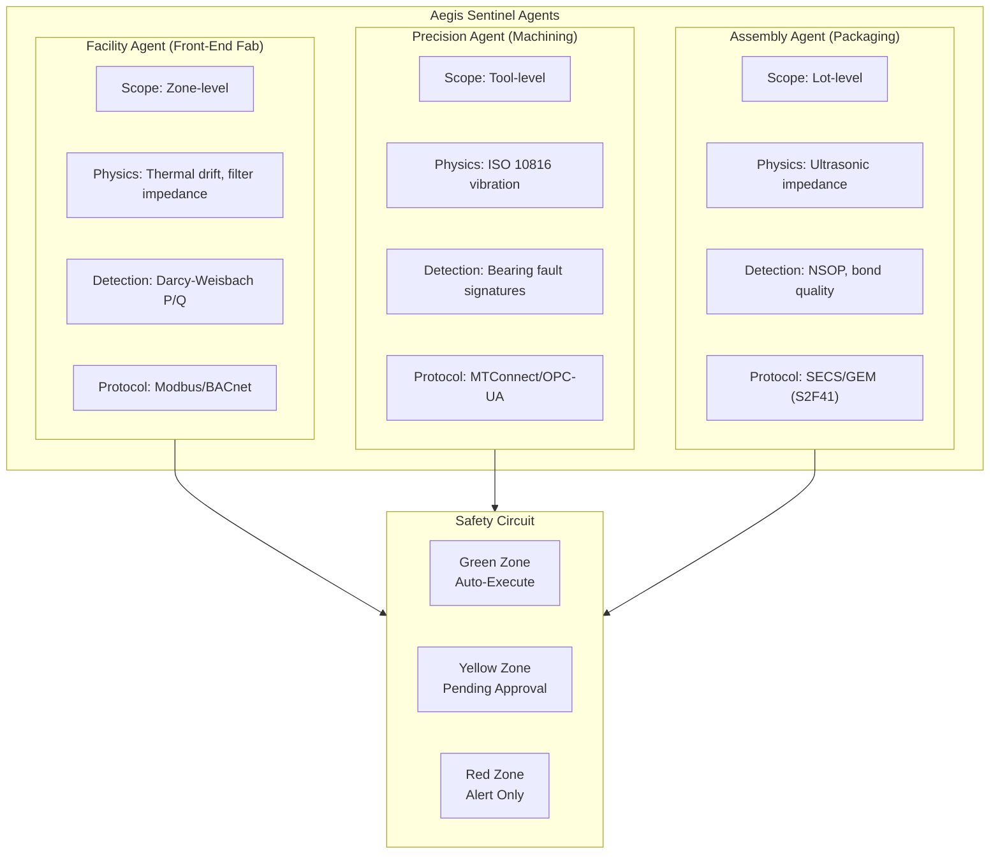

**Agent Responsibilities:**

| Agent | Scope | Physics Domain | Key Detection | Protocol |
|-------|-------|----------------|---------------|----------|
| **Facility Agent** | Zone-level (FFU, HVAC) | Fluid dynamics, ISO 14644 | Filter impedance (P/Q), particle counts | Modbus/BACnet |
| **Precision Agent** | Tool-level (CNC, mills) | ISO 10816 vibration standards | Bearing fault frequencies, chatter | MTConnect/OPC-UA |
| **Assembly Agent** | Lot-level (wire bonders) | Ultrasonic impedance | NSOP detection, bond quality, OEE | SECS/GEM |

### Sand-to-Package Value Chain Coverage

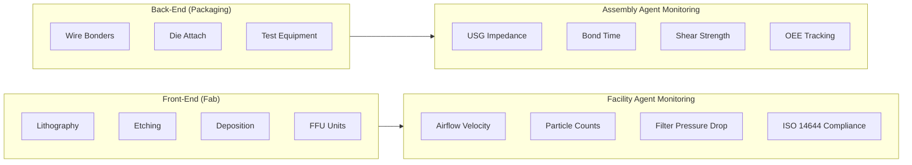

### Safety Circuit (3-Tier Zones)

The Safety Circuit provides a defense-in-depth approach with three escalating response tiers:

| Zone | Threshold | Response | Auto-Action |
|------|-----------|----------|-------------|
| **Green** | Z-score < 2.0 | Normal monitoring | Log telemetry, auto-execute actions |
| **Yellow** | Z-score 2.0-3.0 | Caution state | Increase sampling, queue for approval |
| **Red** | Z-score > 3.0 | Critical alert | Alert only, human intervention required |

**Zone Actions:**

| Zone | Example Actions |
|------|-----------------|
| **Green** | Adjust RPM ±10%, increase coolant, thermal compensation |
| **Yellow** | Reduce speed >20%, schedule maintenance, feed hold |
| **Red** | Emergency stop, unknown failure patterns, cascade events |

**Zone Transitions:**
- Green → Yellow: Anomaly score exceeds 2σ threshold
- Yellow → Red: Anomaly score exceeds 3σ or multiple Yellow alerts correlate
- Any → Green: Sustained normal readings for cooldown period (configurable)

### Knowledge Graph Capabilities

The Knowledge Graph provides relationship visualization and concept extraction for incident analysis:

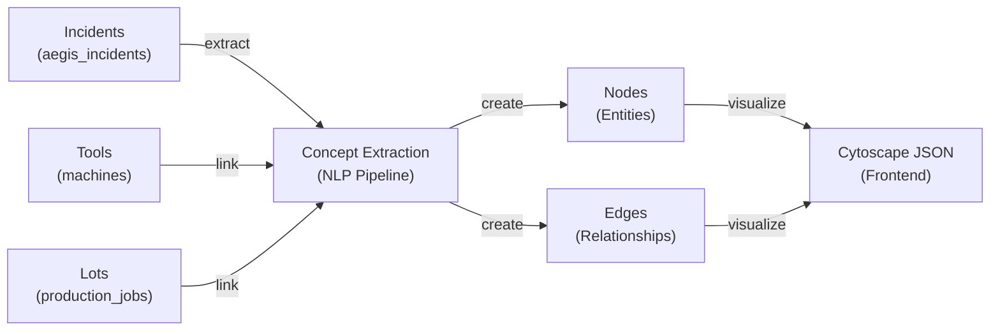

**Graph Features:**

| Feature | Implementation | Use Case |
|---------|----------------|----------|
| **Concept Extraction** | NLP pipeline on incident descriptions | Auto-tag incidents with failure modes |
| **Relationship Mapping** | NetworkX graph analytics | Identify incident clusters |
| **Community Detection** | Greedy modularity communities | Find related failure groups |
| **Graph Visualization** | Cytoscape JSON export | Interactive exploration of incident networks |

**Node Types:**
- `machine` - Equipment IDs (CNC-001, LITHO-01, BOND-01)
- `failure_type` - Thermal runaway, bearing failure, NSOP
- `component` - Spindle, bearing, coolant system, capillary
- `action` - Emergency stop, feed hold, speed reduction
- `severity` - Critical, high, medium, low

### Physics-Based Detection

Aegis implements physics-informed detection algorithms based on semiconductor manufacturing domain knowledge:

**Thermal Drift Detection (Precision Agent):**
- Monitors temperature sensors for deviation from baseline
- Z-score calculation with exponential weighting
- Rate of Change (RoC) alerts for rapid thermal shifts
- CTE-based thermal expansion calculations: ΔL = α·L·ΔT

**ISO 10816 Vibration Analysis (Precision Agent):**
- Implements ISO 10816-1 mechanical vibration standards
- Velocity-based severity classification:
  - Class I: Small machines (< 15 kW)
  - Class II: Medium machines (15-75 kW)
  - Class III: Large machines (> 75 kW)
  - Class IV: Turbo machines
- Frequency-domain analysis for bearing fault detection (BPFO, BPFI, BSF, FTF)

**Filter Impedance (Facility Agent):**
- Darcy-Weisbach equation: Z = P/Q (Pressure/Flow)
- Predicts HEPA filter end-of-life before airflow drops
- ISO 14644-1 cleanroom compliance monitoring
- Particle count tracking per ISO class

**Ultrasonic Impedance (Assembly Agent):**
- Acoustic monitoring for bond integrity
- NSOP (Non-Stick on Pad) detection via impedance drop
- Bond quality tracking via shear strength
- OEE (Overall Equipment Effectiveness) calculation

### Aegis API Endpoints

| Endpoint | Method | Description |
|----------|--------|-------------|
| `/aegis/incidents` | GET | List all incidents with filtering |
| `/aegis/incidents` | POST | Report new incident from agent |
| `/aegis/incidents/{id}` | GET | Get incident details |
| `/aegis/incidents/{id}/approve` | POST | Approve yellow zone action |
| `/aegis/incidents/{id}/resolve` | POST | Resolve incident |
| `/aegis/agents` | GET | List all sentinel agents |
| `/aegis/agents/register` | POST | Register new agent |
| `/aegis/agents/{id}/heartbeat` | POST | Update agent heartbeat |
| `/aegis/safety-circuit` | GET | Get current safety circuit state |
| `/aegis/summary` | GET | Get sentinel summary for dashboard |
| `/aegis/knowledge-graph` | GET | Get knowledge graph data |
| `/aegis/knowledge-graph/generate` | POST | Generate graph from incidents |
| `/aegis/knowledge-graph/stats` | GET | Get graph statistics |
| `/aegis/telemetry/analyze` | POST | Analyze telemetry for anomalies |

### Why This Stack?

| Component | Winner | Why It Wins |
|-----------|--------|-------------|
| **Database** | **Supabase** | Free Realtime (WebSockets) for live dashboard updates without polling |
| **Backend** | **Optional provider** | Railway/Fly/self-host when live integrations are required |
| **Frontend** | **Vercel** | Best React support with automatic CI/CD and client-side routing |

---

## Database Schema

### Seed Data Overview

The database is seeded with realistic semiconductor fab data:

| Entity | Count | Description |
|--------|-------|-------------|
| **Machines** | 48 | Across 8 zones: LITHO-01 to DEP-12 |
| **Production Jobs** | 25 | Real customers: Apple, NVIDIA, AMD, Intel, etc. |
| **Sensor Readings** | 4,800+ | 100+ readings per machine for VM training |
| **Dispatch Decisions** | 5+ | Sample dispatch history |

#### Machine Zones

| Zone | Machines | Type |
|------|----------|------|
| ZONE A | LITHO-01 to LITHO-08 | EUV/DUV Lithography Scanners |
| ZONE B | ETCH-01 to ETCH-08 | Plasma Etching Systems |
| ZONE C | DEP-01 to DEP-10 | CVD/PVD Deposition |
| ZONE D | INSP-01 to INSP-08 | Inspection & Metrology |
| ZONE E | CLEAN-01 to CLEAN-08 | Wet/Dry Cleaning |
| ZONE F-H | Expansion | Additional capacity |

#### Production Jobs

| Priority | Examples | Customer Tags |
|----------|----------|---------------|
| 1 (Hot Lot) | HOT-LOT-001 to HOT-LOT-005 | Apple, NVIDIA, Google, Amazon, Samsung |
| 2 (High) | WAFER-BATCH-103 to 108 | AMD, Micron, Broadcom, Qualcomm |
| 3 (Medium) | WAFER-BATCH-109 to 116 | TI, NXP, ST, MediaTek |
| 4 (Standard) | WAFER-BATCH-117 to 122 | ADI, Maxim, Cirrus |
| 5 (Low) | WAFER-BATCH-123 to 127 | Internal R&D, QA, Engineering |

### Entity Relationship Diagram

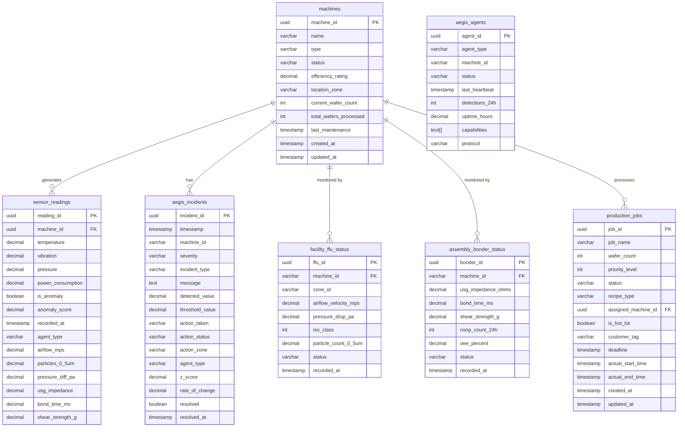

### Core Tables

#### Machines

```sql
CREATE TABLE machines (
    machine_id UUID PRIMARY KEY DEFAULT uuid_generate_v4(),
    name VARCHAR(100) NOT NULL UNIQUE,
    type VARCHAR(50) NOT NULL,
    status VARCHAR(20) NOT NULL DEFAULT 'IDLE',
    efficiency_rating DECIMAL(4,2) NOT NULL CHECK (efficiency_rating >= 0.00 AND efficiency_rating <= 1.00),
    location_zone VARCHAR(20) NOT NULL,
    current_wafer_count INTEGER DEFAULT 0,
    total_wafers_processed INTEGER DEFAULT 0,
    created_at TIMESTAMP WITH TIME ZONE DEFAULT NOW(),
    updated_at TIMESTAMP WITH TIME ZONE DEFAULT NOW()
);
```

#### Sensor Readings

```sql
CREATE TABLE sensor_readings (
    reading_id UUID PRIMARY KEY DEFAULT uuid_generate_v4(),
    machine_id UUID NOT NULL REFERENCES machines(machine_id) ON DELETE CASCADE,
    temperature DECIMAL(6,2) NOT NULL,
    vibration DECIMAL(6,3) NOT NULL,
    pressure DECIMAL(8,2),
    power_consumption DECIMAL(10,2),
    is_anomaly BOOLEAN DEFAULT FALSE,
    anomaly_score DECIMAL(5,4),
    recorded_at TIMESTAMP WITH TIME ZONE DEFAULT NOW(),
    -- Aegis Sentinel fields
    agent_type VARCHAR(50) CHECK (agent_type IN ('facility', 'assembly', 'precision', 'fab_equipment')),
    -- Facility (Front-End) fields
    airflow_mps DECIMAL(6,3),
    particles_0_5um DECIMAL(12,2),
    pressure_diff_pa DECIMAL(8,2),
    chemical_ppm DECIMAL(8,4),
    -- Assembly (Back-End) fields
    usg_impedance DECIMAL(6,2),
    bond_time_ms DECIMAL(6,2),
    shear_strength_g DECIMAL(6,2),
    capillary_temp DECIMAL(6,2)
);
```

#### Production Jobs

```sql
CREATE TABLE production_jobs (
    job_id UUID PRIMARY KEY DEFAULT uuid_generate_v4(),
    job_name VARCHAR(100) NOT NULL,
    wafer_count INTEGER NOT NULL CHECK (wafer_count > 0),
    priority_level INTEGER NOT NULL CHECK (priority_level BETWEEN 1 AND 5),
    status VARCHAR(20) NOT NULL DEFAULT 'PENDING',
    recipe_type VARCHAR(50) NOT NULL,
    assigned_machine_id UUID REFERENCES machines(machine_id),
    is_hot_lot BOOLEAN DEFAULT FALSE,
    customer_tag VARCHAR(50),
    deadline TIMESTAMP WITH TIME ZONE,
    created_at TIMESTAMP WITH TIME ZONE DEFAULT NOW(),
    updated_at TIMESTAMP WITH TIME ZONE DEFAULT NOW()
);
```

### Aegis Sentinel Tables

#### Aegis Incidents

```sql
CREATE TABLE aegis_incidents (
    incident_id UUID PRIMARY KEY DEFAULT uuid_generate_v4(),
    timestamp TIMESTAMP WITH TIME ZONE DEFAULT NOW(),
    machine_id VARCHAR(100) NOT NULL,
    severity VARCHAR(20) NOT NULL CHECK (severity IN ('low', 'medium', 'high', 'critical')),
    incident_type VARCHAR(100) NOT NULL,
    message TEXT NOT NULL,
    detected_value DECIMAL(12,4) NOT NULL,
    threshold_value DECIMAL(12,4) NOT NULL,
    action_taken VARCHAR(200) NOT NULL,
    action_status VARCHAR(50) NOT NULL CHECK (action_status IN ('auto_executed', 'pending_approval', 'approved', 'rejected', 'alert_only')),
    action_zone VARCHAR(20) NOT NULL CHECK (action_zone IN ('green', 'yellow', 'red')),
    agent_type VARCHAR(50) CHECK (agent_type IN ('facility', 'assembly', 'precision', 'fab_equipment', 'unknown')),
    z_score DECIMAL(8,4),
    rate_of_change DECIMAL(12,6),
    resolved BOOLEAN DEFAULT FALSE,
    resolved_at TIMESTAMP WITH TIME ZONE,
    operator_notes TEXT
);
```

#### Aegis Agents

```sql
CREATE TABLE aegis_agents (
    agent_id UUID PRIMARY KEY DEFAULT uuid_generate_v4(),
    agent_type VARCHAR(50) NOT NULL CHECK (agent_type IN ('facility', 'assembly', 'precision')),
    machine_id VARCHAR(100) NOT NULL UNIQUE,
    status VARCHAR(20) NOT NULL DEFAULT 'active' CHECK (status IN ('active', 'inactive', 'error')),
    last_heartbeat TIMESTAMP WITH TIME ZONE,
    detections_24h INTEGER DEFAULT 0,
    uptime_hours DECIMAL(8,2) DEFAULT 0,
    capabilities TEXT[],
    protocol VARCHAR(50),
    created_at TIMESTAMP WITH TIME ZONE DEFAULT NOW()
);
```

#### Facility FFU Status

```sql
CREATE TABLE facility_ffu_status (
    ffu_id UUID PRIMARY KEY DEFAULT uuid_generate_v4(),
    machine_id VARCHAR(100) NOT NULL REFERENCES machines(name),
    zone_id VARCHAR(20) NOT NULL,
    airflow_velocity_mps DECIMAL(5,2) NOT NULL,
    pressure_drop_pa DECIMAL(8,2) NOT NULL,
    motor_rpm INTEGER,
    motor_current_a DECIMAL(5,2),
    filter_life_percent DECIMAL(5,2),
    iso_class INTEGER CHECK (iso_class BETWEEN 1 AND 9),
    particle_count_0_5um DECIMAL(12,2),
    status VARCHAR(20) NOT NULL DEFAULT 'normal',
    recorded_at TIMESTAMP WITH TIME ZONE DEFAULT NOW()
);
```

#### Assembly Bonder Status

```sql
CREATE TABLE assembly_bonder_status (
    bonder_id UUID PRIMARY KEY DEFAULT uuid_generate_v4(),
    machine_id VARCHAR(100) NOT NULL REFERENCES machines(name),
    usg_frequency_khz DECIMAL(6,2),
    usg_impedance_ohms DECIMAL(6,2),
    bond_force_grams DECIMAL(6,2),
    bond_time_ms DECIMAL(6,2),
    capillary_temp_c DECIMAL(5,2),
    shear_strength_g DECIMAL(6,2),
    nsop_count_24h INTEGER DEFAULT 0,
    oee_percent DECIMAL(5,2),
    cycle_time_ms DECIMAL(6,2),
    units_bonded_24h INTEGER,
    status VARCHAR(20) NOT NULL DEFAULT 'normal',
    recorded_at TIMESTAMP WITH TIME ZONE DEFAULT NOW()
);
```

### Database Files

| File | Size | Description |
|------|------|-------------|
| `schema.sql` | 13KB | Core tables, constraints, indexes, RLS policies |
| `seed.sql` | 16KB | 48 machines, 25 jobs, sensor readings |
| `reset_and_seed.sql` | 27KB | **Full reset + seed** - Use this for Supabase migration |
| `migrations/002_virtual_metrology.sql` | 4KB | VM tables |
| `migrations/003_aegis_sentinel_sand_to_package.sql` | 8KB | Aegis tables for Sand-to-Package |

### Virtual Metrology Hooks

The frontend implements a sophisticated **global shared cache pattern** for Virtual Metrology data to eliminate flickering and ensure consistent mock data:

```typescript
// Global cache shared between all hook instances
const globalMockCache: Record<string, { status: VMStatus; history: VMHistory }> = {};
```

**Key Design Patterns:**

| Feature | Implementation | Benefit |
|---------|---------------|---------|
| **Global Shared Cache** | Module-level `globalMockCache` | Data persists across re-renders and hook instances |
| **Synchronous Generation** | `useMemo` for mock data | Data available on first render, no loading flash |
| **Dual Hook API** | `useVirtualMetrology` + `useVirtualMetrologyBatch` | Single machine or batch queries with shared cache |
| **No Loading in Mock** | `isLoading: apiAvailable ? isLoading : false` | No "Loading..." states in demo mode |
| **Persistent Values** | Cache never cleared | Same machine always shows same mock values |

**Hook APIs:**

```typescript
// Single machine VM data
const { status, history, isLoading, error, refresh } = useVirtualMetrology(
  machineId,
  { pollingInterval: 30000, enabled: true }
);

// Batch VM data for all machines
const { statuses, isLoading, error, refresh } = useVirtualMetrologyBatch(
  machineIds,
  { pollingInterval: 30000, enabled: true }
);
```

---

## Repository Structure

```
YieldOps/
├── apps/
│   ├── dashboard/          # React Frontend (Vercel)
│   │   ├── src/
│   │   │   ├── components/    # React components
│   │   │   │   ├── tabs/         # Overview, Machines, Jobs, Sentinel tabs
│   │   │   │   ├── aegis/        # Sentinel, Knowledge Graph, Safety Circuit
│   │   │   │   ├── jobs/         # Jobs-specific components
│   │   │   │   ├── overview/     # Overview-specific components
│   │   │   │   └── ui/           # Reusable UI components
│   │   │   ├── hooks/         # Custom hooks
│   │   │   │   ├── useRealtime.ts
│   │   │   │   ├── useVirtualMetrology.ts
│   │   │   │   ├── useAegisRealtime.ts
│   │   │   │   └── useAegisSentinel.ts
│   │   │   ├── services/      # API clients
│   │   │   │   ├── apiClient.ts
│   │   │   │   └── supabaseClient.ts
│   │   │   ├── lib/           # Utility libraries
│   │   │   │   └── spcEngine.ts
│   │   │   └── types/         # TypeScript types
│   │   ├── .env               # Environment variables (not in git)
│   │   └── vercel.json        # Vercel config
│   │
│   └── api/                # FastAPI Backend (optional for live mode)
│       ├── app/
│       │   ├── api/v1/        # API endpoints
│       │   │   ├── machines.py
│       │   │   ├── jobs.py
│       │   │   ├── dispatch.py
│       │   │   ├── chaos.py
│       │   │   ├── analytics.py
│       │   │   ├── vm.py
│       │   │   ├── aegis.py          # Aegis Sentinel routes
│       │   │   ├── graphs.py         # Knowledge graph routes
│       │   │   ├── simulation.py
│       │   │   └── scheduler.py
│       │   ├── core/          # ML & algorithms
│       │   │   ├── toc_engine.py
│       │   │   ├── anomaly_detector.py
│       │   │   ├── sentinel_engine.py       # Aegis detection
│       │   │   ├── knowledge_graph_engine.py # Graph analytics
│       │   │   ├── monte_carlo.py
│       │   │   ├── vm_engine.py
│       │   │   ├── rust_monte_carlo.py
│       │   │   └── rust_scheduler.py
│       │   ├── models/        # Pydantic schemas
│       │   │   ├── schemas.py
│       │   │   └── aegis_schemas.py
│       │   └── services/      # Database service
│       ├── .env               # Environment variables (not in git)
│       ├── requirements.txt
│       └── koyeb.yaml         # Legacy Koyeb config (optional)
│
├── aegis/                  # Aegis Sentinel Platform
│   ├── aegis-sentinel/     # Rust agent implementation
│   │   ├── src/
│   │   │   ├── main.rs
│   │   │   ├── types.rs
│   │   │   ├── mqtt.rs
│   │   │   ├── detection.rs
│   │   │   ├── safety.rs
│   │   │   ├── api_bridge.rs
│   │   │   └── agents/
│   │   │       ├── mod.rs
│   │   │       ├── precision.rs
│   │   │       ├── facility.rs
│   │   │       └── assembly.rs
│   │   └── Cargo.toml
│   ├── supabase-bridge/    # MQTT to Supabase bridge
│   ├── knowledge-graph/    # Graph analytics (Python)
│   ├── simulator/          # Ghost CNC simulator
│   └── gem_adapter.py      # SECS/GEM bridge
│
├── rust/                   # Rust extensions
│   ├── monte_carlo/        # Parallel Monte Carlo simulation
│   └── scheduler/          # Constraint-based scheduler
│
├── packages/
│   └── types/              # Shared TypeScript types
│
├── ml/                     # ML notebooks & scripts
│
├── database/               # Schema & seed files
│   ├── schema.sql
│   ├── seed.sql
│   ├── reset_and_seed.sql
│   └── migrations/
│       ├── 002_virtual_metrology.sql
│       └── 003_aegis_sentinel_sand_to_package.sql
│
├── README.md
└── Architecture.md
```

---

## Core Components

### 1. Theory of Constraints (ToC) Dispatch Engine

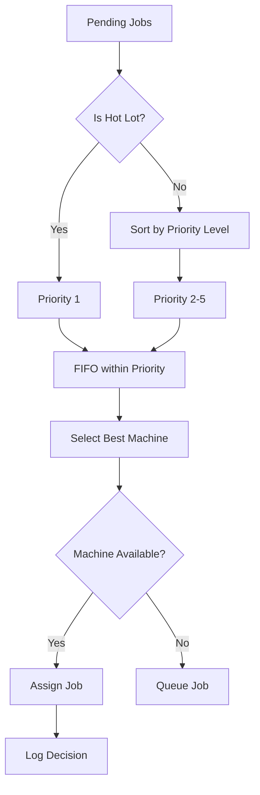

**Algorithm Rules:**

1. Hot Lots (is_hot_lot=True) always first
2. Priority level (1=highest, 5=lowest)
3. FIFO within same priority
4. Select machine with highest efficiency rating

### 2. Anomaly Detection (ML)

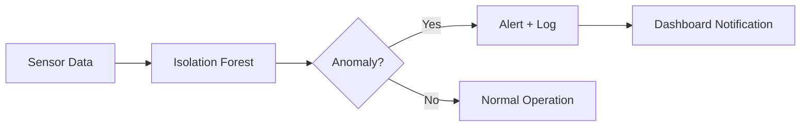

- **Algorithm**: Isolation Forest
- **Features**: Temperature, Vibration, Pressure
- **Output**: Anomaly score (0-1) + Confidence level
- **Training**: Auto-initializes with synthetic data

### 3. Virtual Metrology (VM)

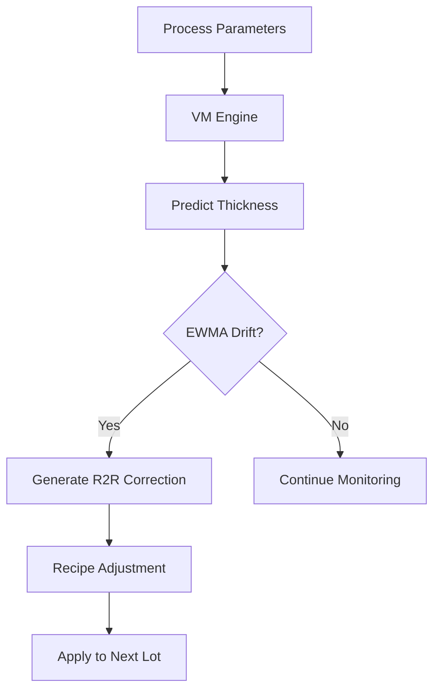

- **Purpose**: Predict film thickness without physical measurement
- **Algorithm**: Ridge Regression with EWMA correction
- **Features**: Temperature, Pressure, Power Consumption
- **R2R**: Run-to-Run control for process drift correction

#### Frontend VM Hook Architecture

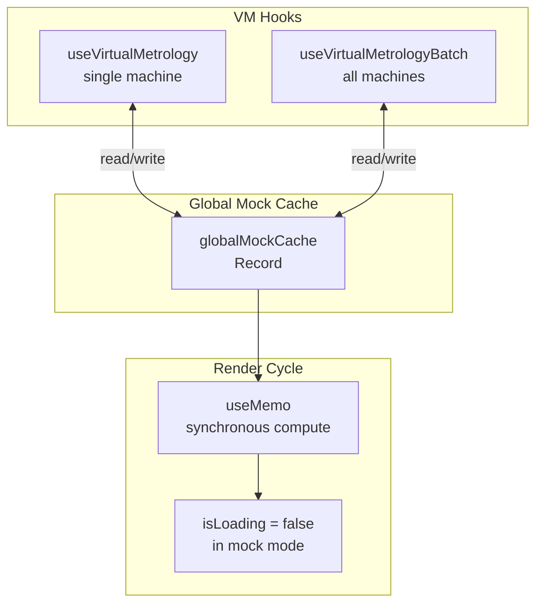

### 4. Monte Carlo Simulation

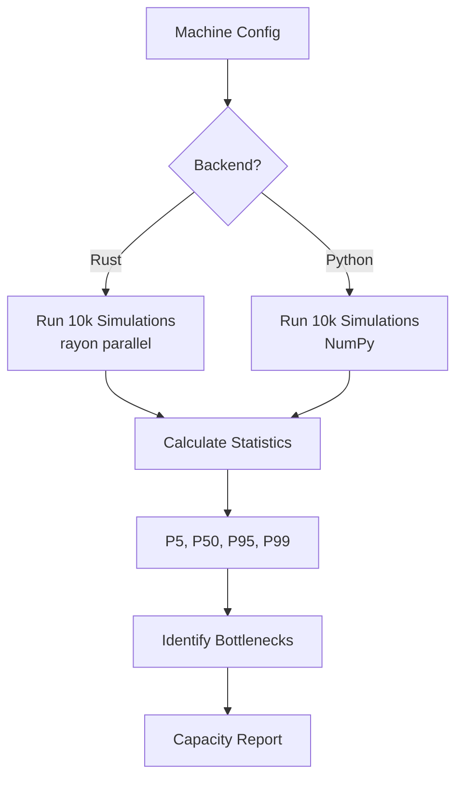

- **Purpose**: Capacity planning & throughput forecasting
- **Iterations**: 10,000+ simulations
- **Output**: P5, P50, P95, P99 confidence intervals
- **Use Case**: "Can we meet 1000 wafers/day target?"
- **Backends**:
  - **Rust**: 10-50x speedup using rayon parallel execution
  - **Python/NumPy**: Fallback when Rust unavailable
- **Auto-selection**: Rust for n≥1000 simulations

### 5. Scheduler Optimizer

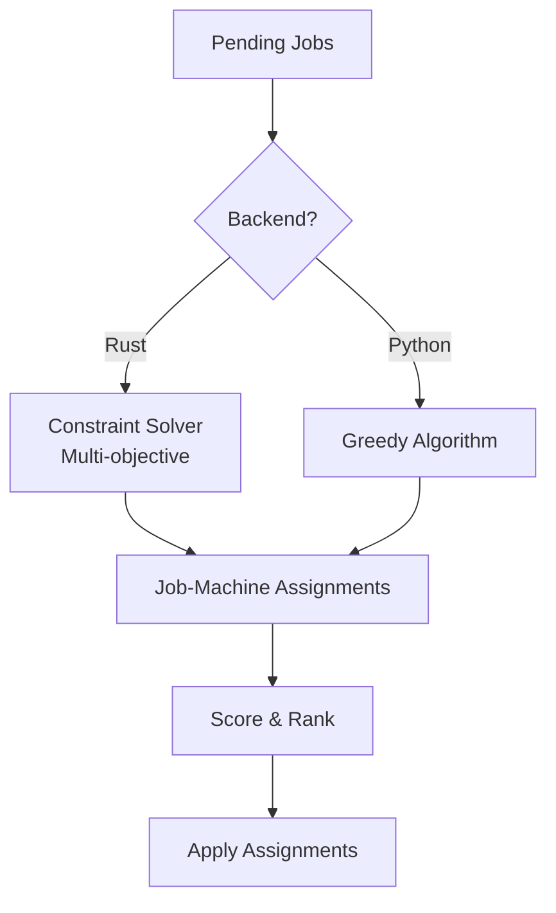

- **Purpose**: Constraint-based job-to-machine optimization
- **Constraints**: Recipe type matching, deadlines, priority
- **Scoring**: Priority + Efficiency + Deadline urgency + Queue depth
- **Backends**:
  - **Rust**: High-performance constraint solver
  - **Python**: Greedy fallback algorithm

### 6. Chaos Engineering API

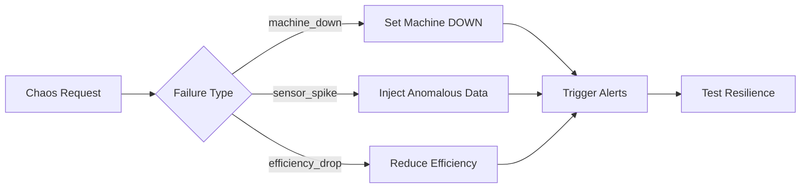

**Scenarios:**

- `machine_down`: Force machine failure
- `sensor_spike`: Inject anomalous readings
- `efficiency_drop`: Reduce machine efficiency

### 7. Aegis Sentinel Engine

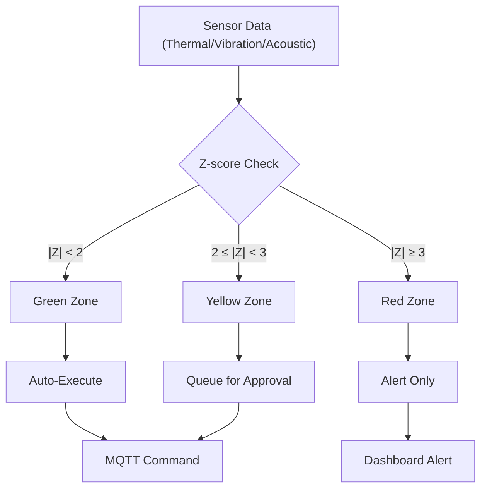

- **Algorithm**: Z-score anomaly detection + Rate of Change (RoC)
- **Physics Domains**: Thermal drift, ISO 10816 vibration, ultrasonic impedance
- **Output**: Zone classification (Green/Yellow/Red) + Confidence score

### 8. Knowledge Graph Engine

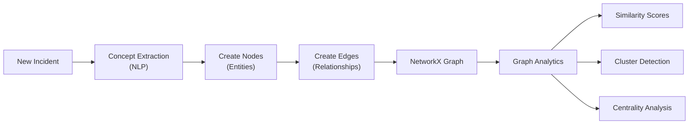

- **Library**: NetworkX for graph analytics
- **NLP**: Concept extraction from incident descriptions
- **Analytics**: PageRank centrality, community detection, shortest path
- **Export**: Cytoscape JSON for frontend visualization

### 9. Autonomous Job Simulation

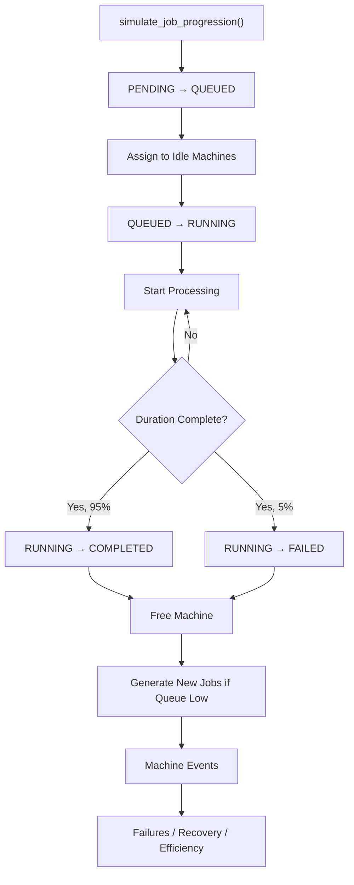

**PostgreSQL Function**: `simulate_job_progression()`

- Dispatches PENDING jobs to IDLE machines
- Starts QUEUED jobs (sets RUNNING status)
- Completes/fails RUNNING jobs based on duration
- Auto-generates new jobs when queue is low
- Handles machine failures and recovery

---

## Frontend State Management

### Dual-State Pattern for Immediate UI Updates

The frontend uses a dual-state pattern to provide immediate UI feedback while maintaining data consistency:

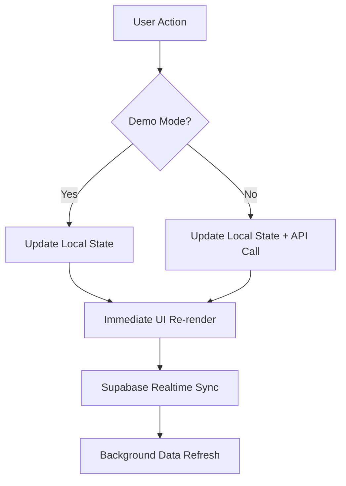

**Key Features:**

- `updateMachine()` - Updates machine status/efficiency immediately
- `updateJob()` - Updates job status and assignments immediately  
- `addJob()` - Adds new jobs to the list immediately
- All state changes propagate across tabs without refresh
- Toast notifications confirm actions

### ToC Dispatch Algorithm (Frontend)

When running in demo mode, the frontend implements Goldratt's Theory of Constraints algorithm:

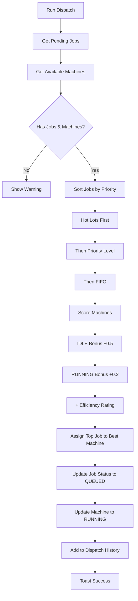

---

## Frontend Tab Structure

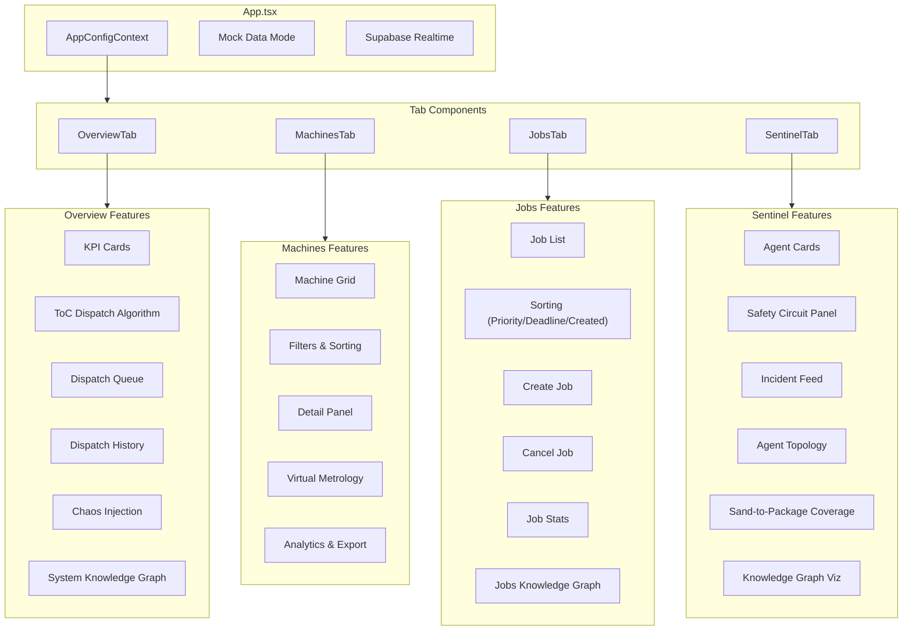

---

## API Reference

### Base URL

```
Production backend URL: Optional / environment-specific
Local: http://localhost:8000
```

### Core Endpoints

| Endpoint | Method | Description |
|----------|--------|-------------|
| `/health` | GET | Health check |
| `/api/v1/machines` | GET | List all machines |
| `/api/v1/machines/{id}` | GET | Get machine details |
| `/api/v1/machines/{id}/stats` | GET | Get machine statistics |
| `/api/v1/jobs` | GET | List all jobs |
| `/api/v1/jobs` | POST | Create new job |
| `/api/v1/jobs/{id}/cancel` | POST | Cancel a job |
| `/api/v1/jobs/queue` | GET | Get job queue |
| `/api/v1/dispatch/run` | POST | Execute ToC dispatch |
| `/api/v1/dispatch/queue` | GET | View dispatch queue |
| `/api/v1/dispatch/history` | GET | Get dispatch history |

### Analytics Endpoints

| Endpoint | Method | Description |
|----------|--------|-------------|
| `/api/v1/analytics/monte-carlo` | POST | Run Monte Carlo simulation |
| `/api/v1/analytics/capacity-planning` | POST | Capacity analysis |
| `/api/v1/analytics/anomaly/detect` | POST | Detect anomaly |
| `/api/v1/analytics/anomaly/train` | POST | Train model |
| `/api/v1/analytics/bottlenecks` | GET | Identify bottlenecks |
| `/api/v1/analytics/dashboard` | GET | Dashboard summary |

### VM Endpoints

| Endpoint | Method | Description |
|----------|--------|-------------|
| `/api/v1/vm/status/{id}` | GET | Get VM status |
| `/api/v1/vm/history/{id}` | GET | Get VM history |
| `/api/v1/vm/predict` | POST | Request prediction |
| `/api/v1/vm/model/info` | GET | Get VM model info |

### Chaos Endpoints

| Endpoint | Method | Description |
|----------|--------|-------------|
| `/api/v1/chaos/inject` | POST | Inject failure |
| `/api/v1/chaos/recover/{id}` | POST | Recover machine |
| `/api/v1/chaos/scenarios` | GET | List chaos scenarios |

### Simulation Endpoints

| Endpoint | Method | Description |
|----------|--------|-------------|
| `/api/v1/simulation/tick` | POST | Run one simulation tick |
| `/api/v1/simulation/fast` | POST | Fast forward (multiple ticks) |
| `/api/v1/simulation/status` | GET | Get job/machine counts |
| `/api/v1/simulation/reset` | POST | Reset to initial distribution |

### Aegis Sentinel Endpoints

| Endpoint | Method | Description |
|----------|--------|-------------|
| `/api/v1/aegis/incidents` | GET/POST | List/Report incidents |
| `/api/v1/aegis/incidents/{id}` | GET | Get incident details |
| `/api/v1/aegis/incidents/{id}/approve` | POST | Approve yellow zone action |
| `/api/v1/aegis/incidents/{id}/resolve` | POST | Resolve incident |
| `/api/v1/aegis/agents` | GET | List all agents |
| `/api/v1/aegis/agents/register` | POST | Register new agent |
| `/api/v1/aegis/agents/{id}/heartbeat` | POST | Agent heartbeat |
| `/api/v1/aegis/safety-circuit` | GET | Get safety circuit status |
| `/api/v1/aegis/summary` | GET | Get sentinel summary |
| `/api/v1/aegis/knowledge-graph` | GET | Get knowledge graph |
| `/api/v1/aegis/knowledge-graph/generate` | POST | Generate graph from incidents |
| `/api/v1/aegis/knowledge-graph/stats` | GET | Get graph statistics |
| `/api/v1/aegis/telemetry/analyze` | POST | Analyze telemetry |

### Knowledge Graph Endpoints

| Endpoint | Method | Description |
|----------|--------|-------------|
| `/api/v1/graphs/jobs` | GET | Get jobs knowledge graph |
| `/api/v1/graphs/system` | GET | Get system knowledge graph |
| `/api/v1/graphs/overview` | GET | Get overview knowledge graph |

---

## Environment Variables

### apps/api/.env

```bash
SUPABASE_URL=your_supabase_url
SUPABASE_SERVICE_KEY=your_service_key
SUPABASE_ANON_KEY=your_anon_key
DEBUG=true
AUTO_INIT_MODEL=true
```

### apps/dashboard/.env

```bash
# Demo mode default: keep these unset
# VITE_SUPABASE_URL=
# VITE_SUPABASE_ANON_KEY=
# VITE_API_URL=
```

### aegis/aegis-sentinel/.env (Optional)

```bash
MQTT_BROKER=localhost
YIELDOPS_API_URL=http://localhost:8000
YIELDOPS_API_KEY=your-api-key
```

---

## Rust Modules

High-performance Rust extensions for compute-intensive operations.

### Building

```bash
cd rust

# Install maturin
pip install maturin

# Build for Python (requires PYO3_USE_ABI3_FORWARD_COMPATIBILITY for Python 3.14+)
PYO3_USE_ABI3_FORWARD_COMPATIBILITY=1 maturin develop --release
```

### Monte Carlo Module

**Path**: `rust/monte_carlo/`

**Features:**

- Parallel simulation using rayon
- P5/P50/P95/P99 confidence intervals
- Bottleneck analysis
- 10-50x speedup over Python

```rust
// Rust API
use yieldops_monte_carlo::{MachineConfig, MonteCarloSimulator};

let sim = MonteCarloSimulator::new(42);
let result = sim.run_simulation(machines, 30, 10000)?;
```

### Scheduler Module

**Path**: `rust/scheduler/`

**Features:**

- Constraint-based optimization
- Recipe type matching
- Deadline awareness
- Multi-objective scoring

```rust
// Rust API
use yieldops_scheduler::{SchedulerJob, SchedulerMachine, SchedulerOptimizer};

let optimizer = SchedulerOptimizer::new(None);
let result = optimizer.optimize(jobs, machines, 10)?;
```

### Performance Comparison

| Operation | Python | Rust | Speedup |
|-----------|--------|------|---------|
| 10k MC simulations | ~5s | ~0.1s | 50x |
| Schedule 50 jobs | ~10ms | ~0.1ms | 100x |

---

## Deployment

### Backend (Optional)

Legacy Koyeb snippet retained for historical reference only. Current recommendation is demo mode on Vercel by default, and optional live integrations via Railway/Fly/self-host.

### Frontend (Vercel)

1. Connect GitHub repo to Vercel
2. Set framework preset to "Vite"
3. Set root directory to `apps/dashboard`
4. Add environment variables

---

## Quick Start

```bash
# Clone repository
git clone git@github.com:AngelP17/YieldOps.git
cd YieldOps

# Install dependencies
npm install
cd apps/api && pip install -r requirements.txt

# Set up environment variables
cp apps/api/.env.example apps/api/.env
cp apps/dashboard/.env.example apps/dashboard/.env
# Edit .env files with your credentials

# Run development servers
npm run dev:dashboard  # Terminal 1
npm run dev:api        # Terminal 2
```

---

## Demo Mode

The application includes a **Demo Mode** that provides full functionality without requiring backend configuration:

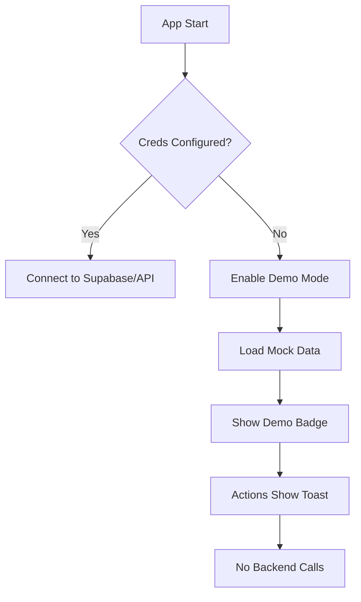

**Features in Demo Mode:**

- All four tabs functional (Overview, Machines, Jobs, Sentinel)
- Realistic mock data (48 machines, 25 jobs with real customers)
- **Working ToC Dispatch** - Frontend algorithm actually assigns jobs to machines
- **Aegis Sentinel Demo** - Sample incidents, agents, and safety circuit
- **Knowledge Graph Demo** - Mock graph visualization from sample incidents
- **Immediate UI Updates** - Dual-state pattern for instant feedback
- Actions trigger toast notifications
- Sorting on all tabs (priority, deadline, status, efficiency, type)
- Analytics modal with Excel export
- **Virtual Metrology with Global Cache** - No flickering, consistent mock predictions
- System Analytics with realistic data fallback
- Visual indicators show "Demo Mode" status
- No "Failed to fetch" errors
- Full UI interactivity

---

## Live Mode with Supabase (Optional)

When connected to Supabase, the system operates in **Live Mode**:

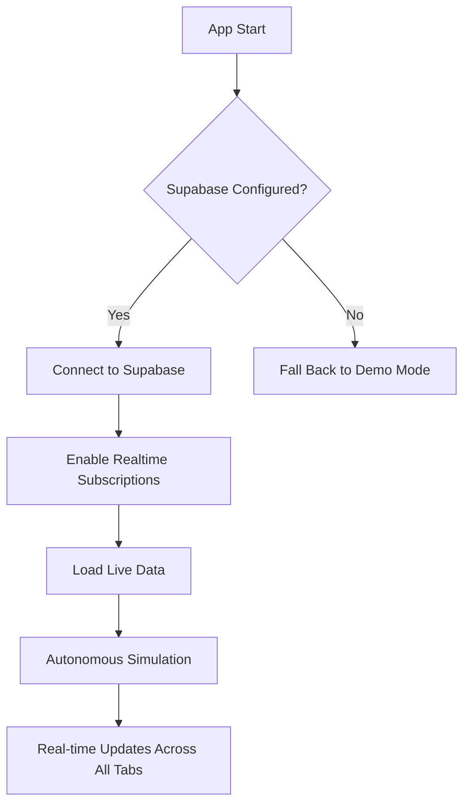

**Live Mode Features:**

- ✅ Real-time data sync via Supabase Realtime
- ✅ Persistent data storage
- ✅ Autonomous simulation (jobs progress automatically)
- ✅ Live VM predictions using sensor data
- ✅ Live Aegis Sentinel data (incidents, agents, safety circuit)
- ✅ Multi-user support (all users see same data)
- ✅ Changes propagate instantly without page refresh

### Setting Up Live Mode

1. **Create Supabase Project** at [supabase.com](https://supabase.com)
2. **Run Database Migration** in Supabase SQL Editor:

   ```sql
   -- Copy contents of database/reset_and_seed.sql
   -- Then run: database/migrations/003_aegis_sentinel_sand_to_package.sql
   ```

3. **Configure Environment Variables** in Vercel:
   - `VITE_SUPABASE_URL`
   - `VITE_SUPABASE_ANON_KEY`

---

## Testing

```bash
# Health check
curl http://localhost:8000/health

# Inject chaos
curl -X POST http://localhost:8000/api/v1/chaos/inject \
  -H "Content-Type: application/json" \
  -d '{"failure_type": "machine_down"}'

# Run Monte Carlo simulation
curl -X POST http://localhost:8000/api/v1/analytics/monte-carlo \
  -H "Content-Type: application/json" \
  -d '{"time_horizon_days": 30, "n_simulations": 1000}'

# Get VM status
curl http://localhost:8000/api/v1/vm/status/{machine_id}

# Get Aegis summary
curl http://localhost:8000/api/v1/aegis/summary

# Generate knowledge graph
curl -X POST http://localhost:8000/api/v1/aegis/knowledge-graph/generate \
  -H "Content-Type: application/json" \
  -d '{"include_resolved": false, "max_incidents": 500}'
```

---

## License

MIT License
