# YieldOps - Smart Fab Architecture

Intelligent Manufacturing & IIoT Portfolio Project

**Live Demo:** [https://yield-ops-dashboard.vercel.app/](https://yield-ops-dashboard.vercel.app/) *(Frontend)*  
**API Endpoint:** <https://beneficial-mathilde-yieldops-883cf8bf.koyeb.app/> *(Backend)*

---

## Executive Summary

**Smart Fab** is a full-stack Industrial IoT (IIoT) portfolio project demonstrating intelligent semiconductor manufacturing capabilities. The system simulates a fabrication plant with real-time machine monitoring, automated job dispatching using Theory of Constraints (ToC) algorithms, predictive maintenance through machine learning, and Virtual Metrology for process control.

### Key Capabilities

- **Real-time Monitoring**: Live machine status via WebSockets/Supabase Realtime
- **Intelligent Dispatching**: Automated job routing based on efficiency and priority (Theory of Constraints)
- **Predictive Maintenance**: Anomaly detection using Isolation Forest with SPC control charts
- **Virtual Metrology**: Predict film thickness and enable Run-to-Run (R2R) control
- **Capacity Planning**: Monte Carlo simulation for production forecasting
- **Chaos Engineering**: Controlled failure injection for resilience testing
- **Process Capability (CPK)**: Statistical process control with CPK calculation and rating
- **Job Lifecycle Management**: Full job status control with manual and autonomous transitions
- **Simulation Speed Control**: 1x/10x/100x speed toggle for accelerated testing
- **Mobile-Responsive Design**: Full dashboard functionality across all device sizes
- **Demo Mode**: Full functionality without backend configuration

---

## System Architecture

```mermaid
flowchart TB
    subgraph Frontend["Frontend - Vercel"]
        direction TB
        React["React 18 + Vite + TypeScript"]
        Tailwind["Tailwind CSS 3.4"]
        Recharts["Recharts"]
        Lucide["Lucide Icons"]
        
        subgraph Components["UI Components"]
            OverviewTab["Overview Tab"]
            MachinesTab["Machines Tab"]
            JobsTab["Jobs Tab"]
            MachineNode["Machine Node Cards"]
            KpiCard["KPI Cards"]
            Modals["Modals & Forms"]
            SPCCharts["SPC Control Charts"]
            SpeedControl["Simulation Speed Control"]
        end
        
        subgraph Hooks["Custom Hooks"]
            useRealtime["useRealtime"]
            useVirtualMetrology["useVirtualMetrology"]
            useAutonomousSimulation["useAutonomousSimulation"]
            usePolling["usePolling"]
        end
        
        subgraph Services["Services"]
            apiClient["API Client"]
            supabaseClient["Supabase Client"]
        end
        
        React --> Tailwind
        React --> Recharts
        React --> Lucide
        Components --> Hooks
        Hooks --> Services
    end

    subgraph Backend["Backend - Koyeb"]
        direction TB
        FastAPI["FastAPI Controller"]
        
        subgraph APIRoutes["API Routes"]
            MachinesAPI["/machines"]
            JobsAPI["/jobs"]
            DispatchAPI["/dispatch"]
            ChaosAPI["/chaos"]
            AnalyticsAPI["/analytics"]
            VMAPI["/vm"]
            SchedulerAPI["/scheduler"]
        end
        
        subgraph CoreEngines["Core Engines"]
            ToC["Theory of Constraints Engine"]
            AnomalyDetector["Anomaly Detector (Isolation Forest)"]
            MonteCarlo["Monte Carlo Simulator"]
            VMEngine["Virtual Metrology Engine"]
            SchedulerOpt["Scheduler Optimizer"]
        end
        
        subgraph RustModules["Rust Extensions"]
            RustMC["Monte Carlo (rayon parallel)"]
            RustSched["Scheduler (constraint solver)"]
        end
        
        subgraph ServicesBE["Services"]
            SupabaseService["Supabase Service"]
        end
        
        FastAPI --> APIRoutes
        APIRoutes --> CoreEngines
        APIRoutes --> ServicesBE
        CoreEngines --> RustModules
    end

    subgraph Database["Database - Supabase"]
        direction TB
        PostgreSQL[("PostgreSQL 15")]
        Realtime[("Supabase Realtime")]
        
        subgraph Tables["Core Tables"]
            Machines[(machines - 48 tools)]
            SensorReadings[(sensor_readings)]
            ProductionJobs[(production_jobs - 25 jobs)]
            DispatchDecisions[(dispatch_decisions)]
        end
        
        subgraph VMTables["Virtual Metrology Tables"]
            VMPredictions[(vm_predictions)]
            MetrologyResults[(metrology_results)]
            RecipeAdjustments[(recipe_adjustments)]
        end
        
        subgraph OpsTables["Operations Tables"]
            MaintenanceLogs[(maintenance_logs)]
            AnomalyAlerts[(anomaly_alerts)]
            CapacitySimulations[(capacity_simulations)]
        end
        
        PostgreSQL --> Tables
        PostgreSQL --> VMTables
        PostgreSQL --> OpsTables
        PostgreSQL --> Realtime
    end

    Frontend <-->|HTTP REST API| Backend
    Backend <-->|PostgreSQL Driver| Database
    Frontend <-.->|Supabase Realtime| Database
```

---

## Technology Stack

| Layer | Technology | Purpose | Hosting |
|-------|------------|---------|---------|
| **Frontend** | React 18 + Vite + TypeScript | UI Framework | Vercel |
| **Styling** | Tailwind CSS 3.4 | Utility-first CSS | - |
| **Charts** | Recharts | Data Visualization | - |
| **Icons** | Lucide React | Icon Library | - |
| **Backend** | FastAPI (Python 3.11) | API & ML Services | Koyeb |
| **Database** | PostgreSQL 15 | Primary Data Store | Supabase |
| **Realtime** | Supabase Realtime | WebSocket Events | Supabase |
| **ML** | Scikit-Learn | Anomaly Detection & VM | - |
| **Rust** | PyO3 + rayon | High-performance compute | - |
| **SPC** | Custom Engine | Statistical Process Control | - |
| **Charts** | Recharts | Data visualization with SPC | - |

### Why This Stack?

| Component | Winner | Why It Wins |
|-----------|--------|-------------|
| **Database** | **Supabase** | Free Realtime (WebSockets) for live dashboard updates without polling |
| **Backend** | **Koyeb** | Free tier with no cold starts - stays running for responsive demos |
| **Frontend** | **Vercel** | Best React support with automatic CI/CD and client-side routing |

---

## Database Schema

### Seed Data Overview

The database is seeded with realistic semiconductor fab data:

| Entity | Count | Description |
|--------|-------|-------------|
| **Machines** | 48 | Across 8 zones: LITHO-01 to DEP-12 |
| **Production Jobs** | 25 | Real customers: Apple, NVIDIA, AMD, Intel, etc. |
| **Sensor Readings** | 4,800+ | 100+ readings per machine for VM training |
| **Dispatch Decisions** | 5+ | Sample dispatch history |

#### Machine Zones

| Zone | Machines | Type |
|------|----------|------|
| ZONE A | LITHO-01 to LITHO-08 | EUV/DUV Lithography Scanners |
| ZONE B | ETCH-01 to ETCH-08 | Plasma Etching Systems |
| ZONE C | DEP-01 to DEP-10 | CVD/PVD Deposition |
| ZONE D | INSP-01 to INSP-08 | Inspection & Metrology |
| ZONE E | CLEAN-01 to CLEAN-08 | Wet/Dry Cleaning |
| ZONE F-H | Expansion | Additional capacity |

#### Production Jobs

| Priority | Examples | Customer Tags |
|----------|----------|---------------|
| 1 (Hot Lot) | HOT-LOT-001 to HOT-LOT-005 | Apple, NVIDIA, Google, Amazon, Samsung |
| 2 (High) | WAFER-BATCH-103 to 108 | AMD, Micron, Broadcom, Qualcomm |
| 3 (Medium) | WAFER-BATCH-109 to 116 | TI, NXP, ST, MediaTek |
| 4 (Standard) | WAFER-BATCH-117 to 122 | ADI, Maxim, Cirrus |
| 5 (Low) | WAFER-BATCH-123 to 127 | Internal R&D, QA, Engineering |

### Entity Relationship Diagram

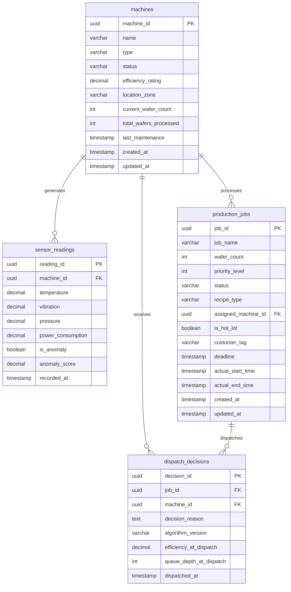

### Core Tables

#### Machines

```sql
CREATE TABLE machines (
    machine_id UUID PRIMARY KEY DEFAULT uuid_generate_v4(),
    name VARCHAR(100) NOT NULL UNIQUE,
    type VARCHAR(50) NOT NULL, -- lithography, etching, deposition, inspection, cleaning
    status VARCHAR(20) NOT NULL DEFAULT 'IDLE', -- IDLE, RUNNING, DOWN, MAINTENANCE
    efficiency_rating DECIMAL(4,2) NOT NULL CHECK (efficiency_rating >= 0.00 AND efficiency_rating <= 1.00),
    location_zone VARCHAR(20) NOT NULL,
    current_wafer_count INTEGER DEFAULT 0,
    total_wafers_processed INTEGER DEFAULT 0,
    created_at TIMESTAMP WITH TIME ZONE DEFAULT NOW(),
    updated_at TIMESTAMP WITH TIME ZONE DEFAULT NOW()
);
```

#### Sensor Readings

```sql
CREATE TABLE sensor_readings (
    reading_id UUID PRIMARY KEY DEFAULT uuid_generate_v4(),
    machine_id UUID NOT NULL REFERENCES machines(machine_id) ON DELETE CASCADE,
    temperature DECIMAL(6,2) NOT NULL,
    vibration DECIMAL(6,3) NOT NULL,
    pressure DECIMAL(8,2),
    power_consumption DECIMAL(10,2),
    is_anomaly BOOLEAN DEFAULT FALSE,
    anomaly_score DECIMAL(5,4),
    recorded_at TIMESTAMP WITH TIME ZONE DEFAULT NOW()
);
```

#### Production Jobs

```sql
CREATE TABLE production_jobs (
    job_id UUID PRIMARY KEY DEFAULT uuid_generate_v4(),
    job_name VARCHAR(100) NOT NULL,
    wafer_count INTEGER NOT NULL CHECK (wafer_count > 0),
    priority_level INTEGER NOT NULL CHECK (priority_level BETWEEN 1 AND 5),
    status VARCHAR(20) NOT NULL DEFAULT 'PENDING',
    recipe_type VARCHAR(50) NOT NULL,
    assigned_machine_id UUID REFERENCES machines(machine_id),
    is_hot_lot BOOLEAN DEFAULT FALSE,
    customer_tag VARCHAR(50),
    deadline TIMESTAMP WITH TIME ZONE,
    created_at TIMESTAMP WITH TIME ZONE DEFAULT NOW(),
    updated_at TIMESTAMP WITH TIME ZONE DEFAULT NOW()
);
```

#### Dispatch Decisions

```sql
CREATE TABLE dispatch_decisions (
    decision_id UUID PRIMARY KEY DEFAULT uuid_generate_v4(),
    job_id UUID NOT NULL REFERENCES production_jobs(job_id),
    machine_id UUID NOT NULL REFERENCES machines(machine_id),
    decision_reason TEXT NOT NULL,
    algorithm_version VARCHAR(20) DEFAULT '1.0.0',
    efficiency_at_dispatch DECIMAL(4,2),
    queue_depth_at_dispatch INTEGER,
    dispatched_at TIMESTAMP WITH TIME ZONE DEFAULT NOW()
);
```

### Additional Tables

#### Virtual Metrology Predictions

```sql
CREATE TABLE vm_predictions (
    prediction_id UUID PRIMARY KEY DEFAULT uuid_generate_v4(),
    lot_id VARCHAR NOT NULL,
    tool_id UUID NOT NULL REFERENCES machines(machine_id),
    predicted_thickness_nm DECIMAL NOT NULL,
    confidence_score DECIMAL NOT NULL CHECK (confidence_score >= 0 AND confidence_score <= 1),
    model_version VARCHAR DEFAULT '1.0.0',
    features_used JSONB,
    actual_thickness_nm DECIMAL,
    prediction_error DECIMAL,
    created_at TIMESTAMP WITH TIME ZONE DEFAULT NOW()
);
```

#### Metrology Results

```sql
CREATE TABLE metrology_results (
    result_id UUID PRIMARY KEY DEFAULT uuid_generate_v4(),
    lot_id VARCHAR NOT NULL,
    tool_id UUID NOT NULL REFERENCES machines(machine_id),
    thickness_nm DECIMAL NOT NULL,
    uniformity_pct DECIMAL,
    measured_at TIMESTAMP WITH TIME ZONE DEFAULT NOW()
);
```

#### Recipe Adjustments (R2R Control)

```sql
CREATE TABLE recipe_adjustments (
    adjustment_id UUID PRIMARY KEY DEFAULT uuid_generate_v4(),
    tool_id UUID NOT NULL REFERENCES machines(machine_id),
    lot_id VARCHAR,
    parameter_name VARCHAR NOT NULL,
    current_value DECIMAL NOT NULL DEFAULT 0,
    adjustment_value DECIMAL NOT NULL,
    new_value DECIMAL NOT NULL DEFAULT 0,
    reason TEXT,
    applied BOOLEAN DEFAULT FALSE,
    created_at TIMESTAMP WITH TIME ZONE DEFAULT NOW()
);
```

### Database Files

| File | Size | Description |
|------|------|-------------|
| `schema.sql` | 13KB | Core tables, constraints, indexes, RLS policies |
| `seed.sql` | 16KB | 48 machines, 25 jobs, sensor readings |
| `reset_and_seed.sql` | 27KB | **Full reset + seed** - Use this for Supabase migration |
| `migrations/002_virtual_metrology.sql` | 4KB | VM tables (if not in schema) |

### Core Tables

#### Production Jobs Status Enum

| Status | Description | Transitions |
|--------|-------------|-------------|
| `PENDING` | Awaiting dispatch | → QUEUED, CANCELLED |
| `QUEUED` | Assigned to machine | → RUNNING, CANCELLED |
| `RUNNING` | Actively processing | → COMPLETED, FAILED, CANCELLED |
| `COMPLETED` | Successfully finished | (terminal) |
| `FAILED` | Processing failed | → QUEUED (retry) |
| `CANCELLED` | Manually cancelled | → QUEUED (retry) |

---

## Repository Structure

```
YieldOps/
├── apps/
│   ├── dashboard/          # React Frontend (Vercel)
│   │   ├── src/
│   │   │   ├── components/    # React components
│   │   │   │   ├── tabs/         # Overview, Machines, Jobs tabs
│   │   │   │   ├── ui/           # Reusable UI components
│   │   │   │   ├── MachineNode.tsx
│   │   │   │   ├── SPCControlChart.tsx
│   │   │   │   └── SPCViolationBadges.tsx
│   │   │   ├── hooks/         # Custom hooks
│   │   │   │   ├── useRealtime.ts
│   │   │   │   ├── useVirtualMetrology.ts
│   │   │   │   └── usePolling.ts
│   │   │   ├── services/      # API clients
│   │   │   │   ├── apiClient.ts
│   │   │   │   └── supabaseClient.ts
│   │   │   ├── lib/           # Utility libraries
│   │   │   │   └── spcEngine.ts
│   │   │   └── types/         # TypeScript types
│   │   ├── .env               # Environment variables (not in git)
│   │   └── vercel.json        # Vercel config
│   │
│   └── api/                # FastAPI Backend (Koyeb)
│       ├── app/
│       │   ├── api/v1/        # API endpoints
│       │   │   ├── machines.py
│       │   │   ├── jobs.py
│       │   │   ├── dispatch.py
│       │   │   ├── chaos.py
│       │   │   ├── analytics.py
│       │   │   └── vm.py
│       │   ├── core/          # ML & algorithms
│       │   │   ├── toc_engine.py
│       │   │   ├── anomaly_detector.py
│       │   │   ├── monte_carlo.py
│       │   │   └── vm_engine.py
│       │   ├── models/        # Pydantic schemas
│       │   └── services/      # Database service
│       ├── .env               # Environment variables (not in git)
│       ├── requirements.txt
│       └── koyeb.yaml         # Koyeb config
│
├── packages/
│   └── types/              # Shared TypeScript types
│
├── ml/                     # ML notebooks & scripts
├── database/               # Schema & seed files
│   ├── schema.sql          # Core database schema
│   ├── seed.sql            # Seed data (48 machines, 25 jobs)
│   ├── reset_and_seed.sql  # Full reset + seed for Supabase
│   └── migrations/
│       └── 002_virtual_metrology.sql
│
├── README.md               # Project overview
└── Architecture.md         # This file
```

---

## Core Components

### 1. Theory of Constraints (ToC) Dispatch Engine

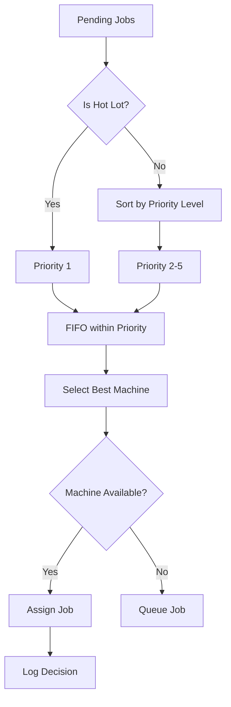

**Algorithm Rules:**

1. Hot Lots (is_hot_lot=True) always first
2. Priority level (1=highest, 5=lowest)
3. FIFO within same priority
4. Select machine with highest efficiency rating

### 2. Anomaly Detection (ML)

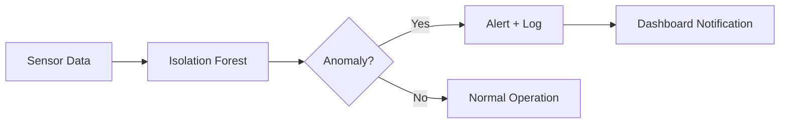

- **Algorithm**: Isolation Forest
- **Features**: Temperature, Vibration, Pressure
- **Output**: Anomaly score (0-1) + Confidence level
- **Training**: Auto-initializes with synthetic data

### 3. Virtual Metrology (VM)

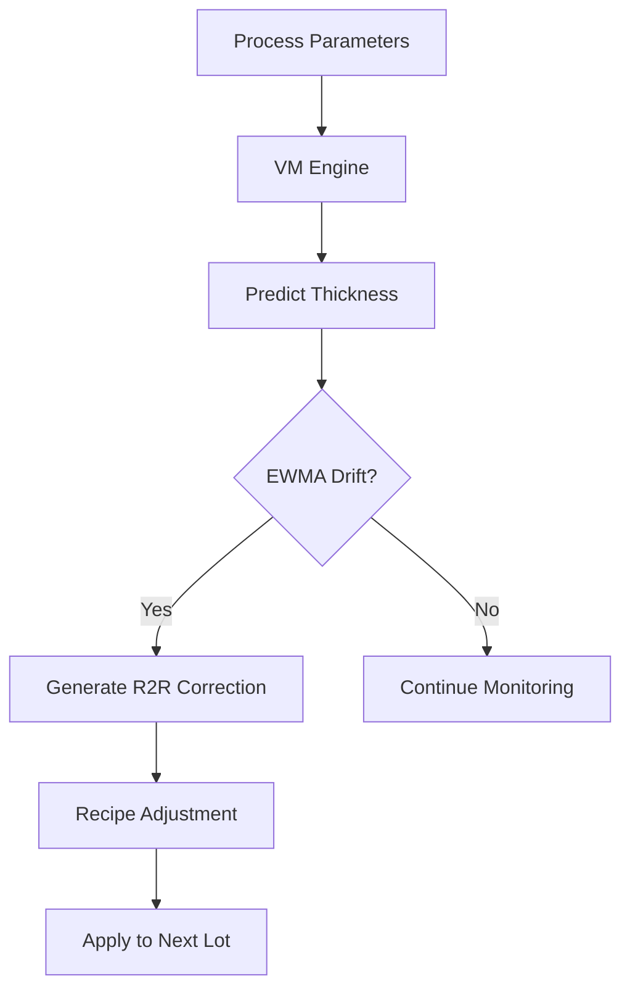

- **Purpose**: Predict film thickness without physical measurement
- **Algorithm**: Ridge Regression with EWMA correction
- **Features**: Temperature, Pressure, Power Consumption
- **R2R**: Run-to-Run control for process drift correction

### 4. Monte Carlo Simulation

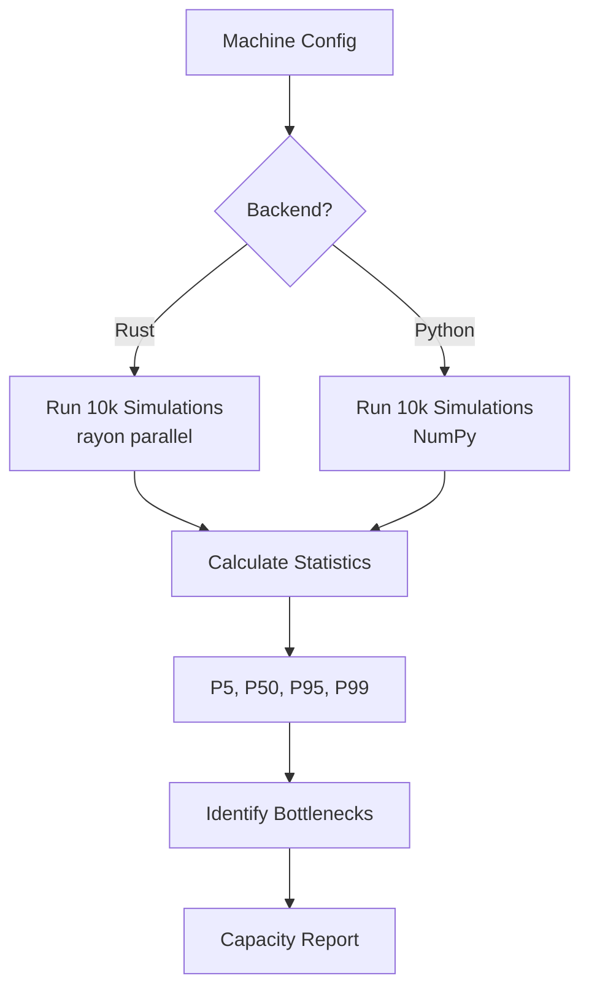

- **Purpose**: Capacity planning & throughput forecasting
- **Iterations**: 10,000+ simulations
- **Output**: P5, P50, P95, P99 confidence intervals
- **Use Case**: "Can we meet 1000 wafers/day target?"
- **Backends**: 
  - **Rust**: 10-50x speedup using rayon parallel execution
  - **Python/NumPy**: Fallback when Rust unavailable
- **Auto-selection**: Rust for n≥1000 simulations

### 5. Scheduler Optimizer

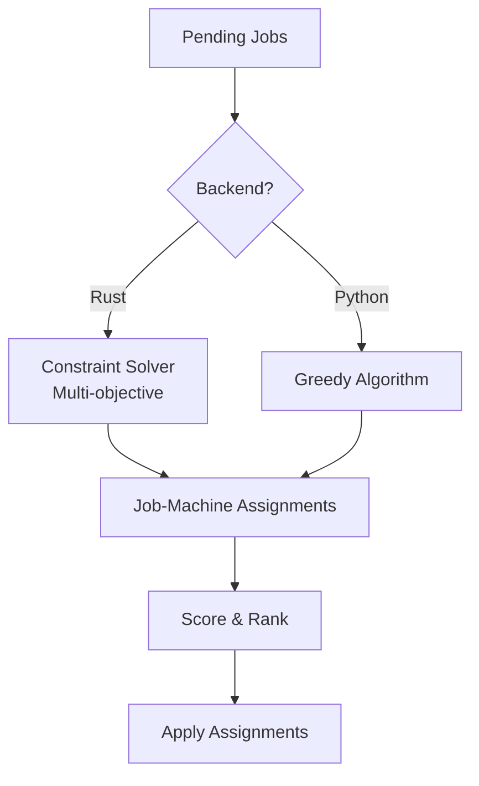

- **Purpose**: Constraint-based job-to-machine optimization
- **Constraints**: Recipe type matching, deadlines, priority
- **Scoring**: Priority + Efficiency + Deadline urgency + Queue depth
- **Backends**:
  - **Rust**: High-performance constraint solver
  - **Python**: Greedy fallback algorithm
- **Features**:
  - Hot lot prioritization
  - Recipe-machine compatibility
  - Deadline awareness
  - Queue depth optimization

### 6. Chaos Engineering API

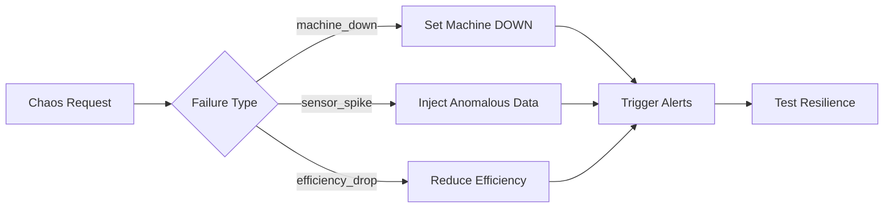

**Scenarios:**

- `machine_down`: Force machine failure
- `sensor_spike`: Inject anomalous readings
- `efficiency_drop`: Reduce machine efficiency

**Purpose**: Test system resilience under failures

---

## Frontend State Management

### Dual-State Pattern for Immediate UI Updates

The frontend uses a dual-state pattern to provide immediate UI feedback while maintaining data consistency:

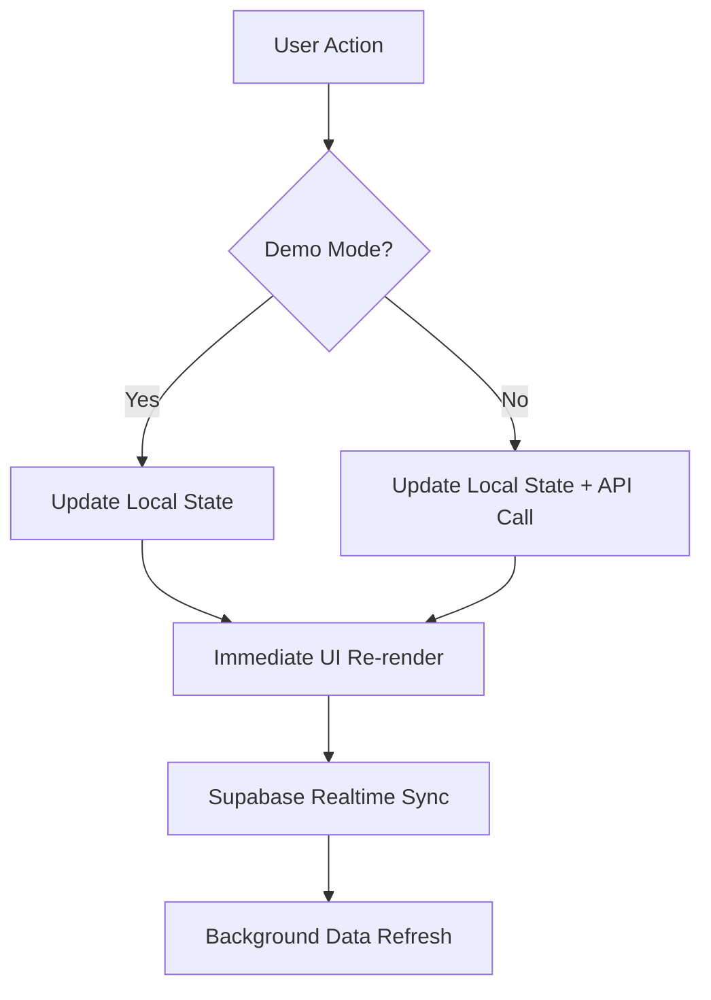

**Key Features:**

- `updateMachine()` - Updates machine status/efficiency immediately
- `updateJob()` - Updates job status and assignments immediately  
- `addJob()` - Adds new jobs to the list immediately
- All state changes propagate across tabs without refresh
- Toast notifications confirm actions

### ToC Dispatch Algorithm (Frontend)

When running in demo mode, the frontend implements Goldratt's Theory of Constraints algorithm:

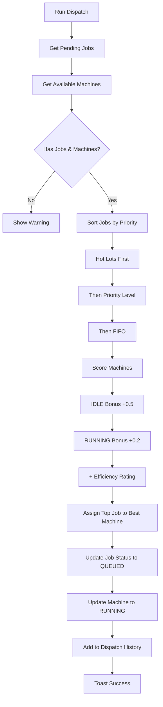

**Algorithm Rules:**

1. Hot lots always processed first
2. Priority level (1=highest, 5=lowest)
3. FIFO within same priority
4. Machine scoring: Efficiency + Status Bonus
5. IDLE machines preferred (can take new jobs)

## Frontend Tab Structure

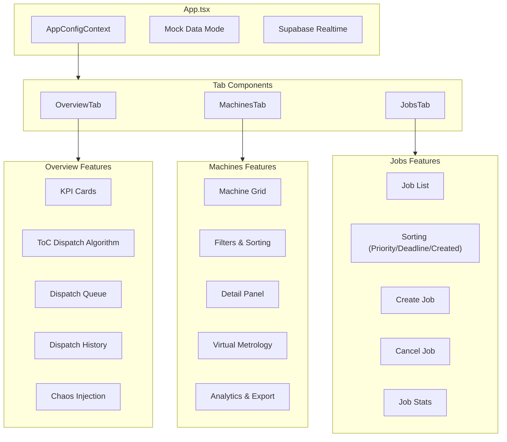

---

## API Reference

### Base URL

```
Production: https://beneficial-mathilde-yieldops-883cf8bf.koyeb.app
Local: http://localhost:8000
```

### Endpoints

| Endpoint | Method | Description |
|----------|--------|-------------|
| `/health` | GET | Health check |
| `/api/v1/machines` | GET | List all machines |
| `/api/v1/machines/{id}` | GET | Get machine details |
| `/api/v1/machines/{id}/stats` | GET | Get machine statistics |
| `/api/v1/jobs` | GET | List all jobs |
| `/api/v1/jobs` | POST | Create new job |
| `/api/v1/jobs/{id}/cancel` | POST | Cancel a job |
| `/api/v1/jobs/queue` | GET | Get job queue |
| `/api/v1/dispatch/run` | POST | Execute ToC dispatch |
| `/api/v1/dispatch/queue` | GET | View dispatch queue |
| `/api/v1/dispatch/history` | GET | Get dispatch history |
| `/api/v1/analytics/monte-carlo` | POST | Run simulation |
| `/api/v1/analytics/anomalies` | GET | Get anomaly stats |
| `/api/v1/chaos/inject` | POST | Inject failure |
| `/api/v1/chaos/recover/{id}` | POST | Recover machine |
| `/api/v1/chaos/scenarios` | GET | List chaos scenarios |
| `/api/v1/vm/status/{id}` | GET | Get VM status |
| `/api/v1/vm/history/{id}` | GET | Get VM history |
| `/api/v1/vm/predict` | POST | Request prediction |
| `/api/v1/vm/model/info` | GET | Get VM model info |

See `apps/api/README.md` for detailed API documentation.

---

## Environment Variables

### apps/api/.env

```bash
SUPABASE_URL=your_supabase_url
SUPABASE_SERVICE_KEY=your_service_key
SUPABASE_ANON_KEY=your_anon_key
DEBUG=true
AUTO_INIT_MODEL=true
```

### apps/dashboard/.env

```bash
VITE_SUPABASE_URL=your_supabase_url
VITE_SUPABASE_ANON_KEY=your_anon_key
VITE_API_URL=http://localhost:8000
```

---

## Rust Modules

High-performance Rust extensions for compute-intensive operations.

### Building

```bash
cd rust

# Install maturin
pip install maturin

# Build for Python (requires PYO3_USE_ABI3_FORWARD_COMPATIBILITY for Python 3.14+)
PYO3_USE_ABI3_FORWARD_COMPATIBILITY=1 maturin develop --release
```

### Monte Carlo Module

**Path**: `rust/monte_carlo/`

**Features**:
- Parallel simulation using rayon
- P5/P50/P95/P99 confidence intervals
- Bottleneck analysis
- 10-50x speedup over Python

```rust
// Rust API
use yieldops_monte_carlo::{MachineConfig, MonteCarloSimulator};

let sim = MonteCarloSimulator::new(42);
let result = sim.run_simulation(machines, 30, 10000)?;
```

### Scheduler Module

**Path**: `rust/scheduler/`

**Features**:
- Constraint-based optimization
- Recipe type matching
- Deadline awareness
- Multi-objective scoring

```rust
// Rust API
use yieldops_scheduler::{SchedulerJob, SchedulerMachine, SchedulerOptimizer};

let optimizer = SchedulerOptimizer::new(None);
let result = optimizer.optimize(jobs, machines, 10)?;
```

### Performance Comparison

| Operation | Python | Rust | Speedup |
|-----------|--------|------|---------|
| 10k MC simulations | ~5s | ~0.1s | 50x |
| Schedule 50 jobs | ~10ms | ~0.1ms | 100x |

---

## Deployment

### Backend (Koyeb)

```bash
koyeb app create yieldops-api \
  --git github.com:AngelP17/YieldOps.git \
  --git-branch main \
  --git-build-command "pip install -r requirements.txt" \
  --git-run-command "uvicorn app.main:app --host 0.0.0.0 --port 8000" \
  --git-workdir apps/api \
  --ports 8000:http \
  --instance-type nano
```

### Frontend (Vercel)

1. Connect GitHub repo to Vercel
2. Set framework preset to "Vite"
3. Set root directory to `apps/dashboard`
4. Add environment variables

---

## Quick Start

```bash
# Clone repository
git clone git@github.com:AngelP17/YieldOps.git
cd YieldOps

# Install dependencies
npm install
cd apps/api && pip install -r requirements.txt

# Set up environment variables
cp apps/api/.env.example apps/api/.env
cp apps/dashboard/.env.example apps/dashboard/.env
# Edit .env files with your credentials

# Run development servers
npm run dev:dashboard  # Terminal 1
npm run dev:api        # Terminal 2
```

---

## Demo Mode

The application includes a **Demo Mode** that provides full functionality without requiring backend configuration:

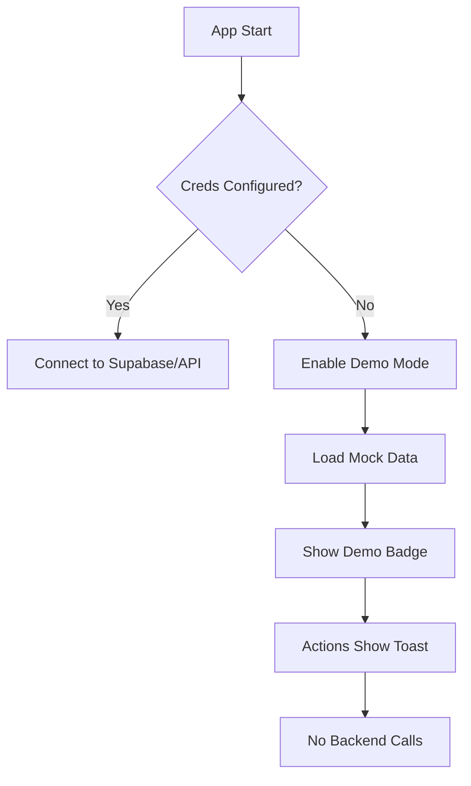

**Features in Demo Mode:**

- All tabs display realistic mock data (48 machines, 25 jobs)
- **Working ToC Dispatch** - Frontend algorithm actually assigns jobs to machines
- **Immediate UI Updates** - Dual-state pattern for instant feedback
- Actions trigger toast notifications
- Sorting on all tabs (priority, deadline, status, efficiency, type)
- Analytics modal with Excel export
- Virtual Metrology with fallback mock predictions
- System Analytics with realistic data fallback
- Visual indicators show "Demo Mode" status
- No "Failed to fetch" errors
- Full UI interactivity

---

## Live Mode with Supabase

When connected to Supabase, the system operates in **Live Mode**:

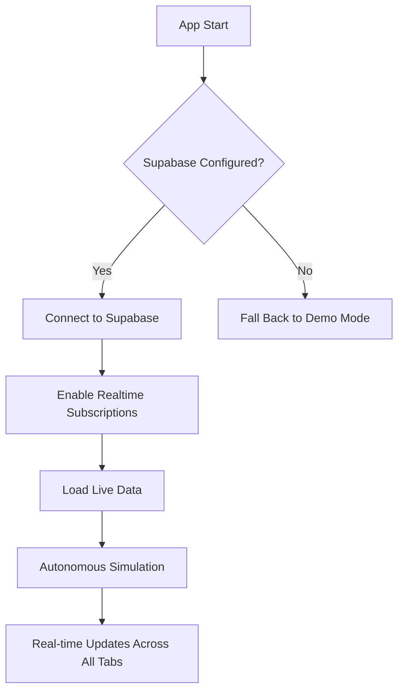

**Live Mode Features:**

- ✅ Real-time data sync via Supabase Realtime
- ✅ Persistent data storage
- ✅ Autonomous simulation (jobs progress automatically)
- ✅ Live VM predictions using sensor data
- ✅ Multi-user support (all users see same data)
- ✅ Changes propagate instantly without page refresh

### Setting Up Live Mode

1. **Create Supabase Project** at [supabase.com](https://supabase.com)
2. **Run Database Migration** in Supabase SQL Editor:

   ```sql
   -- Copy contents of database/reset_and_seed.sql
   ```

3. **Configure Environment Variables** in Vercel:
   - `VITE_SUPABASE_URL`
   - `VITE_SUPABASE_ANON_KEY`

---

## Testing

```bash
# Health check
curl http://localhost:8000/health

# Inject chaos
curl -X POST http://localhost:8000/api/v1/chaos/inject \
  -H "Content-Type: application/json" \
  -d '{"failure_type": "machine_down"}'

# Run Monte Carlo simulation
curl -X POST http://localhost:8000/api/v1/analytics/monte-carlo \
  -H "Content-Type: application/json" \
  -d '{"time_horizon_days": 30, "n_simulations": 1000}'

# Get VM status
curl http://localhost:8000/api/v1/vm/status/{machine_id}
```

---

## License

MIT License
