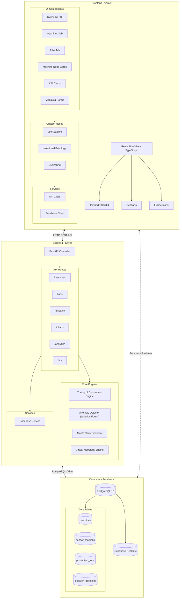
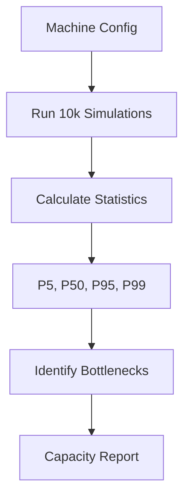
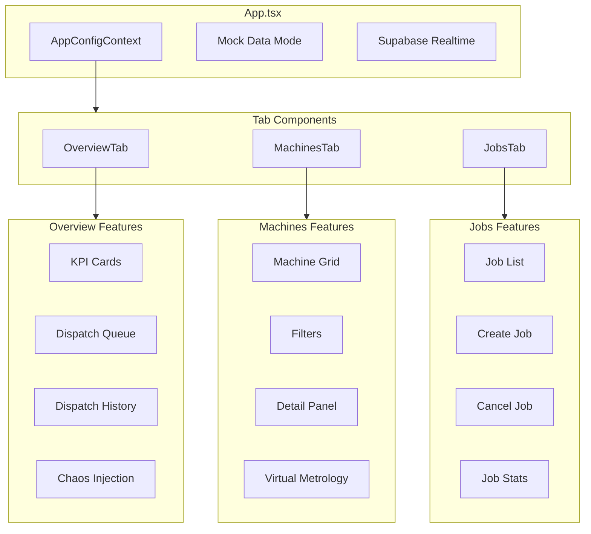

# YieldOps - Smart Fab Architecture

Intelligent Manufacturing & IIoT Portfolio Project

**Live Demo:** [https://yield-ops-dashboard.vercel.app/](https://yield-ops-dashboard.vercel.app/) *(Frontend)*  
**API Endpoint:** https://beneficial-mathilde-yieldops-883cf8bf.koyeb.app/ *(Backend)*

---

## Executive Summary

**Smart Fab** is a full-stack Industrial IoT (IIoT) portfolio project demonstrating intelligent semiconductor manufacturing capabilities. The system simulates a fabrication plant with real-time machine monitoring, automated job dispatching using Theory of Constraints (ToC) algorithms, predictive maintenance through machine learning, and Virtual Metrology for process control.

### Key Capabilities

- **Real-time Monitoring**: Live machine status via WebSockets/Supabase Realtime
- **Intelligent Dispatching**: Automated job routing based on efficiency and priority (ToC)
- **Predictive Maintenance**: Anomaly detection using Isolation Forest
- **Virtual Metrology**: Predict film thickness and enable Run-to-Run control
- **Capacity Planning**: Monte Carlo simulation for production forecasting
- **Chaos Engineering**: Controlled failure injection for resilience testing
- **Demo Mode**: Full functionality without backend configuration

---

## System Architecture



---

## Technology Stack

| Layer | Technology | Purpose | Hosting |
|-------|------------|---------|---------|
| **Frontend** | React 18 + Vite + TypeScript | UI Framework | Vercel |
| **Styling** | Tailwind CSS 3.4 | Utility-first CSS | - |
| **Charts** | Recharts | Data Visualization | - |
| **Icons** | Lucide React | Icon Library | - |
| **Backend** | FastAPI (Python 3.11) | API & ML Services | Koyeb |
| **Database** | PostgreSQL 15 | Primary Data Store | Supabase |
| **Realtime** | Supabase Realtime | WebSocket Events | Supabase |
| **ML** | Scikit-Learn | Anomaly Detection & VM | - |

### Why This Stack?

| Component | Winner | Why It Wins |
|-----------|--------|-------------|
| **Database** | **Supabase** | Free Realtime (WebSockets) for live dashboard updates without polling |
| **Backend** | **Koyeb** | Free tier with no cold starts - stays running for responsive demos |
| **Frontend** | **Vercel** | Best React support with automatic CI/CD and client-side routing |

---

## Database Schema

### Entity Relationship Diagram


### Core Tables

#### Machines
```sql
CREATE TABLE machines (
    machine_id UUID PRIMARY KEY DEFAULT uuid_generate_v4(),
    name VARCHAR(100) NOT NULL UNIQUE,
    type VARCHAR(50) NOT NULL, -- lithography, etching, deposition, inspection, cleaning
    status VARCHAR(20) NOT NULL DEFAULT 'IDLE', -- IDLE, RUNNING, DOWN, MAINTENANCE
    efficiency_rating DECIMAL(4,2) NOT NULL CHECK (efficiency_rating >= 0.00 AND efficiency_rating <= 1.00),
    location_zone VARCHAR(20) NOT NULL,
    current_wafer_count INTEGER DEFAULT 0,
    total_wafers_processed INTEGER DEFAULT 0,
    created_at TIMESTAMP WITH TIME ZONE DEFAULT NOW(),
    updated_at TIMESTAMP WITH TIME ZONE DEFAULT NOW()
);
```

#### Sensor Readings
```sql
CREATE TABLE sensor_readings (
    reading_id UUID PRIMARY KEY DEFAULT uuid_generate_v4(),
    machine_id UUID NOT NULL REFERENCES machines(machine_id) ON DELETE CASCADE,
    temperature DECIMAL(6,2) NOT NULL,
    vibration DECIMAL(6,3) NOT NULL,
    pressure DECIMAL(8,2),
    power_consumption DECIMAL(10,2),
    is_anomaly BOOLEAN DEFAULT FALSE,
    anomaly_score DECIMAL(5,4),
    recorded_at TIMESTAMP WITH TIME ZONE DEFAULT NOW()
);
```

#### Production Jobs
```sql
CREATE TABLE production_jobs (
    job_id UUID PRIMARY KEY DEFAULT uuid_generate_v4(),
    job_name VARCHAR(100) NOT NULL,
    wafer_count INTEGER NOT NULL CHECK (wafer_count > 0),
    priority_level INTEGER NOT NULL CHECK (priority_level BETWEEN 1 AND 5),
    status VARCHAR(20) NOT NULL DEFAULT 'PENDING',
    recipe_type VARCHAR(50) NOT NULL,
    assigned_machine_id UUID REFERENCES machines(machine_id),
    is_hot_lot BOOLEAN DEFAULT FALSE,
    customer_tag VARCHAR(50),
    deadline TIMESTAMP WITH TIME ZONE,
    created_at TIMESTAMP WITH TIME ZONE DEFAULT NOW(),
    updated_at TIMESTAMP WITH TIME ZONE DEFAULT NOW()
);
```

#### Dispatch Decisions
```sql
CREATE TABLE dispatch_decisions (
    decision_id UUID PRIMARY KEY DEFAULT uuid_generate_v4(),
    job_id UUID NOT NULL REFERENCES production_jobs(job_id),
    machine_id UUID NOT NULL REFERENCES machines(machine_id),
    decision_reason TEXT NOT NULL,
    algorithm_version VARCHAR(20) DEFAULT '1.0.0',
    efficiency_at_dispatch DECIMAL(4,2),
    queue_depth_at_dispatch INTEGER,
    dispatched_at TIMESTAMP WITH TIME ZONE DEFAULT NOW()
);
```

See `database/schema.sql` for complete schema with indexes, triggers, and RLS policies.

---

## Repository Structure

```
YieldOps/
├── apps/
│   ├── dashboard/          # React Frontend (Vercel)
│   │   ├── src/
│   │   │   ├── components/    # React components
│   │   │   │   ├── tabs/         # Overview, Machines, Jobs tabs
│   │   │   │   ├── ui/           # Reusable UI components
│   │   │   │   ├── MachineNode.tsx
│   │   │   │   ├── SPCControlChart.tsx
│   │   │   │   └── SPCViolationBadges.tsx
│   │   │   ├── hooks/         # Custom hooks
│   │   │   │   ├── useRealtime.ts
│   │   │   │   ├── useVirtualMetrology.ts
│   │   │   │   └── usePolling.ts
│   │   │   ├── services/      # API clients
│   │   │   │   ├── apiClient.ts
│   │   │   │   └── supabaseClient.ts
│   │   │   ├── lib/           # Utility libraries
│   │   │   │   └── spcEngine.ts
│   │   │   └── types/         # TypeScript types
│   │   ├── .env               # Environment variables (not in git)
│   │   └── vercel.json        # Vercel config
│   │
│   └── api/                # FastAPI Backend (Koyeb)
│       ├── app/
│       │   ├── api/v1/        # API endpoints
│       │   │   ├── machines.py
│       │   │   ├── jobs.py
│       │   │   ├── dispatch.py
│       │   │   ├── chaos.py
│       │   │   ├── analytics.py
│       │   │   └── vm.py
│       │   ├── core/          # ML & algorithms
│       │   │   ├── toc_engine.py
│       │   │   ├── anomaly_detector.py
│       │   │   ├── monte_carlo.py
│       │   │   └── vm_engine.py
│       │   ├── models/        # Pydantic schemas
│       │   └── services/      # Database service
│       ├── .env               # Environment variables (not in git)
│       ├── requirements.txt
│       └── koyeb.yaml         # Koyeb config
│
├── packages/
│   └── types/              # Shared TypeScript types
│
├── ml/                     # ML notebooks & scripts
├── database/               # Schema & seed files
│   ├── schema.sql
│   ├── seed.sql
│   └── migrations/
│
├── README.md               # Project overview
└── Architecture.md         # This file
```

---

## Core Components

### 1. Theory of Constraints (ToC) Dispatch Engine


**Algorithm Rules:**
1. Hot Lots (is_hot_lot=True) always first
2. Priority level (1=highest, 5=lowest)
3. FIFO within same priority
4. Select machine with highest efficiency rating

### 2. Anomaly Detection (ML)


- **Algorithm**: Isolation Forest
- **Features**: Temperature, Vibration, Pressure
- **Output**: Anomaly score (0-1) + Confidence level
- **Training**: Auto-initializes with synthetic data

### 3. Virtual Metrology (VM)


- **Purpose**: Predict film thickness without physical measurement
- **Algorithm**: Ridge Regression with EWMA correction
- **Features**: Temperature, Pressure, Power Consumption
- **R2R**: Run-to-Run control for process drift correction

### 4. Monte Carlo Simulation



- **Purpose**: Capacity planning & throughput forecasting
- **Iterations**: 10,000+ simulations
- **Output**: P5, P50, P95, P99 confidence intervals
- **Use Case**: "Can we meet 1000 wafers/day target?"

### 5. Chaos Engineering API


**Scenarios:**
- `machine_down`: Force machine failure
- `sensor_spike`: Inject anomalous readings
- `efficiency_drop`: Reduce machine efficiency

**Purpose**: Test system resilience under failures

---

## Frontend Tab Structure



---

## API Reference

### Base URL
```
Production: https://beneficial-mathilde-yieldops-883cf8bf.koyeb.app
Local: http://localhost:8000
```

### Endpoints

| Endpoint | Method | Description |
|----------|--------|-------------|
| `/health` | GET | Health check |
| `/api/v1/machines` | GET | List all machines |
| `/api/v1/machines/{id}` | GET | Get machine details |
| `/api/v1/machines/{id}/stats` | GET | Get machine statistics |
| `/api/v1/jobs` | GET | List all jobs |
| `/api/v1/jobs` | POST | Create new job |
| `/api/v1/jobs/{id}/cancel` | POST | Cancel a job |
| `/api/v1/jobs/queue` | GET | Get job queue |
| `/api/v1/dispatch/run` | POST | Execute ToC dispatch |
| `/api/v1/dispatch/queue` | GET | View dispatch queue |
| `/api/v1/dispatch/history` | GET | Get dispatch history |
| `/api/v1/analytics/monte-carlo` | POST | Run simulation |
| `/api/v1/analytics/anomalies` | GET | Get anomaly stats |
| `/api/v1/chaos/inject` | POST | Inject failure |
| `/api/v1/chaos/recover/{id}` | POST | Recover machine |
| `/api/v1/chaos/scenarios` | GET | List chaos scenarios |
| `/api/v1/vm/status/{id}` | GET | Get VM status |
| `/api/v1/vm/history/{id}` | GET | Get VM history |
| `/api/v1/vm/predict` | POST | Request prediction |
| `/api/v1/vm/model/info` | GET | Get VM model info |

See `apps/api/README.md` for detailed API documentation.

---

## Environment Variables

### apps/api/.env
```bash
SUPABASE_URL=your_supabase_url
SUPABASE_SERVICE_KEY=your_service_key
SUPABASE_ANON_KEY=your_anon_key
DEBUG=true
AUTO_INIT_MODEL=true
```

### apps/dashboard/.env
```bash
VITE_SUPABASE_URL=your_supabase_url
VITE_SUPABASE_ANON_KEY=your_anon_key
VITE_API_URL=http://localhost:8000
```

---

## Deployment

### Backend (Koyeb)

```bash
koyeb app create yieldops-api \
  --git github.com:AngelP17/YieldOps.git \
  --git-branch main \
  --git-build-command "pip install -r requirements.txt" \
  --git-run-command "uvicorn app.main:app --host 0.0.0.0 --port 8000" \
  --git-workdir apps/api \
  --ports 8000:http \
  --instance-type nano
```

### Frontend (Vercel)

1. Connect GitHub repo to Vercel
2. Set framework preset to "Vite"
3. Set root directory to `apps/dashboard`
4. Add environment variables

---

## Quick Start

```bash
# Clone repository
git clone git@github.com:AngelP17/YieldOps.git
cd YieldOps

# Install dependencies
npm install
cd apps/api && pip install -r requirements.txt

# Set up environment variables
cp apps/api/.env.example apps/api/.env
cp apps/dashboard/.env.example apps/dashboard/.env
# Edit .env files with your credentials

# Run development servers
npm run dev:dashboard  # Terminal 1
npm run dev:api        # Terminal 2
```

---

## Demo Mode

The application includes a **Demo Mode** that provides full functionality without requiring backend configuration:


**Features in Demo Mode:**
- All tabs display mock data
- Actions trigger toast notifications
- Visual indicators show "Demo Mode" status
- No "Failed to fetch" errors
- Full UI interactivity

---

## Testing

```bash
# Health check
curl http://localhost:8000/health

# Inject chaos
curl -X POST http://localhost:8000/api/v1/chaos/inject \
  -H "Content-Type: application/json" \
  -d '{"failure_type": "machine_down"}'

# Run Monte Carlo simulation
curl -X POST http://localhost:8000/api/v1/analytics/monte-carlo \
  -H "Content-Type: application/json" \
  -d '{"time_horizon_days": 30, "n_simulations": 1000}'

# Get VM status
curl http://localhost:8000/api/v1/vm/status/{machine_id}
```

---

## License

MIT License
