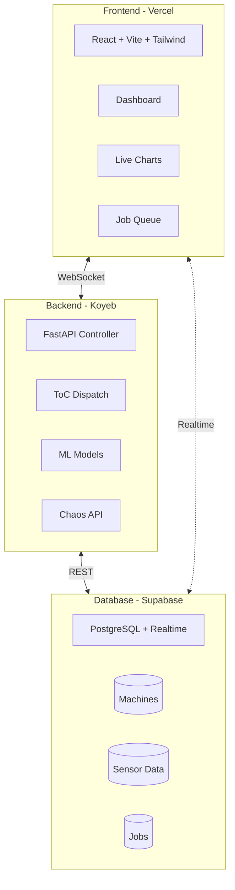

# YieldOps - Smart Fab

Intelligent Manufacturing & IIoT Portfolio Project

**Live Demo:** https://beneficial-mathilde-yieldops-883cf8bf.koyeb.app/

---

## Overview

**Smart Fab** is a full-stack Industrial IoT (IIoT) portfolio project demonstrating intelligent semiconductor manufacturing capabilities. The system simulates a fabrication plant with real-time machine monitoring, automated job dispatching using Theory of Constraints (ToC) algorithms, and predictive maintenance through machine learning.

### Key Capabilities

- **Real-time Monitoring**: Live machine status via WebSockets
- **Intelligent Dispatching**: Automated job routing based on efficiency and priority
- **Predictive Maintenance**: Anomaly detection using Isolation Forest
- **Capacity Planning**: Monte Carlo simulation for production forecasting
- **Chaos Engineering**: Controlled failure injection for resilience testing

---

## Architecture



---

## Technology Stack

| Layer | Technology | Purpose | Hosting |
|-------|------------|---------|---------|
| **Frontend** | React 18 + Vite + TypeScript | UI Framework | Vercel |
| **Styling** | Tailwind CSS 3.4 | Utility-first CSS | - |
| **Charts** | Recharts | Data Visualization | - |
| **Backend** | FastAPI (Python 3.11) | API & ML Services | Koyeb |
| **Database** | PostgreSQL 15 | Primary Data Store | Supabase |
| **Realtime** | Supabase Realtime | WebSocket Events | Supabase |
| **ML** | Scikit-Learn | Anomaly Detection | - |

---

## Repository Structure

```
YieldOps/
├── apps/
│   ├── dashboard/          # React Frontend (Vercel)
│   └── api/                # FastAPI Backend (Koyeb)
├── packages/
│   └── types/              # Shared TypeScript types
├── ml/                     # ML & Simulation
├── database/               # Schema & Seed files
├── README.md               # This file
└── Architecture.md         # Detailed architecture docs
```

---

## Quick Start

### Prerequisites

- Node.js 18+
- Python 3.11+
- Supabase account

### Setup

1. **Clone the repository**
   ```bash
   git clone git@github.com:AngelP17/YieldOps.git
   cd YieldOps
   ```

2. **Install dependencies**
   ```bash
   # Root
   npm install
   
   # Dashboard
   cd apps/dashboard && npm install
   
   # API
   cd apps/api && pip install -r requirements.txt
   ```

3. **Environment Variables**

   Create `.env` files:

   **apps/api/.env:**
   ```bash
   SUPABASE_URL=your_supabase_url
   SUPABASE_SERVICE_KEY=your_service_key
   SUPABASE_ANON_KEY=your_anon_key
   DEBUG=true
   ```

   **apps/dashboard/.env:**
   ```bash
   VITE_SUPABASE_URL=your_supabase_url
   VITE_SUPABASE_ANON_KEY=your_anon_key
   VITE_API_URL=http://localhost:8000
   ```

4. **Run Development**
   ```bash
   # Dashboard
   npm run dev:dashboard
   
   # API
   npm run dev:api
   ```

---

## API Endpoints

| Endpoint | Method | Description |
|----------|--------|-------------|
| `/health` | GET | Health check |
| `/api/v1/machines` | GET | List machines |
| `/api/v1/jobs` | GET | List jobs |
| `/api/v1/dispatch/run` | POST | Execute ToC dispatch |
| `/api/v1/analytics/monte-carlo` | POST | Run simulation |
| `/api/v1/chaos/inject` | POST | Inject failure |

See [Architecture.md](Architecture.md) for complete documentation.

---

## Deployment

### Backend (Koyeb)

```bash
koyeb app create yieldops-api \
  --git github.com:AngelP17/YieldOps.git \
  --git-branch main \
  --git-build-command "pip install -r requirements.txt" \
  --git-run-command "uvicorn app.main:app --host 0.0.0.0 --port 8000" \
  --git-workdir apps/api \
  --ports 8000:http \
  --instance-type nano
```

### Frontend (Vercel)

Connect your GitHub repo to Vercel for automatic deployments.

---

## Documentation

- **[Architecture.md](Architecture.md)** - Detailed architecture, database schema, API specs
- **[apps/api/README.md](apps/api/README.md)** - API-specific documentation
- **[apps/dashboard/README.md](apps/dashboard/README.md)** - Frontend documentation

---

## License

MIT License
