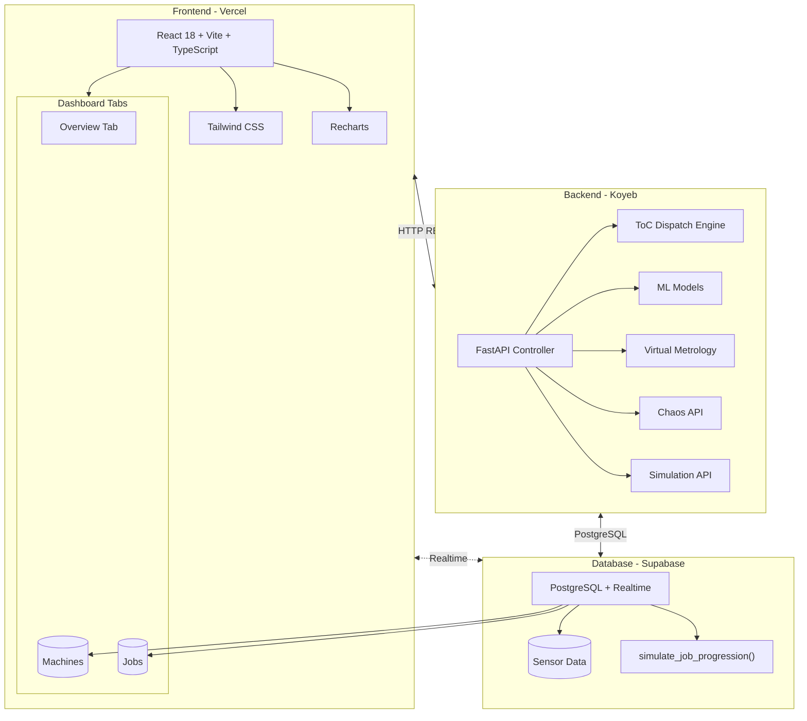
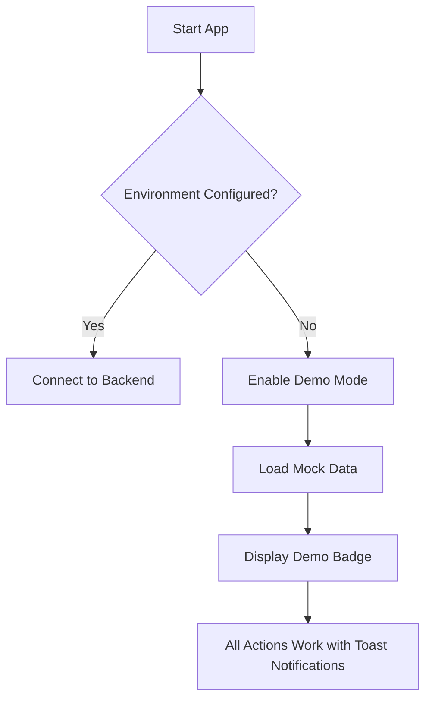

# YieldOps - Smart Fab

Intelligent Manufacturing & IIoT Portfolio Project

**Live Demo:** [https://yield-ops-dashboard.vercel.app/](https://yield-ops-dashboard.vercel.app/) *(Frontend)*  
**API Endpoint:** <https://beneficial-mathilde-yieldops-883cf8bf.koyeb.app/> *(Backend)*

---

## Overview

**Smart Fab** is a full-stack Industrial IoT (IIoT) portfolio project demonstrating intelligent semiconductor manufacturing capabilities. The system simulates a fabrication plant with real-time machine monitoring, automated job dispatching using Theory of Constraints (ToC) algorithms, predictive maintenance through machine learning, and Virtual Metrology for advanced process control.

### Key Capabilities

- **Real-time Monitoring**: Live machine status via WebSockets/Supabase Realtime
- **Intelligent Dispatching**: Automated job routing based on efficiency and priority (ToC)
- **Autonomous Simulation**: Jobs progress automatically through PENDING→QUEUED→RUNNING→COMPLETED
- **Predictive Maintenance**: Anomaly detection using Isolation Forest
- **Virtual Metrology**: Predict film thickness and enable Run-to-Run (R2R) control
- **Capacity Planning**: Monte Carlo simulation for production forecasting
- **Chaos Engineering**: Controlled failure injection for resilience testing
- **Demo Mode**: Full functionality without backend configuration

---

## Architecture



---

## Technology Stack

| Layer | Technology | Purpose | Hosting |
|-------|------------|---------|---------|
| **Frontend** | React 18 + Vite + TypeScript | UI Framework | Vercel |
| **Styling** | Tailwind CSS 3.4 | Utility-first CSS | - |
| **Charts** | Recharts | Data Visualization | - |
| **Icons** | Lucide React | Icon Library | - |
| **Backend** | FastAPI (Python 3.11) | API & ML Services | Koyeb |
| **Database** | PostgreSQL 15 | Primary Data Store | Supabase |
| **Realtime** | Supabase Realtime | WebSocket Events | Supabase |
| **ML** | Scikit-Learn | Anomaly Detection & VM | - |

---

## Repository Structure

```
YieldOps/
├── apps/
│   ├── dashboard/          # React Frontend (Vercel)
│   │   ├── src/
│   │   │   ├── components/    # React components
│   │   │   │   ├── tabs/         # Overview, Machines, Jobs tabs
│   │   │   │   ├── ui/           # Reusable UI components
│   │   │   │   └── *.tsx         # Component files
│   │   │   ├── hooks/         # Custom hooks (useRealtime, useVirtualMetrology)
│   │   │   ├── services/      # API & Supabase clients
│   │   │   ├── lib/           # Utility libraries
│   │   │   └── types/         # TypeScript types
│   │   └── .env               # Environment variables
│   │
│   └── api/                # FastAPI Backend (Koyeb)
│       ├── app/
│       │   ├── api/v1/        # API endpoints
│       │   ├── core/          # ML & algorithms
│       │   ├── models/        # Pydantic schemas
│       │   └── services/      # Database service
│       └── requirements.txt
│
├── packages/
│   └── types/              # Shared TypeScript types
├── database/               # Schema & seed files
│   ├── schema.sql          # Core database schema
│   ├── seed.sql            # Seed data (48 machines, 25 jobs)
│   ├── reset_and_seed.sql  # Full reset + seed for Supabase
│   └── migrations/
├── README.md               # This file
└── Architecture.md         # Detailed architecture docs
```

### Database Seed Data

| Entity | Count | Description |
|--------|-------|-------------|
| **Machines** | 48 | LITHO-01 to DEP-12 across 8 zones |
| **Production Jobs** | 25 | Apple, NVIDIA, AMD, Intel, etc. |
| **Sensor Readings** | 4,800+ | 100+ per machine for VM training |

---

## Quick Start

### Prerequisites

- Node.js 18+
- Python 3.11+
- Supabase account (optional for demo mode)

### Setup

1. **Clone the repository**

   ```bash
   git clone git@github.com:AngelP17/YieldOps.git
   cd YieldOps
   ```

2. **Install dependencies**

   ```bash
   # Root
   npm install
   
   # Dashboard
   cd apps/dashboard && npm install
   
   # API
   cd apps/api && pip install -r requirements.txt
   ```

3. **Environment Variables** (Optional for demo mode)

   Create `.env` files:

   **apps/api/.env:**

   ```bash
   SUPABASE_URL=your_supabase_url
   SUPABASE_SERVICE_KEY=your_service_key
   SUPABASE_ANON_KEY=your_anon_key
   DEBUG=true
   ```

   **apps/dashboard/.env:**

   ```bash
   VITE_SUPABASE_URL=your_supabase_url
   VITE_SUPABASE_ANON_KEY=your_anon_key
   VITE_API_URL=http://localhost:8000
   ```

4. **Run Development**

   ```bash
   # Dashboard
   npm run dev:dashboard
   
   # API (optional for demo mode)
   npm run dev:api
   ```

---

## Demo Mode

YieldOps includes a **Demo Mode** that provides full UI functionality without requiring any backend configuration:



**Demo Mode Features:**

- ✅ All three tabs functional (Overview, Machines, Jobs)
- ✅ Realistic mock data (48 machines, 25 jobs with real customers)
- ✅ **Working ToC Dispatch** - Actually assigns jobs to machines using Goldratt's algorithm
- ✅ **Immediate UI Updates** - All actions update state without page refresh
- ✅ Machine detail panel with status controls, chaos injection, recovery
- ✅ Job creation and cancellation with instant list updates
- ✅ Sorting on all tabs (priority, deadline, status, efficiency, type)
- ✅ Analytics modal with export to Excel functionality
- ✅ Virtual Metrology with fallback mock predictions
- ✅ System Analytics with realistic data fallback
- ✅ Toast notifications for all actions
- ❌ No persistent data storage
- ❌ No real-time sync across tabs/users

---

## Live Mode (Supabase)

When connected to Supabase, the system operates in **Live Mode** with real-time data sync:

**Live Mode Features:**

- ✅ Real-time data sync via Supabase Realtime
- ✅ Persistent data storage in PostgreSQL
- ✅ Autonomous simulation (jobs progress automatically)
- ✅ Live VM predictions using sensor data
- ✅ Multi-user support (all users see same data)
- ✅ Changes propagate instantly without page refresh

### Setting Up Live Mode

1. **Create Supabase Project** at [supabase.com](https://supabase.com)
2. **Run Database Migration** in Supabase SQL Editor:
   - Copy contents of `database/reset_and_seed.sql`
   - Paste into SQL Editor and run
3. **Configure Environment Variables** in Vercel:
   - `VITE_SUPABASE_URL` - Your Supabase project URL
   - `VITE_SUPABASE_ANON_KEY` - Your Supabase anon key

---

## Dashboard Tabs

### Overview Tab

- KPI Cards (Machines, Efficiency, Wafers, Jobs, Alerts)
- **ToC Dispatch** - Run Theory of Constraints dispatch algorithm
- Dispatch Queue with prioritized jobs (hot lots first)
- Recent Dispatch Decisions with timestamps
- Production Queue preview with assigned machines
- Chaos Injection controls (machine down, sensor spike, efficiency drop)
- Machine Status Summary with visual progress bar
- Troubled Machines list with recover actions

### Machines Tab

- Machine Grid with filterable/sortable cards (by name, status, efficiency, type)
- Real-time status indicators with VM predictions
- **Sorting** - Name, Status, Efficiency, Type
- Machine Detail Panel:
  - Status controls (IDLE, RUNNING, MAINTENANCE, DOWN)
  - Metrics (Efficiency, Wafers, Temperature, Vibration)
  - **Analytics & Export** - View detailed analytics and export to Excel
  - Recover action for troubled machines
  - Chaos injection (machine down, sensor spike, efficiency drop)

### Jobs Tab

- Job Statistics (Total, Pending, Queued, Running, Completed, Failed, Hot Lots)
- **Enhanced Sorting** - Priority (hot lots first), Deadline, Created
- Filterable Job List by status and search
- Hot Lot filter toggle
- Create Job Modal with full form
- Cancel Job action with immediate UI update
- Hot Lot indicators and Priority badges
- Assigned machine display

---

## API Endpoints

| Endpoint | Method | Description |
|----------|--------|-------------|
| `/health` | GET | Health check |
| `/api/v1/machines` | GET | List machines |
| `/api/v1/jobs` | GET/POST | List/Create jobs |
| `/api/v1/jobs/{id}/cancel` | POST | Cancel job |
| `/api/v1/dispatch/run` | POST | Execute ToC dispatch |
| `/api/v1/dispatch/queue` | GET | View dispatch queue |
| `/api/v1/simulation/tick` | POST | Run one simulation tick |
| `/api/v1/simulation/fast` | POST | Run multiple ticks (fast forward) |
| `/api/v1/simulation/status` | GET | Get simulation status |
| `/api/v1/simulation/reset` | POST | Reset to initial distribution |
| `/api/v1/analytics/monte-carlo` | POST | Run simulation |
| `/api/v1/analytics/anomalies` | GET | Get anomaly stats |
| `/api/v1/chaos/inject` | POST | Inject failure |
| `/api/v1/chaos/recover/{id}` | POST | Recover machine |
| `/api/v1/vm/status/{id}` | GET | Get VM status |
| `/api/v1/vm/predict` | POST | Request VM prediction |

See [Architecture.md](Architecture.md) for complete documentation.

---

## Deployment

### Backend (Koyeb)

```bash
koyeb app create yieldops-api \
  --git github.com:AngelP17/YieldOps.git \
  --git-branch main \
  --git-build-command "pip install -r requirements.txt" \
  --git-run-command "uvicorn app.main:app --host 0.0.0.0 --port 8000" \
  --git-workdir apps/api \
  --ports 8000:http \
  --instance-type nano
```

### Frontend (Vercel)

1. Connect GitHub repo to Vercel
2. Set framework preset to "Vite"
3. Set root directory to `apps/dashboard`
4. Add environment variables

---

## Testing

```bash
# Health check
curl http://localhost:8000/health

# Inject chaos
curl -X POST http://localhost:8000/api/v1/chaos/inject \
  -H "Content-Type: application/json" \
  -d '{"failure_type": "machine_down"}'

# Run Monte Carlo simulation
curl -X POST http://localhost:8000/api/v1/analytics/monte-carlo \
  -H "Content-Type: application/json" \
  -d '{"time_horizon_days": 30, "n_simulations": 1000}'

# Get VM status
curl http://localhost:8000/api/v1/vm/status/{machine_id}
```

---

## Documentation

- **[Architecture.md](Architecture.md)** - Detailed architecture, database schema, API specs, Mermaid diagrams
- **[apps/api/README.md](apps/api/README.md)** - API-specific documentation
- **[apps/dashboard/README.md](apps/dashboard/README.md)** - Frontend documentation

---

## License

MIT License
