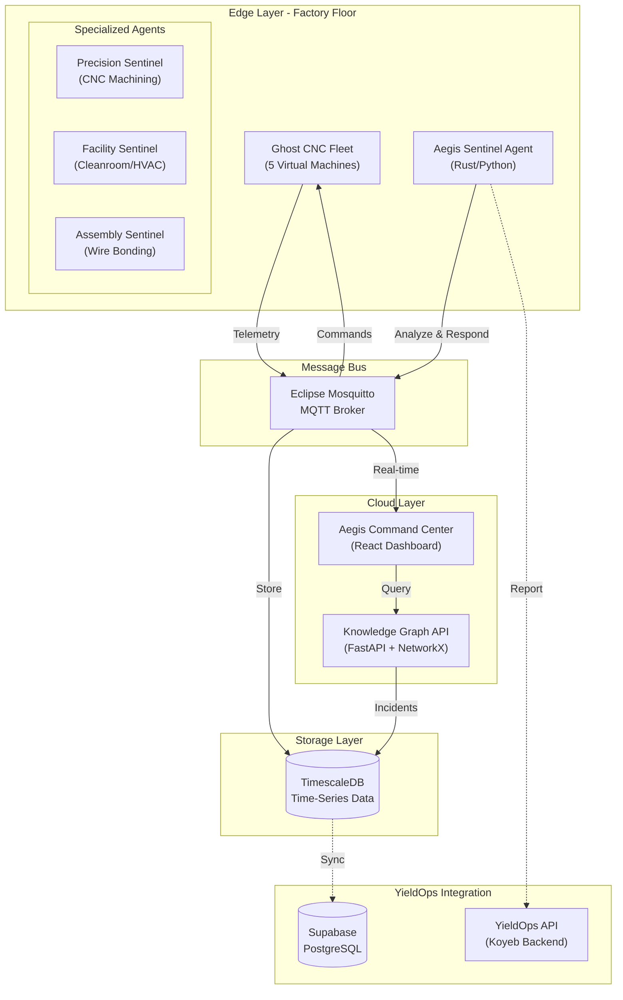
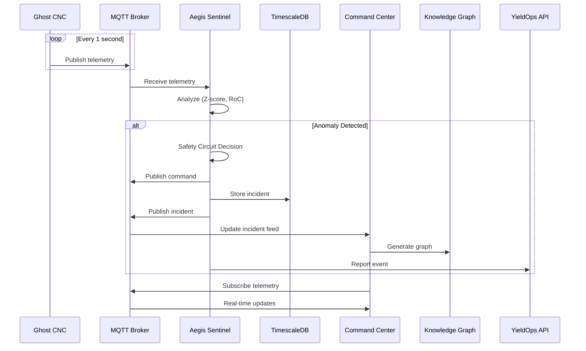
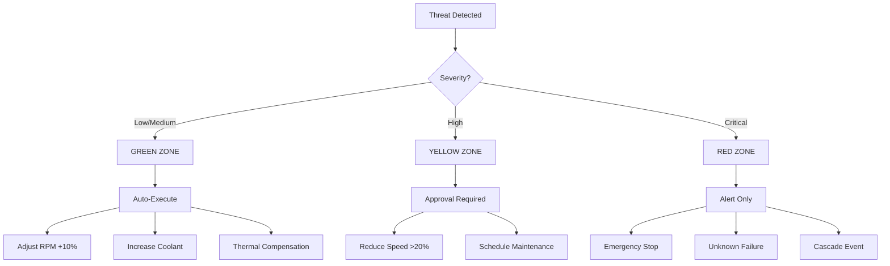
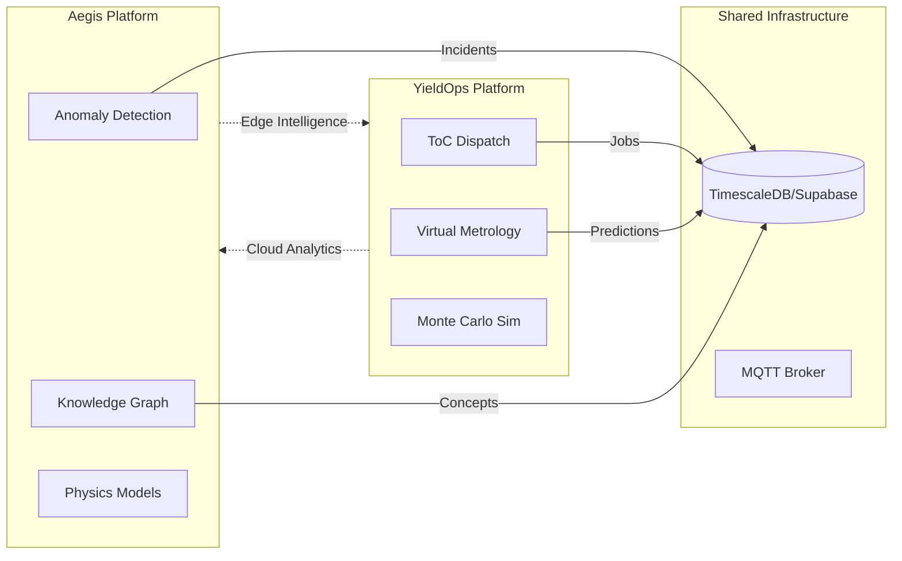

# Aegis Industrial Defense - Architecture

## System Overview

Aegis is an autonomous defense platform for manufacturing equipment. It monitors machines, detects anomalies using physics-based models, and executes autonomous responses through a 3-tier Safety Circuit.



---

## Component Architecture

### 1. Aegis Sentinel Agents

| Agent | Target | Protocol | Physics |
|-------|--------|----------|---------|
| **Precision** | CNC Mills/Lathes | MQTT/FOCAS | Thermal drift (CTE), ISO 10816 vibration |
| **Facility** | Cleanroom/HVAC | Modbus/BACnet | Bernoulli flow, ISO 14644 particles |
| **Assembly** | Wire Bonders | SECS/GEM | Ultrasonic impedance, capillary expansion |

### 2. Message Bus

- **Technology**: Eclipse Mosquitto
- **Ports**: 1883 (MQTT), 9001 (WebSocket)
- **QoS**: At-least-once delivery
- **Topics**:
  - `factory/+/telemetry` - Machine telemetry
  - `factory/+/command` - Control commands
  - `aegis/incidents` - Incident reports

### 3. Time-Series Database

- **Technology**: TimescaleDB (PostgreSQL extension)
- **Tables**:
  - `telemetry` - Raw sensor data (hypertable)
  - `incidents` - Detected anomalies
  - `machines` - Machine registry
- **Retention**: 30 days raw, aggregated hourly

### 4. Command Center

- **Technology**: React 18 + Vite + TypeScript
- **Features**:
  - Real-time telemetry charts
  - Topology visualization
  - Knowledge graph
  - Incident feed
  - Safety Circuit status

### 5. Knowledge Graph

- **Technology**: FastAPI + NetworkX
- **Purpose**: Extract concepts from incidents
- **Nodes**: Machines, failures, components, actions
- **Edges**: has_issue, classifies, resolves, affects

---

## Data Flow



---

## Safety Circuit (3-Tier Model)



---

## Integration with YieldOps

### Data Sync

| Aegis Data | YieldOps Endpoint | Purpose |
|------------|-------------------|---------|
| Incidents | `POST /api/v1/analytics/anomalies` | Yield loss tracking |
| Machine Status | `POST /api/v1/machines/{id}/status` | Fab-wide visibility |
| Telemetry | `POST /api/v1/sensor/readings` | Virtual Metrology input |
| Dispatch | `POST /api/v1/dispatch/run` | ToC job routing |

### Shared Components



---

## Directory Structure

```
aegis-core/
├── aegis-sentinel/           # Rust agent (NEW)
│   ├── src/
│   │   ├── main.rs           # Agent orchestrator
│   │   ├── types.rs          # Core types & traits
│   │   ├── mqtt.rs           # MQTT client
│   │   ├── detection.rs      # Statistical analysis
│   │   ├── safety.rs         # Safety Circuit logic
│   │   └── agents/
│   │       ├── mod.rs        # Agent trait
│   │       ├── precision.rs  # CNC machining agent
│   │       ├── facility.rs   # Cleanroom agent
│   │       └── assembly.rs   # Wire bonding agent
│   ├── Cargo.toml
│   └── Dockerfile
│
├── agent/                    # Python agent (fallback)
│   ├── sentinel_agent.py
│   └── Dockerfile
│
├── simulator/                # Ghost CNC simulator
│   ├── ghost_cnc.py
│   └── Dockerfile
│
├── dashboard/                # React Command Center
│   ├── dist/                 # Built app
│   ├── Dockerfile
│   └── nginx.conf
│
├── knowledge-graph/          # Graph analytics
│   ├── knowledge_graph.py
│   ├── api.py
│   └── Dockerfile
│
├── config/                   # Infrastructure config
│   ├── mosquitto.conf        # MQTT broker config
│   └── init.sql              # TimescaleDB init
│
├── docker-compose.yml        # Full stack orchestration
├── quickstart.sh             # One-command deployment
├── README.md                 # Main documentation
├── ATTRIBUTION.md            # IP protection
├── ARCHITECTURE.md           # This file
├── SEMICONDUCTOR_VALUE_CHAIN.md  # Value chain docs
├── KNOWLEDGE_GRAPH.md        # KG documentation
└── AEGIS_LAUNCH_KIT.md       # Quick start guide
```

---

## Deployment

### Local Development

```bash
# Start full stack
./quickstart.sh

# Access points
# Dashboard: http://localhost:3000
# MQTT: localhost:1883
# Knowledge Graph API: http://localhost:8000
# TimescaleDB: localhost:5432
```

### Production (with YieldOps)

```bash
# 1. Deploy Aegis Edge
kubectl apply -f k8s/aegis-edge.yaml

# 2. Configure YieldOps integration
export YIELDOPS_API_URL=https://yieldops-api.koyeb.app
export YIELDOPS_SUPABASE_URL=your_supabase_url

# 3. Start with cloud backend
docker-compose -f docker-compose.yml -f docker-compose.cloud.yml up -d
```

---

## Performance Specifications

| Metric | Target | Actual |
|--------|--------|--------|
| Detection Latency | <100ms | ~50ms |
| Response Time | <500ms | ~200ms |
| Agent Memory | <50MB | ~10MB |
| MQTT Throughput | 10K msg/s | 50K msg/s |
| Dashboard Render | <100ms | ~50ms |

---

## Security Considerations

1. **MQTT**: Use TLS in production
2. **Database**: Row-level security policies
3. **API**: JWT authentication
4. **Network**: VPC isolation for edge devices

---

## License

MIT License - See ATTRIBUTION.md for IP declaration
