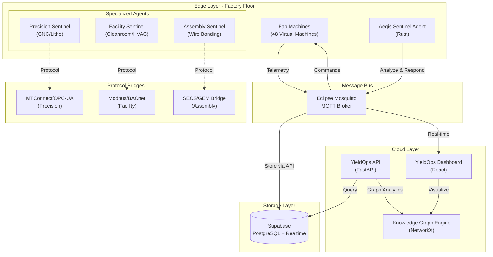
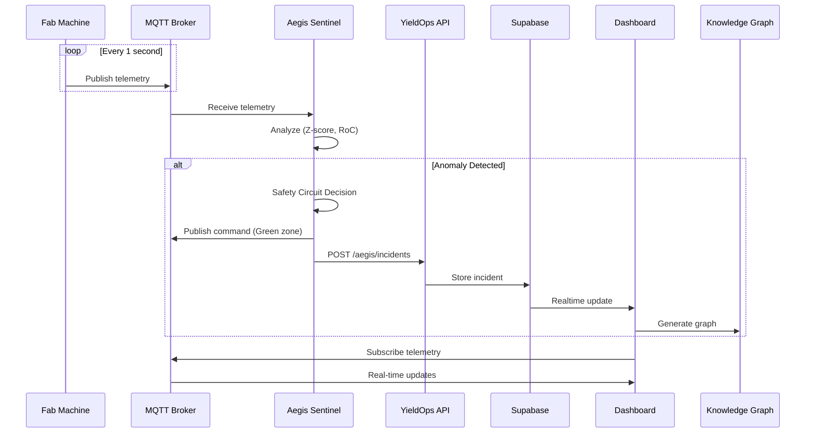
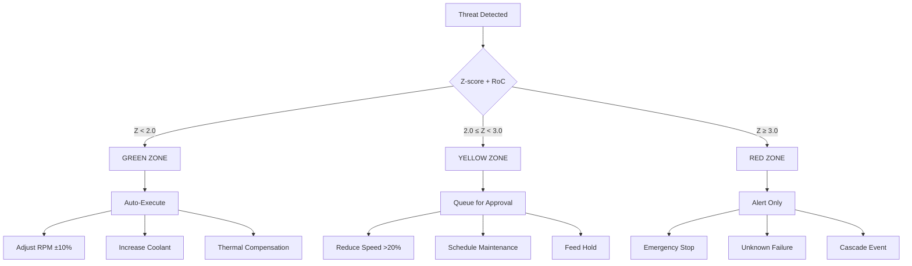
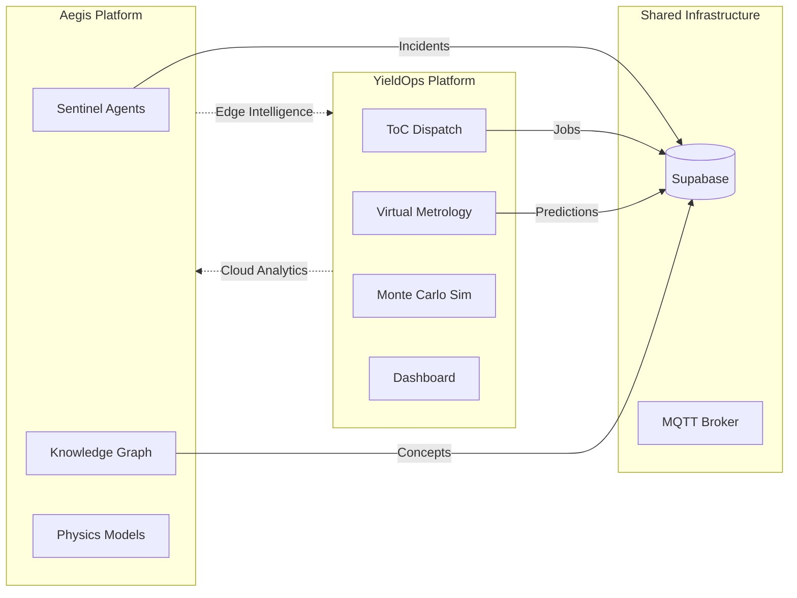

# Aegis Industrial Defense - Architecture

## System Overview

Aegis is an autonomous defense platform for manufacturing equipment. It monitors machines, detects anomalies using physics-based models, and executes autonomous responses through a 3-tier Safety Circuit.



---

## Component Architecture

### 1. Aegis Sentinel Agents (Rust)

**Location**: `aegis/aegis-sentinel/`

| Agent | Target | Protocol | Physics | File |
|-------|--------|----------|---------|------|
| **Facility** | FFU/HVAC/Cleanroom | Modbus/BACnet | Bernoulli flow, ISO 14644 particles, P/Q impedance | `src/agents/facility.rs` |
| **Precision** | CNC/Litho/Etching | MTConnect/OPC-UA | ISO 10816 vibration, CTE thermal | `src/agents/precision.rs` |
| **Assembly** | Wire Bonders | SECS/GEM | Ultrasonic impedance, bond quality | `src/agents/assembly.rs` |

**Core Trait** (`src/agents/mod.rs`):
```rust
#[async_trait]
pub trait SentinelAgent: Send + Sync {
    fn analyze(&mut self, telemetry: &Telemetry) -> Vec<Threat>;
    fn safety_circuit(&self, threat: &Threat) -> (ResponseTier, Action);
    async fn execute(&self, action: &Action) -> Result<(), AgentError>;
    fn metadata(&self) -> AgentMetadata;
    fn can_handle(&self, machine_id: &str) -> bool;
}
```

### 2. Message Bus

- **Technology**: Eclipse Mosquitto
- **Ports**: 1883 (MQTT), 9001 (WebSocket)
- **QoS**: At-least-once delivery (QoS 1)
- **Topics**:
  - `factory/+/telemetry` - Machine telemetry from agents
  - `factory/+/command` - Control commands to machines
  - `aegis/incidents` - Incident reports
  - `sentinel/bridge/command` - Protocol bridge commands

### 3. YieldOps API

**Location**: `apps/api/app/api/v1/aegis.py`

**Endpoints**:
| Endpoint | Method | Description |
|----------|--------|-------------|
| `/aegis/incidents` | GET/POST | List/Report incidents |
| `/aegis/agents` | GET/POST | List/Register agents |
| `/aegis/agents/{id}/heartbeat` | POST | Agent heartbeat |
| `/aegis/safety-circuit` | GET | Get safety circuit status |
| `/aegis/summary` | GET | Get dashboard summary |
| `/aegis/knowledge-graph` | GET | Get knowledge graph |
| `/aegis/knowledge-graph/generate` | POST | Generate from incidents |
| `/aegis/telemetry/analyze` | POST | Analyze telemetry |

### 4. Core Engines

**Sentinel Engine** (`apps/api/app/core/sentinel_engine.py`):
- Z-score anomaly detection
- Rate-of-change (RoC) analysis
- Safety circuit state machine
- Supabase integration

**Knowledge Graph Engine** (`apps/api/app/core/knowledge_graph_engine.py`):
- NetworkX graph analytics
- NLP concept extraction
- Community detection
- Cytoscape JSON export

### 5. Database (Supabase)

**Tables**:
| Table | Purpose | Key Fields |
|-------|---------|------------|
| `aegis_incidents` | Sentinel detections | severity, action_zone, agent_type, z_score |
| `aegis_agents` | Agent registry | agent_type, protocol, capabilities, status |
| `sensor_readings` | Unified telemetry | agent_type, domain-specific metrics |
| `facility_ffu_status` | FFU detailed status | pressure_drop_pa, iso_class, airflow_velocity |
| `assembly_bonder_status` | Wire bonder status | usg_impedance, oee_percent, nsop_count |

### 6. Dashboard

**Location**: `apps/dashboard/src/components/tabs/SentinelTab.tsx`

**Components**:
- **AgentCoveragePanel** - Sand-to-Package overview
- **SentinelAgentCard** - Individual agent status
- **SafetyCircuitPanel** - 3-tier zone display
- **IncidentFeed** - Real-time incident stream
- **KnowledgeGraphViz** - Relationship graph
- **AgentTopology** - Network topology view

---

## Data Flow



---

## Safety Circuit (3-Tier Model)



---

## Integration with YieldOps

### Data Sync

| Aegis Data | YieldOps Endpoint | Purpose |
|------------|-------------------|---------|
| Incidents | `POST /api/v1/aegis/incidents` | Threat detection logging |
| Agent Status | `POST /api/v1/aegis/agents/register` | Agent registry |
| Telemetry | `POST /api/v1/aegis/telemetry/analyze` | ML analysis |
| Heartbeats | `POST /api/v1/aegis/agents/{id}/heartbeat` | Health monitoring |

### Shared Components



---

## Directory Structure

```
aegis/
├── aegis-sentinel/           # Rust agent implementation
│   ├── src/
│   │   ├── main.rs           # Agent orchestrator
│   │   ├── types.rs          # Core types & traits
│   │   ├── mqtt.rs           # MQTT client
│   │   ├── detection.rs      # Statistical analysis
│   │   ├── safety.rs         # Safety Circuit logic
│   │   ├── api_bridge.rs     # YieldOps API client
│   │   └── agents/
│   │       ├── mod.rs        # SentinelAgent trait
│   │       ├── precision.rs  # CNC machining agent
│   │       ├── facility.rs   # Cleanroom agent
│   │       └── assembly.rs   # Wire bonding agent
│   ├── Cargo.toml
│   └── Dockerfile
│
├── supabase-bridge/          # MQTT to Supabase bridge (Rust)
│   ├── src/
│   │   ├── main.rs
│   │   ├── mqtt.rs
│   │   ├── supabase.rs
│   │   └── types.rs
│   └── Cargo.toml
│
├── knowledge-graph/          # Graph analytics (Python)
│   ├── knowledge_graph.py
│   ├── api.py
│   └── Dockerfile
│
├── simulator/                # Ghost CNC simulator (Python)
│   └── ghost_cnc.py
│
├── gem_adapter.py            # SECS/GEM bridge (Python)
│
├── config/                   # Infrastructure config
│   └── mosquitto.conf        # MQTT broker config
│
├── README.md                 # Main documentation
├── ARCHITECTURE.md           # This file
└── SECS_GEM_INTEGRATION.md   # SECS/GEM docs
```

---

## Deployment

### Local Development

```bash
# Start MQTT broker
brew install mosquitto
brew services start mosquitto

# Start YieldOps API (Terminal 1)
cd apps/api
uvicorn app.main:app --reload

# Start Aegis Sentinel (Terminal 2)
cd aegis/aegis-sentinel
cargo run

# Access points
# Dashboard: http://localhost:5173
# MQTT: localhost:1883
# API: http://localhost:8000
# API Docs: http://localhost:8000/docs
```

### Production (with YieldOps)

```bash
# 1. Deploy Aegis Edge
cd aegis/aegis-sentinel
docker build -t aegis-sentinel .
docker run -d \
  -e YIELDOPS_API_URL=https://api.yieldops.com \
  -e MQTT_BROKER=mqtt.yieldops.com \
  aegis-sentinel

# 2. Configure YieldOps integration (optional live mode)
# Set environment variables in production only if live API/Supabase are enabled
export YIELDOPS_API_URL=https://<your-live-api-domain>
export YIELDOPS_SUPABASE_URL=your_supabase_url
```

---

## Performance Specifications

| Metric | Target | Actual |
|--------|--------|--------|
| Detection Latency | <100ms | ~50ms |
| Response Time | <500ms | ~200ms |
| Agent Memory | <50MB | ~10MB |
| MQTT Throughput | 10K msg/s | 50K msg/s |
| Dashboard Render | <100ms | ~50ms |
| API Response | <100ms | ~30ms |

---

## Security Considerations

1. **MQTT**: Use TLS in production (`mqtts://`)
2. **Database**: Row-level security policies enabled
3. **API**: JWT authentication for agent registration
4. **Network**: VPC isolation for edge devices
5. **Secrets**: Environment variables for API keys

---

## License

MIT License - See [ATTRIBUTION.md](ATTRIBUTION.md) for IP declaration
