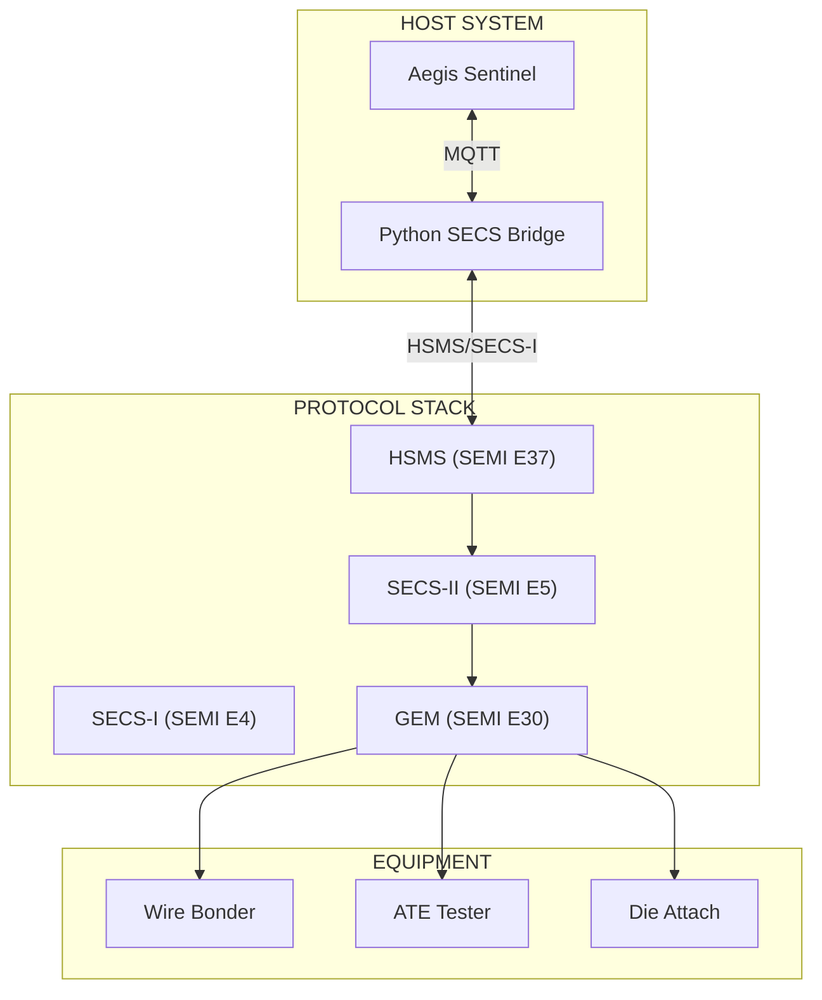
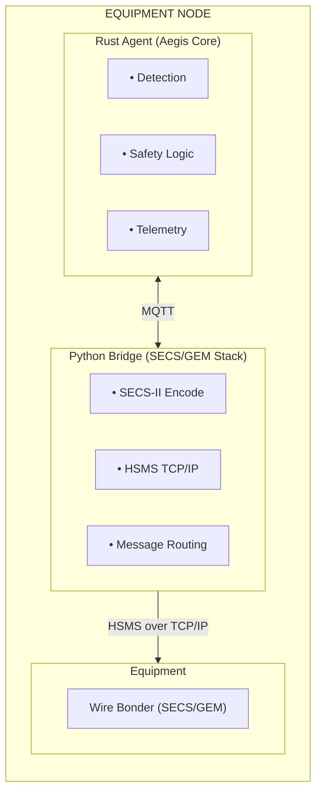
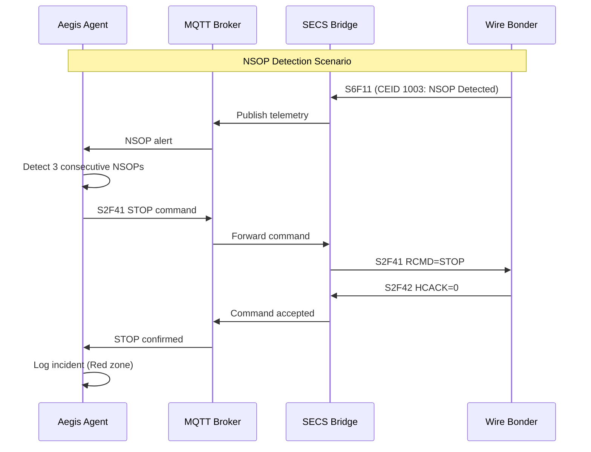

# SECS/GEM Integration

## SECS/GEM Protocol Integration for Aegis Sentinel

This document describes how the Aegis Sentinel Platform integrates with semiconductor manufacturing equipment using the **SECS/GEM (SEMI Equipment Communications Standard/Generic Equipment Model)** protocol.

---

## Overview

SECS/GEM is the industry standard protocol for communication between manufacturing equipment and host systems in semiconductor manufacturing.



---

## Architecture

### Sidecar Pattern

Aegis uses a **Sidecar Pattern** for SECS/GEM integration:



**Why Sidecar Pattern?**

| Approach | Effort | Maintenance | Performance |
|----------|--------|-------------|-------------|
| Pure Rust SECS/GEM | 6+ months | High | Fastest |
| **Sidecar (Selected)** | 2 weeks | Low | Fast |
| Direct C Library | 1 month | Medium | Fast |

The sidecar pattern allows Aegis to leverage mature Python SECS/GEM libraries (like `secsgem` or custom implementations) while keeping the core detection logic in high-performance Rust.

---

## SECS-II Message Reference

### Stream 1 - Equipment Status

| Function | Direction | Description |
|----------|-----------|-------------|
| S1F1 | H→E, E→H | Are you online? (Status request) |
| S1F2 | H←E, E←H | Online response |
| S1F3 | H→E | Selected equipment status request |
| S1F4 | H←E | Selected equipment status data |
| S1F13 | H→E, E→H | Establish communications request |
| S1F14 | H←E, E←H | Establish communications confirm |

### Stream 2 - Equipment Control and Diagnostics

| Function | Direction | Description |
|----------|-----------|-------------|
| S2F13 | H→E | Date and time request |
| S2F14 | H←E | Date and time data |
| S2F15 | H→E | New equipment constants request |
| S2F16 | H←E | New equipment constants confirm |
| **S2F41** | **H→E** | **Host command send (RCMD)** |
| **S2F42** | **H←E** | **Host command acknowledge** |

### Stream 5 - Alarms

| Function | Direction | Description |
|----------|-----------|-------------|
| S5F1 | H←E | Alarm report send |
| S5F2 | H→E | Alarm report acknowledge |
| S5F3 | H→E | Enable/disable alarm send |
| S5F4 | H←E | Enable/disable alarm acknowledge |

### Stream 6 - Event Data Collection

| Function | Direction | Description |
|----------|-----------|-------------|
| **S6F11** | **H←E** | **Event report send** |
| S6F12 | H→E | Event report acknowledge |
| S6F15 | H→E | Request event report (for rptid) |
| S6F16 | H←E | Event report data |

### Stream 9 - System Errors

| Function | Direction | Description |
|----------|-----------|-------------|
| S9F1 | H←E | Unrecognized device ID |
| S9F3 | H←E | Unrecognized stream type |
| S9F5 | H←E | Unrecognized function type |
| S9F7 | H←E | Illegal data |
| S9F9 | H←E | Transaction timer timeout |

---

## Key SECS Messages for Aegis

### S2F41 - Host Command Send (RCMD)

This is the primary message for sending remote commands to equipment.

**Message Structure:**
```
S2F41 W
  <L[2]
    <A "RCMD">          // Remote command name
    <L[n]               // Command parameters (CPNAME/CPVAL)
      <L[2]
        <A "CPNAME">    // Command parameter name
        <V CPVAL>       // Command parameter value
      >
      ...
    >
  >
```

**Common RCMDs for Wire Bonders:**

| RCMD | Description | Aegis Use Case |
|------|-------------|----------------|
| `STOP` | Stop bonding | NSOP detection (Red zone) |
| `START` | Start bonding | Recovery after maintenance |
| `PAUSE` | Pause operation | Yellow zone approval pending |
| `ABORT` | Abort current lot | Critical contamination |
| `PP-SELECT` | Select process program | Recipe change |

**Aegis Implementation:**

```rust
// Assembly Sentinel - Send STOP command via sidecar
async fn execute_stop(&self, reason: &str) -> Result<(), AgentError> {
    let topic = "sentinel/bridge/command";
    let payload = json!({
        "action": "STOP",
        "machine_id": self.config.machine_id,
        "reason": reason,
        "protocol": "SECS-II",
        "stream": 2,
        "function": 41,
        "rcmd": "STOP",
        "params": []
    });
    
    info!(
        "[SECS-BRIDGE] Sending S2F41 RCMD=STOP to {}: {}",
        self.config.machine_id, reason
    );
    
    // Publish to MQTT for bridge to pick up
    self.mqtt_client.publish(topic, payload).await?;
    
    Ok(())
}
```

### S2F42 - Host Command Acknowledge

Equipment response to S2F41.

**Message Structure:**
```
S2F42 
  <B[1] HCACK>          // Host command acknowledge code
  <L[n]                 // Command parameter acknowledge
    <L[2]
      <A "CPNAME">
      <B[1] CPACK>      // Command parameter acknowledge code
    >
  >
```

**HCACK Codes:**

| Code | Meaning | Aegis Action |
|------|---------|--------------|
| 0 | Command accepted | Continue monitoring |
| 1 | Command denied (busy) | Queue for retry |
| 2 | Command denied (invalid) | Log error, alert operator |
| 3 | Command denied (paused) | Queue for resume |
| 4 | Command denied (locked) | Escalate to supervisor |
| 5-63 | Reserved | Log warning |

### S6F11 - Event Report Send

Equipment-initiated event reports.

**Message Structure:**
```
S6F11 
  <U4 DATAID>           // Data ID
  <U4 CEID>             // Collection event ID
  <L[n]                 // Reports
    <L[2]
      <U4 RPTID>        // Report ID
      <L[m]             // Report variables
        <V V>           // Variable value
      >
    >
  >
```

**Common CEIDs for Wire Bonders:**

| CEID | Description | Variables |
|------|-------------|-----------|
| 1001 | Bond completed | Bond time, force, impedance |
| 1002 | Bond started | Lot ID, recipe ID |
| 1003 | NSOP detected | Impedance value, pad location |
| 1004 | Cycle complete | UPH, OEE metrics |
| 1005 | Recipe changed | Old recipe, new recipe |
| 2001 | Maintenance required | Component, hours |
| 3001 | Alarm occurred | Alarm ID, text |

---

## Python Bridge Implementation

### Bridge Architecture

```python
# aegis/gem_adapter.py

import asyncio
import json
import paho.mqtt.client as mqtt
from secsgem.hsms import HsmsConnection
from secsgem.secs import SecsMessage

class SecsGemBridge:
    """
    SECS/GEM Bridge for Aegis Sentinel
    Translates MQTT commands from Rust agents to SECS-II messages
    """
    
    def __init__(self, equipment_config: dict):
        self.equipment_id = equipment_config['machine_id']
        self.host = equipment_config['hsms_host']
        self.port = equipment_config['hsms_port']
        self.session_id = equipment_config['session_id']
        
        # HSMS connection
        self.hsms = None
        
        # MQTT client
        self.mqtt = mqtt.Client()
        self.mqtt.on_message = self._on_mqtt_message
        
    async def connect(self):
        """Connect to both HSMS and MQTT"""
        # Connect to equipment via HSMS
        self.hsms = HsmsConnection(
            address=(self.host, self.port),
            session_id=self.session_id,
            is_equipment=False  # We are the host
        )
        await self.hsms.connect()
        
        # Connect to MQTT broker
        self.mqtt.connect("mqtt.yieldops.com", 1883)
        self.mqtt.subscribe(f"sentinel/bridge/{self.equipment_id}/+")
        self.mqtt.loop_start()
        
    def _on_mqtt_message(self, client, userdata, message):
        """Handle command from Rust agent"""
        payload = json.loads(message.payload)
        
        if payload['protocol'] == 'SECS-II':
            self._handle_secs_command(payload)
            
    def _handle_secs_command(self, cmd: dict):
        """Translate MQTT command to SECS-II message"""
        stream = cmd['stream']
        function = cmd['function']
        
        if stream == 2 and function == 41:
            # S2F41 - Host Command Send
            self._send_s2f41(cmd)
        elif stream == 2 and function == 33:
            # S2F33 - Define Report
            self._send_s2f33(cmd)
        elif stream == 2 and function == 35:
            # S2F35 - Link Event Report
            self._send_s2f35(cmd)
            
    def _send_s2f41(self, cmd: dict):
        """Send S2F41 Host Command"""
        rcmd = cmd['rcmd']
        params = cmd.get('params', [])
        
        # Build SECS-II message
        msg = SecsMessage(
            stream=2,
            function=41,
            reply_expected=True
        )
        
        # Set message data
        msg.data = [
            rcmd,  # RCMD
            [[p['name'], p['value']] for p in params]  # CPNAME/CPVAL list
        ]
        
        # Send and wait for S2F42 response
        response = self.hsms.send_message(msg)
        
        # Parse response
        hcack = response.data[0][0]  # HCACK code
        
        # Publish result back to MQTT
        result = {
            'equipment_id': self.equipment_id,
            'command': rcmd,
            'hcack': hcack,
            'status': 'accepted' if hcack == 0 else 'denied'
        }
        
        self.mqtt.publish(
            f"sentinel/bridge/{self.equipment_id}/response",
            json.dumps(result)
        )
```

### Configuration

```yaml
# config/secs_gem.yaml

bridge:
  mqtt_broker: "mqtt.yieldops.com"
  mqtt_port: 1883
  command_topic: "sentinel/bridge/command"
  response_topic: "sentinel/bridge/response"

equipment:
  - machine_id: "BOND-01"
    type: "wire_bonder"
    manufacturer: "K&S"
    model: "ICON"
    hsms:
      host: "192.168.1.101"
      port: 5000
      session_id: 1
      mode: "active"  # or "passive"
    events:
      - ceid: 1001
        name: "BondCompleted"
        variables: ["bond_time", "usg_impedance", "bond_force"]
      - ceid: 1003
        name: "NSOPDetected"
        variables: ["impedance", "pad_x", "pad_y"]
    commands:
      - rcmd: "STOP"
        description: "Stop bonding operation"
      - rcmd: "START"
        description: "Start bonding operation"
      - rcmd: "BOND_FORCE_ADJ"
        description: "Adjust bond force"
        params: ["FORCE_PCT"]
```

---

## Equipment-Specific Integration

### Wire Bonder Integration



**Bond Parameter Adjustment (Green Zone):**

```rust
// Adjust bond force by 5% to improve throughput
let action = Action::AdjustParameter {
    parameter_name: "bond_force".to_string(),
    new_value: 1.05,  // +5%
    unit: "percent".to_string(),
};

// Translated to SECS:
// S2F41 W
//   <L[2]
//     <A "BOND_FORCE_ADJ">
//     <L[1]
//       <L[2]
//         <A "FORCE_PCT">
//         <F4 105.0>
//       >
//     >
//   >
```

### Die Attach Integration

| Parameter | SECS Variable | Aegis Threshold |
|-----------|---------------|-----------------|
| Placement X | `PLACEMENT_X` | ±10µm |
| Placement Y | `PLACEMENT_Y` | ±10µm |
| Placement Theta | `PLACEMENT_T` | ±0.5° |
| Bond Force | `BOND_FORCE` | Per recipe ±5% |
| Die Pick Time | `PICK_TIME` | > 500ms = alert |

### ATE Tester Integration

| Event | CEID | Aegis Action |
|-------|------|--------------|
| Test Started | 4001 | Log lot start |
| Test Completed | 4002 | Update OEE |
| Bin Sort Complete | 4003 | Yield tracking |
| Alarm | 5001 | Escalate based on severity |

---

## Error Handling

### Common SECS/GEM Errors

| Error | Cause | Aegis Response |
|-------|-------|----------------|
| S9F1 | Unrecognized device | Log and alert |
| S9F9 | Transaction timeout | Retry with backoff |
| HCACK=1 | Equipment busy | Queue command |
| HCACK=4 | Equipment locked | Escalate to supervisor |
| HSMS disconnect | Network issue | Attempt reconnection |

### Retry Logic

```rust
const MAX_RETRIES: u32 = 3;
const RETRY_DELAY_MS: u64 = 1000;

async fn execute_with_retry(
    &self, 
    action: &Action
) -> Result<(), AgentError> {
    let mut retries = 0;
    
    loop {
        match self.execute(action).await {
            Ok(()) => return Ok(()),
            Err(e) if retries < MAX_RETRIES => {
                retries += 1;
                warn!(
                    "SECS command failed, retrying ({}/{}): {}",
                    retries, MAX_RETRIES, e
                );
                sleep(Duration::from_millis(RETRY_DELAY_MS)).await;
            }
            Err(e) => return Err(e),
        }
    }
}
```

---

## Testing & Validation

### Test Connection

```bash
# Test SECS/GEM connection to equipment
python aegis/gem_adapter.py --test-connection \
  --equipment BOND-01 \
  --host 192.168.1.101 \
  --port 5000
```

### Simulate SECS Messages

```bash
# Send test S2F41 command
python aegis/gem_adapter.py --send-command \
  --equipment BOND-01 \
  --rcmd STOP \
  --reason "Test NSOP response"

# Subscribe to S6F11 events
python aegis/gem_adapter.py --subscribe-events \
  --equipment BOND-01 \
  --ceid 1001,1003
```

### Validation Checklist

- [ ] HSMS connection established
- [ ] S1F13/S1F14 communications established
- [ ] S2F41 commands accepted (HCACK=0)
- [ ] S6F11 events received and parsed
- [ ] MQTT bridge publishing telemetry
- [ ] Aegis agent responding to events
- [ ] Safety circuit transitions working
- [ ] Error handling and retries functional

---

## References

### SEMI Standards

| Standard | Description |
|----------|-------------|
| SEMI E4 | SECS-I (Serial Communication) |
| SEMI E5 | SECS-II (Message Protocol) |
| SEMI E30 | GEM (Generic Equipment Model) |
| SEMI E37 | HSMS (High-Speed SECS Message Services) |
| SEMI E40 | Processing Management |
| SEMI E41 | Terminal Services |
| SEMI E42 | Error Management |
| SEMI E58 | Reserved |
| SEMI E94 | Control Job Management |
| SEMI E116 | Provisional Specification for Equipment Data Acquisition |

### Aegis Documentation

- [AEGIS_INTEGRATION_GUIDE.md](../AEGIS_INTEGRATION_GUIDE.md) - Main integration guide
- [AEGIS_SAND_TO_PACKAGE.md](../AEGIS_SAND_TO_PACKAGE.md) - Value chain coverage
- [Architecture.md](../Architecture.md) - System architecture

---

## Appendix: SECS-II Message Examples

### S1F13 - Establish Communications

**Request:**
```
S1F13 W
  <L[0]>     // Empty list (no MDLN/ SOFTREV)
```

**Response:**
```
S1F14 
  <L[2]
    <B[1] 0x00>     // COMMACK = 0 (accepted)
    <L[2]
      <A "K&S ICON">  // MDLN (equipment model)
      <A "3.2.1">     // SOFTREV (software revision)
    >
  >
```

### S2F41 - Stop Command

**Request:**
```
S2F41 W
  <L[2]
    <A "STOP">
    <L[0]>     // No parameters
  >
```

**Response:**
```
S2F42 
  <B[1] 0x00>   // HCACK = 0 (command accepted)
  <L[0]>        // No parameter acknowledgments
```

### S6F11 - Bond Completed Event

```
S6F11 
  <U4 12345>     // DATAID
  <U4 1001>      // CEID (Bond Completed)
  <L[1]
    <L[2]
      <U4 1>     // RPTID
      <L[3]
        <F4 15.3>    // Bond time (ms)
        <F4 45.2>    // USG impedance (Ω)
        <F4 25.0>    // Bond force (g)
      >
    >
  >
```
