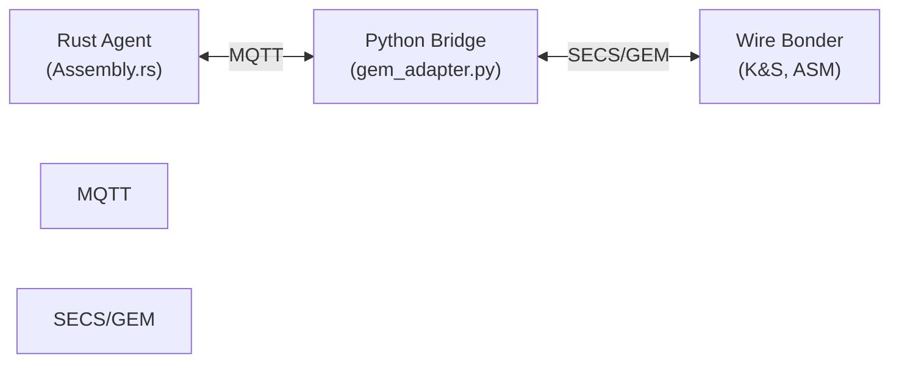

# SECS/GEM Integration for Aegis Sentinel

## Overview

This document describes the SECS/GEM (SEMI Equipment Communications Standard / Generic Equipment Model) integration for the Assembly Sentinel agent, which monitors wire bonding and packaging equipment.

## Architecture: The Sidecar Pattern

Instead of implementing the complex SECS/GEM binary protocol directly in Rust (a 6+ month effort), we use a **Sidecar Pattern**:



### Why This Pattern?

1. **Complexity**: SECS/GEM is a complex binary protocol with HSMS (High-Speed SECS Message Services) over TCP
2. **Libraries**: Python has mature `secsgem` library; Rust SECS/GEM libraries are nascent
3. **Separation of Concerns**: Rust handles physics/AI; Python handles protocol translation
4. **Maintainability**: Bridge can be updated independently of core agent

## Message Flow

### 1. Rust Agent Detects NSOP

```rust
// assembly.rs
fn detect_bond_defect(&self, impedance: f64) -> Option<Threat> {
    if impedance < self.config.min_ultrasonic_impedance {
        Some(Threat::QualityDefect {
            defect_type: "NSOP (Non-Stick on Pad)".to_string(),
            severity: Severity::Critical,
            ...
        })
    }
}
```

### 2. Safety Circuit Triggers FeedHold

```rust
fn safety_circuit(&self, threat: &Threat) -> (ResponseTier, Action) {
    match threat {
        Threat::QualityDefect { .. } => (
            ResponseTier::Red,
            Action::FeedHold { reason: "NSOP Detected".into() }
        ),
    }
}
```

### 3. Execute Sends MQTT Command

```rust
async fn execute(&self, action: &Action) -> Result<(), AgentError> {
    match action {
        Action::FeedHold { reason } => {
            let payload = json!({
                "action": "STOP",
                "machine_id": self.config.machine_id,
                "reason": reason,
                "protocol": "SECS-II",
                "stream": 2,
                "function": 41
            });
            // Publish to MQTT topic
            mqtt_client.publish("sentinel/bridge/command", payload).await?;
        }
    }
}
```

### 4. Python Bridge Translates to SECS-II

```python
# gem_adapter.py
def _on_mqtt_message(self, client, userdata, msg):
    payload = json.loads(msg.payload)
    cmd = SECSCommand(
        action=payload['action'],
        machine_id=payload['machine_id'],
        ...
    )
    self._execute_secs_command(cmd)

def _execute_secs_command(self, cmd: SECSCommand):
    secs_rcmd = self._map_action_to_rcmd(cmd.action)
    # Send S2F41 (Host Command Send)
    self.gem_handler.send_remote_command(secs_rcmd, params)
```

### 5. SECS-II Message Sent to Equipment

```
S2F41 W (Host Command Send)
<L[2]
  <A "STOP">          # RCMD (Remote Command)
  <L[1]               # CPNAME/CPVAL list
    <L[2]
      <A "REASON">    # Parameter name
      <A "NSOP Detected">  # Parameter value
    >
  >
>
```

## SECS/GEM Messages Used

| Stream/Function | Description | Direction | Use Case |
|----------------|-------------|-----------|----------|
| S1F1/S1F2 | Are You There / On Line Data | Bidirectional | Equipment heartbeat |
| S2F41/S2F42 | Host Command Send / Acknowledge | Host → Equipment | STOP, PAUSE, parameter adjust |
| S5F1/S5F2 | Alarm Report Send / Acknowledge | Equipment → Host | Equipment alarms |
| S6F11/S6F12 | Event Report Send / Acknowledge | Equipment → Host | Process events |
| S7F1/S7F2 | Process Program Load / Acknowledge | Bidirectional | Recipe management |

## Setup Instructions

### 1. Install Python Dependencies

```bash
cd aegis
pip install -r requirements-gem.txt
```

### 2. Configure Environment Variables

```bash
export MQTT_BROKER=localhost
export MQTT_PORT=1883
export GEM_HOST=192.168.1.100      # Your wire bonder's IP
export GEM_PORT=5000               # Standard HSMS port
export MACHINE_ID=BOND-01
```

### 3. Start the Python Bridge

```bash
python gem_adapter.py
```

### 4. Start the Rust Agent

```bash
cd aegis-sentinel
cargo run
```

## Testing Without Real Equipment

For development, you can use the `secsgem` simulator:

```python
# Start a simulated wire bonder
from secsgem.gem import GemEquipmentHandler

simulator = GemEquipmentHandler(address="127.0.0.1", port=5000, active=False)
simulator.enable()
```

## Telemetry Data Mapping

The Assembly Sentinel expects these metrics from the wire bonder:

| Metric | SECS Variable | Description | Unit |
|--------|--------------|-------------|------|
| `usg_impedance` | ECID 1001 | Ultrasonic generator impedance | Ω (Ohms) |
| `bond_time_ms` | ECID 1002 | Cycle time per bond | ms |
| `capillary_temp` | ECID 1003 | Capillary temperature | °C |
| `shear_strength_g` | ECID 1004 | Post-bond shear test | grams |

## Troubleshooting

### Bridge Won't Connect to Equipment

1. Check network connectivity: `ping <GEM_HOST>`
2. Verify HSMS port is open: `telnet <GEM_HOST> 5000`
3. Check equipment is in ONLINE/REMOTE mode
4. Review equipment CEID (Collection Event ID) configuration

### MQTT Connection Issues

1. Verify MQTT broker is running: `mosquitto -v`
2. Check topic subscriptions: `mosquitto_sub -t sentinel/bridge/#`
3. Review firewall rules for port 1883

### NSOP Not Detected

1. Verify `usg_impedance` metric is being received
2. Check impedance threshold matches your wire bonder specs
3. Ensure SECS variable mapping is correct (ECID configuration)

## References

- [SEMI E30 - GEM Standard](https://www.semi.org/standards/)
- [SEMI E37 - HSMS Standard](https://www.semi.org/standards/)
- [SEMI E5 - SECS-II Standard](https://www.semi.org/standards/)
- [secsgem Python Library](https://github.com/bparzella/secsgem)
